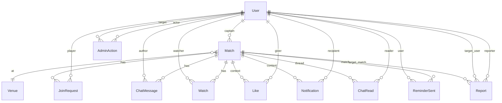

# PITCHUP — App Map

> ⚠ **This map is a navigator + summaries.** **The ERD (Main entities) and the "What's accessible by match status" table are canonical — the spec references them.** All other sections are derived from the spec files.
> On conflict: **the spec wins.** The ERD and the status table are canonical *within this map* and are referenced from the spec; if a discrepancy with a spec file appears, fix the map first.
>
> **Audit checklist in the header:** `total_spots` migration — v1 starts with a minimum of 8 rule, no legacy matches (fresh project).
>
> **Last audit against spec:** `2026-05-24` (ten+ waves in one day, plus a polish pass): first — polish (`total_spots` minimum raised from 2 to 8; `captain_crew` clarified as `NOT NULL DEFAULT '{}'`; rate limits and CSRF policy added; `likes_reminder` SSE replaced with on-read computation; `POST /watch` requires isFull=true; `matches_changed` payload field carries `my_match_changed`-style updates — no separate `actions` DB table). Second — **JoinRequest enum extended (`cancelled`/`left`/`kicked`); ERD got a Type column; audit-note on absence of username/handle fixed; Notification.type enum fixed; Retention policy block added; sub-label for Section Past; ladder-sort for `/admin/reports`**. Third — **Venue ERD re-synced with spec:** added `lat`/`lng` (map + Haversine), `active bool` (deactivation mechanic in `/admin/venues`); `surface` corrected from `text enum` to `text[]` (multi-select grass/hard); `cover_image text` renamed to `cover_id varchar(40)` (unified with `Match.cover_id`); backend tokens `grass` / `hard` fixed in [global.md](./pitchup-spec-global.md) "Field surface". Fourth — **JWT lifetime fixed = 333 days** (Auth.js v5 `session.maxAge`); typo `ushered Watch` → `stale Watch` with condition clarified (`match.start_time < now()`); **`Match.cover_id` declared as snapshot of `venue.cover_id` at INSERT time** (denormalization — changing a venue's cover does not rewrite past/future matches). Fifth — polish: alias `captain_approved` removed from SSE→notification mapping — canonical `accepted` kept; inter-process delivery mechanism added to `auth_revoked` section (Postgres `LISTEN/NOTIFY sse_revoke:{user_id}`, heartbeat as fallback). Sixth — defense-in-depth for two invariants: (a) **`POST /join` now explicitly checks `user !== match.captain_id`** (new code `400 captain_cannot_join`) — closes direct curl/client bug bypassing the CTA cascade; (b) **`cancelled_at` / `cancel_reason` added to "Cannot be changed"** in `/matches/:id/edit` — PATCH whitelist drops these fields, reactivating a Cancelled match is not supported in v1. The map (status table, ERD, BottomNav, Cron, stack) is not affected — backend error codes are delegated to match.md. Seventh — polish-bugs: (a) stub player terminology — "crew member" removed as a synonym (conflicted with global.md "Match type → Terminology"), single canonical term "stub player" kept; (b) 🚫 kicked icon added to Updates panel icon enum (global.md); (c) orphan `DELETE /join` in the Idempotency section (match.md) replaced with real `POST /leave` and `POST /cancel-request`; (d) tap on `/users/:id` from inbox removed — report-notification.type does not exist in v1; (e) sign-out description in personal.md fixed (copy-paste from Delete account); (f) cover default "random" → "deterministic by venue.id" (personal.md); (g) swipe-up multi-match pin sheet clarified (discovery.md). Eighth — **states-axis audit**: (a) **`my_status` mapping extended** — on-read rules added for `JoinRequest.status ∈ {left, kicked, cancelled}` (all three → CTA role `none`, can re-apply); `accepted` split into two cases (`cancelled_at IS NULL` → `accepted`, `cancelled_at IS NOT NULL` → `cancelled`); `watching` clarified to "Watch record exists AND status ∉ {pending,accepted}"; `kicked` declared SSE-only for animation, on-read = `none` (global.md); (b) **player diagram**: erroneous arrow `Accepted → Rejected: match cancelled` removed — match cancellation does not change accepted JoinRequest status, `my_status='cancelled'` derives on-read from `match.cancelled_at` (match.md); (c) **Section Past**: sub-label added `accepted + Cancelled → "Match was cancelled"` (personal.md). Ninth — **morning reminder channel clarification**: `morning_reminder` confirmed as email + in-app (both channels); browser popup suppressed. Two fixes in global.md ("Browser notifications" section + SSE→notification.type table). Map synced: Notifications table (in-app inbox row now lists morning reminder explicitly); PWA checklist bullet updated to match new wording. Edit history lives in `git log`, not duplicated in the header. Tenth — **SSE → polling architecture decision**: removed dual SSE channels (`/api/updates/stream` + `/api/matches/:id/stream`) and Postgres `LISTEN/NOTIFY sse_revoke:{user_id}`; replaced with two poll endpoints (`GET /api/updates/state` every 15s + `GET /api/matches/:id/state` every 15s). Auth revocation: column check on `users.banned` / `users.deleted_at` in `requireAuth()` on every API call is sufficient — **no `revoked_sessions` blacklist table, no cross-process push**. SSE deferred to v1.1. Map updated: stack description (line "SSE — two channels" → "Polling — two endpoints"), chat access table (no SSE → no polling), ChatRead ERD (`chat_read_sync` SSE removed), Notification ERD cross-ref updated, checklist item "Match and player lifecycle" updated. All five spec files updated accordingly. Thirteenth (readiness polish, 2026-05-24): fresh-eyes pass after twelfth uncovered 5 gaps — fixed. **(a)** container width corrected: spec/memory said 480px, mockups show 375px → 375px wins (iPhone-standard, matches existing visual anchors). Updated [ARCHITECTURE.md](../ARCHITECTURE.md) §11 and project memory. **(b)** theme decision: v1 ships **light only** — cream surfaces + dark green + lime accent, palette anchored in `mockups/match.html` and mirrored in `src/ui/tokens.ts`. `next-themes` planned with `forcedTheme="light"` (not yet wired in `app/layout.tsx`). Dark mode deferred to v1.1; Known Gap recorded in [personal.md](./pitchup-spec-personal.md) alongside the responsive-breakpoints gap. (Historical: an earlier audit wave locked dark-only; flipped after the cream/green/lime mockups were anchored.) **(c)** Design Tokens Appendix added to ARCHITECTURE §11 — full token list extracted from `mockups/games.html` (accent / accentHover / accentLight / slotOk / slotWarn / slotFull + zinc palette + skeleton/sheet animations + chip/day-cell state classes). Rule: never inline raw hex outside `src/ui/tokens.ts` and `tailwind.config.ts`. **(d)** Created mandatory starter files: `README.md` (5-min onboarding), `AGENTS.md` (AI quick-reference with conventions cheat sheet + gotchas + workflow), `NAVIGATION.md` (find-by-concept index), `.env.example` (Zod-validated env template), `docs/adr/README.md` + `docs/adr/0000-template.md`. Spec content unchanged. Twelfth (architecture anchor, 2026-05-24): added `docs/ARCHITECTURE.md` — the bridge between [CODING_STANDARDS.md](../../CODING_STANDARDS.md) (universal principles) and the spec (behavior). Locks code-side decisions before the first commit: folder layout (flat bounded contexts × hexagonal layers, `app/` as interfaces), Route Handlers default (Server Actions exception), throw-based errors with `AppError` hierarchy + HTTP mapping table, Zod for DTOs + env validation, Prisma + Repository port pattern + `withMatchLock()` helper for advisory locks, `requireAuth()` auth pattern, polling hook structure, design tokens extracted from `mockups/*.html`, Vitest stack, ADR workflow under `docs/adr/`. No spec content changed in this wave. Eleventh (polish batch A, 2026-05-24): cross-file critical-defect sweep, 12 fixes across all 5 files. **(a) app-map.md:** removed `revoked_sessions` entity from ERD / entity list / cron / retention (column-based session invalidation in global.md "Session invalidation" makes it unnecessary); removed phantom `actions` table mention from header (it's a `matches_changed` payload field, not a DB table); `Match.surface` and `ReminderSent.kind` corrected from `text enum` to `text` (app-level validation, not Postgres enum). **(b) match.md:** captain ban now explicitly listed alongside delete-account for upcoming-match auto-cancel; unified cancel reason text "Organizer account was removed" (was split between ban/delete); captain sheet button renamed `[Reject]` → `[Decline]` (glossary §9 — UI uses "decline", DB stays `rejected`); `notify watching` exception added to non-material edit rules (`total_spots ↑` still triggers `spot_opened`); per-match poll payload now fully typed (was prose only); `PATCH /matches/:id` checklist now requires `updated_at` in payload for optimistic concurrency. **(c) global.md:** `admin_deleted` action uses `my_status: 'none'` (was `'cancelled'` — semantically wrong: JoinRequest is gone); dead cross-ref "Cron auto-reject" replaced with "Reject / Kick / Leave flows → Pending lives until start_time". **(d) personal.md:** Section Captain non-overlap rule explicit (Ended/Cancelled captain matches go to Past only); `admin_deleted` payload uses `my_status: 'none'`; admin bootstrap edge case stripped of `revoked_sessions` SQL; two Known Gaps backfilled — email-change UI, responsive breakpoints (both referenced by global.md but missing here). **(e) discovery.md:** Controls table BottomNav: Map cell clarified that `?date=` is dropped (was contradicting prose at line 216); broken cross-ref "see 'Cancelled matches' below" replaced with link to match.md "Match states".
>
> **Audit checklist** (run on every spec edit and after extended map edits):
> - [x] Stack (Next.js 15 + Postgres + Prisma + Auth.js v5 + MapLibre) — verified against [global.md](./pitchup-spec-global.md)
> - [x] BottomNav: 5 tabs (My matches | Games | Map | Chats | Me), pill-style active. Tab #5 is named `Me`; "Profile" — only for content inside `/me` and the `/users/:id` page.
> - [x] TopBar: logo + 🔔, **no avatar** (own profile — via BottomNav `Me`)
> - [x] Login: Google OAuth, **no magic link / email-password**. JWT claims (`googleSub` / `email` / `name` / `picture`) and adding a second provider — described in [global.md](./pitchup-spec-global.md) "What's in the JWT". **JWT lifetime = 333 days** (Auth.js v5 `session.maxAge`), no refresh flow in MVP — see "Authentication" in [global.md](./pitchup-spec-global.md).
> - [x] PWA / Web Push: **v1.1**, not MVP. In MVP — Notification API (browser notifications) + email + in-app inbox. Morning reminder is not shown as a browser notification (email + in-app already cover it; browser popup suppressed — frontend filters by `type` on poll response — see [global.md](./pitchup-spec-global.md) "Browser notifications").
> - [x] Cron list: morning reminder ×2 (10:00 and 20:00 Europe/Prague) + auto-reject pending (every 5 minutes when `now() >= start_time`) + inbox TTL cleanup (once daily, 30 days) — verified against [match.md](./pitchup-spec-match.md) (section "Cron jobs") and the "Cron jobs" table below.
> - [x] Match and player lifecycle — single source in [match.md](./pitchup-spec-match.md) ("Match states", "Player match states"). In the map — reference only, no more mermaid diagrams. `my_status` in poll payload — UI-derived enum, not equal to `JoinRequest.status`; mapping — in [global.md](./pitchup-spec-global.md) "Polling sync".
> - [x] Entities (User / Match / JoinRequest / Watch / ChatMessage / ChatRead / Venue / Like / Notification / Report / AdminAction / ReminderSent) — User model consolidated: canonical `is_admin: bool`. **User — NO `handle/username` field.** Identification in UI = name + avatar (see global.md). Decision in v1.1 if needed. `Watch`, `Like`, `ChatRead`, `ReminderSent` without `id` — composite PK (see ERD below). `Notification` — separate table for in-app inbox (UI term), TTL 30 days; `ChatRead` — `last_read_at` per (user, match) pair, source of truth for unread dots in `/chats`. `Report` — reports with UNIQUE(reporter, target) for dedup. `AdminAction` — audit log for promote/demote/ban/unban. `ReminderSent` — idempotency for morning reminder cron. **Session invalidation** for banned/delete-account uses column checks (`users.banned`, `users.deleted_at`) in `requireAuth()` on every API call — no separate `revoked_sessions` table (see "Session invalidation" in [global.md](./pitchup-spec-global.md)). **`Venue`** contains `lat`/`lng` (map + Haversine, see [discovery.md](./pitchup-spec-discovery.md)), `surface text[]` (multi-select `grass`/`hard`), `cover_id varchar(40)` (same palette as Match, default deterministic by `venue.id` — see [global.md](./pitchup-spec-global.md) "Cover venue"), `active bool` (NOT NULL DEFAULT true, guard against deactivating a venue with upcoming matches — see [personal.md](./pitchup-spec-personal.md) "/admin/venues").
> - [x] Cancelled and In progress: what is allowed/forbidden (Edit, Cancel, Leave, Cancel request) — see "What's accessible by match status" table below

---

> Pickup football web app in Prague. Captain creates a match → players find it and submit a request → captain approves → they play.
> **Stack:** Next.js 15 (App Router) + TypeScript + Tailwind + shadcn/ui + Postgres + Prisma + Auth.js v5 (Google) + MapLibre/OSM. Mobile-first, 375px central container. **PWA — v1.1, not MVP.**

---

## 👥 Roles

| Role | Capabilities |
|---|---|
| **Guest** (not signed in) | View `/games`, `/map`, `/matches/:id`, profiles. Cannot join, chat, or like. |
| **Player** (signed in) | Everything a guest can + Join/Leave/Watch/chat/likes. |
| **Captain** (player who created the match) | Everything a player can + Create/Edit/Cancel match, Approve/Reject, Kick, delete others' messages in their own chat. |
| **Admin** | Ban, moderation, hide text, `/admin/*`. |

---

## 🗺 Screen map

```
┌─ Public ───────────────────────────────────────────┐
│  /                  landing                        │
│  /login             Google OAuth (Auth.js v5)      │
│  /welcome           onboarding (after first sign-in)│
│  /legal/terms                                      │
│  /legal/privacy                                    │
└────────────────────────────────────────────────────┘

┌─ Discovery (for everyone) ─────────────────────────┐
│  /games             match list + filters           │
│  /map               map with match pins            │
│  /matches/:id       match page (2 tabs)            │
│    └─ Tab: Lineup | Chat                           │
│  /users/:id         public player profile          │
└────────────────────────────────────────────────────┘

┌─ Personal (requires sign-in) ──────────────────────┐
│  /my-matches        home: Upcoming/Past/Captain    │
│  /chats             all of user's match chats      │
│  /me                settings, notifications,       │
│                     account actions                │
└────────────────────────────────────────────────────┘

┌─ Captain / creation ───────────────────────────────┐
│  /matches/new       3-step wizard                  │
│  /matches/:id/edit  editing (before start)         │
└────────────────────────────────────────────────────┘

┌─ Admin (admin only) ───────────────────────────────┐
│  /admin/users       user list, ban                 │
│  /admin/matches     all matches, moderation        │
│  /admin/venues      venue directory                │
│  /admin/reports     reports                        │
└────────────────────────────────────────────────────┘
```

---

## 🧭 Navigation (BottomNav, 5 tabs, pill-style active)

| # | Tab | URL | Label | Who |
|---|---|---|---|---|
| 1 | My matches | `/my-matches` | "My matches" | auth-only (disabled for guest) |
| 2 | Games | `/games` | "Games" | guest + auth |
| 3 | Map | `/map` | "Map" | guest + auth |
| 4 | Chats | `/chats` | "Chats" | auth-only (disabled for guest) |
| 5 | Me | `/me` | "Me" | auth-only (disabled for guest) |

Tab 5 — profile preview (avatar, name) + settings (Notifications, Sign out, Delete account).

**BottomNav is hidden on `/welcome` entirely** — the user has not completed onboarding, taps would trigger redirects back through the middleware guard. Exits from `/welcome` — only `[Get started →]` or `Sign out` in the TopBar.

**TopBar (auth):** logo left + 🔔 right. **No avatar** — own profile via BottomNav `Me`.
**TopBar (guest):** logo left + `[Sign in]` right.
**TopBar (/welcome):** logo left + ghost link `Sign out` right (instead of 🔔).

`[+ New match]` — regular button in the top bar on `/games` and `/map` (not a FAB).

---

## ⚽ Match and player lifecycle

Mermaid diagrams and text rules — **source of truth in** [match.md](./pitchup-spec-match.md):

- **Match states** (Open / AlmostFull / Full / InProgress / Ended / Cancelled) → [match.md → "Match states"](./pitchup-spec-match.md).
- **Player match states** (none / pending / accepted / watching, + Rejected with auto_reason) → [match.md → "Player match states"](./pitchup-spec-match.md).

Match state is **computed on-read** from `start_time` + `duration` + `cancelled_at` — no cron for transitions between states. Cron exists only for `auto-reject pending` (see the "Cron jobs" section below).

---

## 🔒 What's accessible by match status

Summary table. Source of truth — the CTA cascade in [match.md](./pitchup-spec-match.md) (sections "CTA bar" and "Reject / Kick / Leave flows"). Full registry of conflict codes (`409 match_locked` / `409 over_capacity` / `409 already_processed` / ...) and lock strategy — in [match.md → "Concurrency & locking"](./pitchup-spec-match.md).

| Action | Open / AlmostFull / Full | In progress | Ended | Cancelled |
|---|---|---|---|---|
| **Join match** (player) | ✅ (live + slot available / `[Notify me]` if full) | ❌ disabled `"Match in progress"` | ❌ disabled `"Match ended"` | ❌ disabled `"Match cancelled"` |
| **Cancel request** (pending) | ✅ | ❌ hidden (pending already auto-rejected or 5-min window) | ❌ | ❌ (pending → rejected `auto_reason=match_cancelled`) |
| **Leave match** (accepted) | ✅ | ❌ by design — match is considered played | ❌ | ❌ |
| **Like teammates** (captain / accepted) | ❌ | ❌ | ✅ | ❌ |
| **Edit match** (captain) | ✅ (before `start_time`) | ❌ | ❌ | ❌ |
| **Cancel match** (captain) | ✅ (before `start_time`) | ❌ | ❌ | ❌ (already cancelled) |
| **Approve / Reject pending** (captain) | ✅ | ❌ `409 match_locked` | ❌ | ❌ |
| **Kick accepted** (captain) | ✅ | ❌ | ❌ | ❌ |
| **`[Manage match]` button** (captain-only on live; absent from DOM for all other roles and statuses) | ✅ active | ❌ not rendered — CTA: `"Match in progress"` | ❌ not rendered — CTA: `[Like teammates]` / `"Match ended"` | ❌ not rendered — CTA: `"Match cancelled"` |
| **Shuffle teams** (captain) | ✅ (if `filled ≥ 4`) | ✅ by design — offline coordination | ✅ | ❌ |
| **Chat — read** | ✅ everyone (guest = snapshot, no polling) | ✅ | ✅ | ✅ (via direct link) |
| **Chat — read (by role)** | Captain/Accepted: ✅; Pending: ❌ (Tab disabled, see match.md); Watching: ✅ read-only (like guest); Guest: ✅ read-only snapshot, no polling; Left/Kicked: ✅ read-only (chat history available in Past) | — | — | — |
| **Chat — write** | ✅ accepted + captain | ✅ accepted + captain | ✅ accepted + captain (post-match coordination) | ❌ read-only for everyone, input hidden, backend `409 chat_frozen` |
| **Chat — delete message** (captain) | ✅ | ✅ | ✅ | ✅ moderation works even on read-only-frozen chat |
| **Visible in `/games`, `/map`** | ✅ | ❌ only in `/my-matches` for participants (accepted, captain) + direct link | ❌ removed from public discovery | ❌ removed from public discovery |
| **Direct link `/matches/:id`** | ✅ | ✅ | ✅ | ✅ |

---

## 🧩 Main entities



| Entity | Fields | Type |
|---|---|---|
| **User** | id / google_sub (unique, primary OAuth identifier — middleware looks up by it) / email / name / avatar_url / contact_info / email_notifications (default true) / is_admin / banned / deleted_at / created_at. Row is created **only** when onboarding is completed — until the user taps `[Get started →]` on `/welcome`, they don't exist in the DB (see "Onboarding guard" in spec-global.md). **`deleted_at`** — set to `now()` on account deletion (soft delete — row stays for referential integrity); `NULL` = active account. Middleware SELECT fetches `id, banned, deleted_at` on every protected request — no extra query for the invalidation check. **`name` / `avatar_url` / `email` — snapshot at onboarding time, not synced with Google on subsequent sign-ins** (see "Google profile — snapshot, not sync" in [global.md](./pitchup-spec-global.md)). **NO `handle/username` field** — see audit-checklist. | id `uuid` / google_sub `text` / email `text` / name `text` / avatar_url `text` / contact_info `text` / email_notifications `bool` / is_admin `bool` / banned `bool` / deleted_at `timestamptz null` / created_at `timestamptz` |
| **Match** | id / captain_id / venue_id / start_time / duration (minutes) / total_spots / price (Kč) / surface (one of two tokens, app-level validation — not a Postgres enum, see "Field surface" in [global.md](./pitchup-spec-global.md)) / studs_allowed / field_booked / description / **captain_crew NOT NULL DEFAULT '{}'** (never NULL — `captain_crew.length` is always safe; empty crew = open match) / cancelled_at / cancel_reason / description_hidden / cancel_reason_hidden (see "Hide text (content moderation)" in [personal.md](./pitchup-spec-personal.md)) / cover_id | id `uuid` / captain_id `uuid FK` / venue_id `uuid FK` / start_time `timestamptz` / duration `int` / total_spots `smallint` / price `int` / surface `text` / studs_allowed `bool` / field_booked `bool` / description `text` / captain_crew `text[]` / cancelled_at `timestamptz null` / cancel_reason `text null` / description_hidden `bool` / cancel_reason_hidden `bool` / cover_id `varchar(40)` |
| **JoinRequest** | id / match_id / user_id / status (`pending` / `accepted` / `rejected` / `cancelled` / `left` / `kicked`) / guest_count (0..4) / message / auto_reason (NULL / `match_started` / `match_cancelled`) / created_at / updated_at. **UNIQUE(match_id, user_id)** — one row per pair. **Leave/Kick/Cancel-request — UPDATE status, not DELETE.** This allows showing past matches where the user participated and left/was kicked (see personal.md → Section Past). Re-apply after Reject = UPDATE status→pending (not a new INSERT). | id `uuid` / match_id `uuid FK` / user_id `uuid FK` / status `text` enum / guest_count `smallint` / message `text null` / auto_reason `text null` / created_at `timestamptz` / updated_at `timestamptz` |
| **Watch** | match_id / user_id (just a flag "subscribed"). **Composite PK (match_id, user_id)** — no separate `id`. | PK (match_id `uuid`, user_id `uuid`) |
| **ChatMessage** | id / match_id / author_id / text / created_at / deleted_at | id `uuid` / match_id `uuid FK` / author_id `uuid FK` / text `text` / created_at `timestamptz` / deleted_at `timestamptz null` |
| **ChatRead** | match_id / user_id / last_read_at. **Composite PK (match_id, user_id)** — one row per pair. Unread = whether a `ChatMessage` exists with `created_at > last_read_at AND deleted_at IS NULL` for this `(match_id, user_id)`. UPSERT on opening Tab Chat. Row is created lazily (first chat open) — absence of row = "read nothing", unread = all chat messages. See "Unread chat dots" in [personal.md](./pitchup-spec-personal.md). | PK (match_id, user_id) / last_read_at `timestamptz` |
| **Venue** | id / name / address / lat / lng / google_maps_url / surface (array `text[]` of `grass` / `hard` values, multi-select — a single venue can have both, see "Field surface" in [global.md](./pitchup-spec-global.md)) / cover_id (see "Cover venue" in [global.md](./pitchup-spec-global.md), not a DB enum — validated at app level) / active (NOT NULL DEFAULT true, guard against deactivating a venue with upcoming matches — see "/admin/venues" in [personal.md](./pitchup-spec-personal.md)) | id `uuid` / name `text` / address `text` / lat `double precision` / lng `double precision` / google_maps_url `text` / surface `text[]` / cover_id `varchar(40)` / active `bool` |
| **Like** | match_id / giver_id / receiver_id. **Composite PK triple** = UNIQUE — one like per pair + match, no separate `id`. | PK (match_id, giver_id, receiver_id) |
| **Notification** | id / user_id / type (`approved` / `rejected` / `kicked` / `match_cancelled` / `match_updated` / `spot_opened` / `morning_reminder`) / match_id (nullable — for future types without a match) / body (short text) / created_at / read_at (nullable; NULL = unread). **action → notification.type mapping — in [global.md](./pitchup-spec-global.md) → "Polling sync".** **Index:** `(user_id, created_at DESC)` for the Updates panel. **TTL:** rows older than 30 days are cleaned by cron (see "Cron jobs"). Red dot on 🔔 = `EXISTS (notification WHERE user_id=? AND read_at IS NULL)`. Mark-as-read = UPDATE all `read_at IS NULL` → `now()` for user_id (on opening the Updates panel). | id `uuid` / user_id `uuid FK` / type `text` enum / match_id `uuid null FK` / body `text` / created_at `timestamptz` / read_at `timestamptz null` |
| **Report** | id / reporter_id / type (`match` / `player`) / target_match_id (nullable, NOT NULL when type=`match`) / target_user_id (nullable, NOT NULL when type=`player`) / comment (max 500) / status (`new` / `reviewed` / `dismissed`) / created_at / reviewed_at (nullable) / reviewed_by (nullable, admin user_id). **UNIQUE(reporter_id, type, target_match_id, target_user_id)** — a repeat report from the same user on the same target returns 200 without INSERT (silent dedup, see "Report modal" in [personal.md](./pitchup-spec-personal.md)). **Index:** `(status, created_at DESC)` for the list in `/admin/reports`. Retained indefinitely (no TTL — needed for appeals / violation history). | id `uuid` / reporter_id `uuid FK` / type `text` enum / target_match_id `uuid null FK` / target_user_id `uuid null FK` / comment `text` / status `text` enum / created_at `timestamptz` / reviewed_at `timestamptz null` / reviewed_by `uuid null FK` |
| **AdminAction** | id / actor_admin_id / target_user_id / action (`promote` / `demote` / `ban` / `unban`) / reason (text, required) / created_at. Audit log for admin role management and bans. Not shown in the v1 UI (read directly from DB for appeals / investigations). See "Admin role management & safety" in [personal.md](./pitchup-spec-personal.md). | id `uuid` / actor_admin_id `uuid FK` / target_user_id `uuid FK` / action `text` enum / reason `text` / created_at `timestamptz` |
| **ReminderSent** | match_id / user_id / kind (`morning_reminder`). **Composite PK triple** = UNIQUE — morning reminder cron idempotency via `INSERT ON CONFLICT DO NOTHING`. No `id`, `created_at` (optional, for debugging). Cleaned by the same inbox-TTL cron for matches that ended > 7 days ago. See "DST + idempotency" in "Cron jobs" below and in [match.md](./pitchup-spec-match.md). | PK (match_id, user_id, kind `text`) |

> ⚡ Match slots — single formula `computeSlots(match)`, source of truth — section **"Slot math"** in [pitchup-spec-global.md](./pitchup-spec-global.md). In short: `filled = 1 (captain) + captain_crew.length + Σ(accepted JoinRequest: 1 + guest_count)`. All components / APIs / SQL **must** use a single function, not recompute locally.
>
> **Important for the new status enum:** `accepted` in the formula means `JoinRequest.status = 'accepted'`. Statuses `left`, `kicked` **do NOT count** toward `filled` (after Leave/Kick the slot is free). Statuses `cancelled`, `rejected`, `pending` — also **do NOT count**.

---

## 🎯 Three types of "non-user" in Lineup

This is a common source of confusion — locking it down.

**Canonical terms:** a record in `captain_crew[]` — **stub player**. The array as a whole — **crew**. The term "crew member" is not canonical and is not used — see [global.md](./pitchup-spec-global.md) "Match type → Terminology".


| Type | What it is | Source | Where visible |
|---|---|---|---|
| **Stub player** (record from `captain_crew`) | A name string set by the captain at creation. Grey non-clickable chip with first name. | Captain enters via chip input in `/matches/new` or `/edit` | Tab Lineup, mini-roster MatchCard |
| **Guest** (anonymous +N) | Anonymous companion, tied to a player's request. No name, rendered as a `+N` badge on the owner's chip. | Player sets via stepper in the Join modal (0..4) | Badge next to the accepted/pending player's name |
| **Watching** | A user subscribed to "notify me when a slot opens". | Tap `[Notify me]` on a full match | NOT visible in Lineup (internal flag); captain sees an "N watching" counter |

**Stub Pavel → real Pavel:** no automatic linking. Captain taps `[✓]` — real Pavel becomes accepted, the grey stub remains in Lineup. To collapse them — `[Edit match]` → remove the chip from the crew chip input. No modals, no name comparison (see "Approve flow" in [pitchup-spec-match.md](./pitchup-spec-match.md)).

---

## 📨 Notifications

| Channel | When | To whom |
|---|---|---|
| 📧 **Email** (narrow) | Approve, Kick, morning-of-match reminder | themselves |
| 🔔 **In-app inbox** (🔔 in TopBar) | Reject, Cancel match, "slot opened" for watching players, edit details, morning-of-match reminder | themselves |
| 🌐 **Browser** (Notification API) | Optional — mirrors in-app | themselves, if permitted |

Web Push (background / iOS Safari) → v1.1 with PWA.
Polling — two endpoints: per-match `GET /api/matches/:id/state` (chat, Lineup, status, every 15s) + global `GET /api/updates/state` (inbox red dot, counters, every 15s). SSE deferred to v1.1.

---

## 🔁 Key flows

### Join match
```
Player on /matches/:id
  → [Join match] (CTA in page flow, not sticky)
  → Modal: stepper "Bringing friends 0..4" + message
  → [Send request] → POST /api/matches/:id/join
  → Pending. Captain sees in Lineup + captain sheet
```

### Approve (captain)
```
Captain in Tab Lineup or captain sheet
  → [✓] on pending (disabled if 1+guest_count > free — hard cap)
  → Approve is instant, no modal → Pending → Accepted
  → Email to player: "✓ You're in"
```
**Hard cap.** `total_spots` is a hard ceiling: backend rejects an approve that would make `filled > capacity`, UI mirrors this with a disabled button and tooltip `"Not enough spots — increase Total or reject"`. To accept more — `[Edit match] → Total spots [+]`. Editing total ↓ is bounded below by current `filled` (see "Total spots — hard cap on approve" in [pitchup-spec-global.md](./pitchup-spec-global.md)).

### Leave / Kick
```
Player: [Leave match] → reason → frees slot(s) (1+N if with guests)
Captain: [Kick] → confirm → frees slot(s), email to kicked player
→ In both cases: in-app "🟢 A spot just opened" to all watching players + captain, and all Watch records for the match are removed in the same transaction — but only on transition isFull: true → false (Watch records only exist when the match was full, no contradictions; see `notify watching` in spec-match.md)
```

### Cancel match (captain, only before start_time)
```
[Manage match] → [Cancel match] → modal with mandatory reason
→ Banner on the page "Match cancelled · [reason]"
→ Match is removed from public discovery and from Upcoming
→ In-app notification to accepted and pending players (not email); watching players — silently removed without notification
```

---

## ⏰ Cron jobs

> Source of truth — [global.md](./pitchup-spec-global.md) → "Cron jobs". This is a summary.

| Job | When | What it does |
|---|---|---|
| **10:00 reminder** | 10:00 Europe/Prague | Email to accepted players + captain for matches today with `start_time >= now()` (i.e. ≥ 10:00; matches before 10:00 are already in the past at this point — they got the 20:00 reminder the evening before) |
| **20:00 reminder** | 20:00 Europe/Prague | Email to accepted players + captain for matches tomorrow 00:00–11:59 (covers matches before 10:00 that won't be reached by the morning cron) |
| **Cron auto-reject** | every 5 minutes | Auto-rejects pending requests on matches where `now() >= start_time` (auto_reason = `match_started`) |
| **Inbox TTL cleanup** | once daily, 03:00 Prague | `DELETE FROM notification WHERE created_at < now() - interval '30 days'`. Also cleans `reminder_sent` for matches that ended > 7 days ago; **stale `Watch` for past matches** (`Watch WHERE match.start_time < now() - interval '1 day'` — safety cleanup in case the per-5-min auto-reject cron was skipped; primary Watch cleanup happens in auto-reject, see "Cron jobs" in [match.md](./pitchup-spec-match.md)). |

These are the **only** cron jobs. Match status, "spot opened", and so on — on-read / event-driven.

---

## 🧹 Retention policy

- **JoinRequest, ChatMessage, Like** — no TTL (needed for history / Section Past, likes, appeals).
- **Cancelled matches with no participants** and related data — consider TTL in v1.1 (in v1 they live forever for audit purposes).
- **Notification, ReminderSent** — TTL via cron (see Cron jobs above).
- **Watch** — primary cleanup in cron auto-reject (every 5 min, deletes Watch on matches that just hit `start_time`); safety cleanup for stale records in inbox cron (`match.start_time < now() - 1 day`). A Watch on an in-progress / past match is useless (`spot_opened` is not sent).

**DST + idempotency.** Morning reminder crons are registered in TZ `Europe/Prague` (not UTC) so that local "10:00" / "20:00" doesn't drift twice a year. Spring-forward and fall-back do not affect 10:00. Protection against duplicates on retries / restarts — table `reminder_sent(match_id, user_id, kind)` with `UNIQUE(match_id, user_id, kind)`, send via `INSERT ON CONFLICT DO NOTHING`. Details — in "Cron jobs" in [match.md](./pitchup-spec-match.md).

---

## ✂️ Out of scope for v1

- Web Push / PWA install / iOS Safari notifications → v1.1
- Teams and auto-balance in Lineup
- Captain transfer
- Match rescheduling (only cancel + new)
- Cancelling a match after `start_time`
- DMs between players (match chat only)
- Repeat/recurring matches
- Player stats, reputation, no-show
- Repeat crew across matches, invite link for stub players
- Auto-opening the like modal on `/my-matches` (there is a reminder card)
- Payments, field payment in the app

More on this → [pitchup-spec-personal.md](./pitchup-spec-personal.md) "Known gaps" and "Out of scope for v1".

---

## 📚 Where to find details

| Topic | File |
|---|---|
| Global decisions, UI components | [pitchup-spec-global.md](./pitchup-spec-global.md) |
| Discovery (`/games`, `/map`) | [pitchup-spec-discovery.md](./pitchup-spec-discovery.md) |
| Match (page, edit, create, captain flows) | [pitchup-spec-match.md](./pitchup-spec-match.md) |
| Personal screens, profile, admin | [pitchup-spec-personal.md](./pitchup-spec-personal.md) |
| **Code architecture & patterns** (folder layout, errors, validation, repository pattern, advisory locks, auth) | **[../ARCHITECTURE.md](../ARCHITECTURE.md)** |
| **Universal coding principles** (naming, file headers, anchors, error/log rules) | **[../../CODING_STANDARDS.md](../../CODING_STANDARDS.md)** |

Full spec navigator → [pitchup-spec-INDEX.md](./pitchup-spec-INDEX.md).
