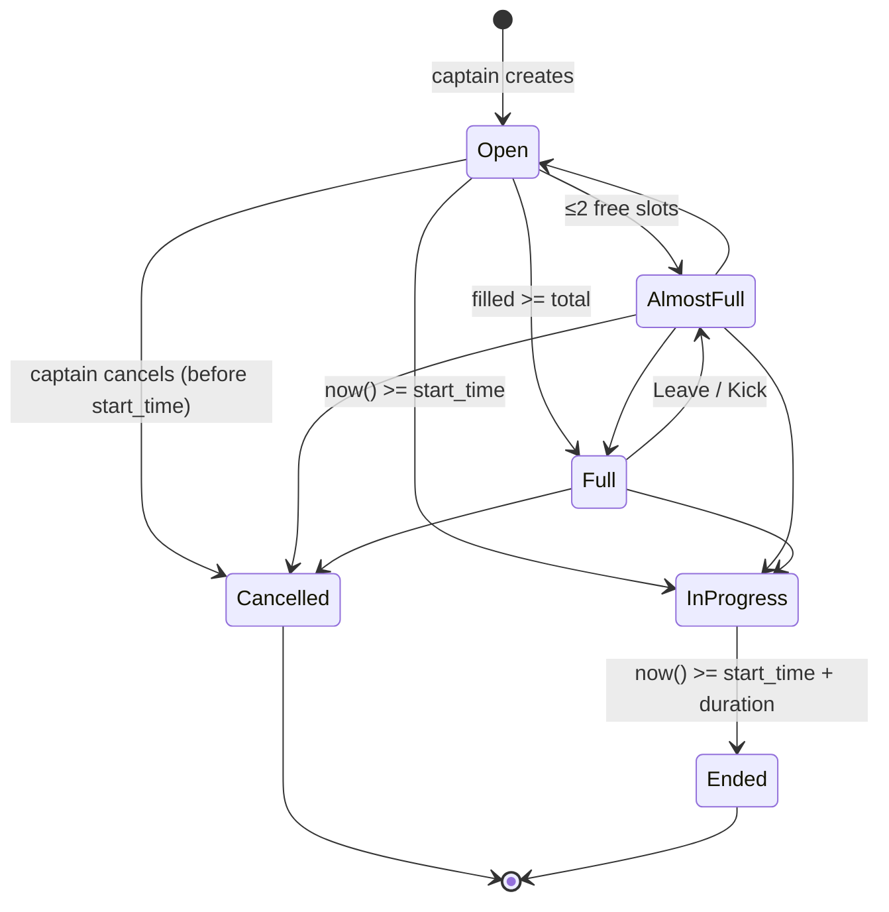
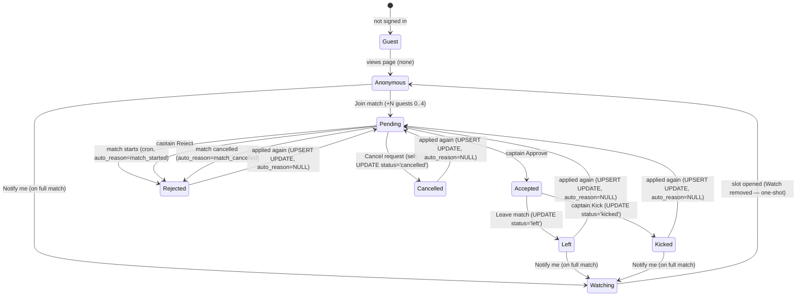

# PITCHUP — Spec: match (page, edit, create)

> Part of the spec. File map — [INDEX](./pitchup-spec-INDEX.md).
> ⚠ **After editing this file** — run the audit checklist in the header of [pitchup-app-map.md](./pitchup-app-map.md) and sync the map if the changes touch any checklist items (stack, nav, TopBar, login, PWA, cron, lifecycle, entities).
> Covers: `/matches/:id` (details, roster, chat, CTA, captain sheet, states), `/matches/:id/edit`, `/matches/new`.

---

## `/matches/:id` — Match page

**Layout — a standard scrollable page, no sticky elements:**

```
[← Back]                                    [⋯]

┌───────────────────────────────────────────┐
│           Hero cover venue (16:9)         │
└───────────────────────────────────────────┘

Letná Park                                  H1
150 Kč / person

📅 Sat 21 Jun · 18:00   (in 3h 20m)
⏱ 90 min
📍 Milady Horákové 23             [Open map ↗]

Bring your boots, no long studs...
(captain's description; empty → block hidden)

🌱 Grass · No studs · Bring: Rubber only
[avatar]  Ivan Novak  Captain

🟢 9/14 players · 5 spots open  →  (tap → Lineup)

[ CTA — depends on role/status ]

──────────────────────────────────────────
[ Lineup ]                    [ Chat ]
──────────────────────────────────────────
(content of the selected tab, scrolls further)
```

**Page elements (top to bottom):**
1. `[← Back]` left · `[⋯]` right (share / report — see below)
2. Hero cover venue (16:9) — a pre-made illustration/avatar (see "Cover venue" in [global.md](./pitchup-spec-global.md))
3. Venue name (H1)
4. Price: `{price} Kč / person` or `Free`
5. `📅` date + time + countdown `(in 3h 20m)` if < 24h to start · `⏱` duration · `📍` address + `[Open map ↗]`
6. **Description** — captain's text, instructions for players. If `description_hidden = true` (moderation) — placeholder `"[Description removed by moderator]"` in grey. If no description — block is hidden.
7. `🌱 Grass` / `🏟️ Hard surface` + `Studs OK` / `No studs` (Grass only) · `Bring: [footwear]` (computed from surface + studs_allowed, see "Field surface" in [global.md](./pitchup-spec-global.md))
7a. **Field not booked** — if `field_booked = false`: line `Field not yet booked` in grey, small font, no emphasis. If `field_booked = true` — line is hidden.
8. Organizer: avatar + name + `Captain` badge. Tap → `/users/:id`
9. **Slot counter** — `"9/14 players · 5 spots open"` (tappable → switches tab to Lineup and scrolls to it) / `"Match full"`. Color: green if slots are available, orange when ≤2 (`"1 spot left"`), red if full.
10. **CTA** — depends on role and match status (see "CTA" below). Regular in-flow block, not sticky.
11. **Tab bar** `[ Lineup ] [ Chat ]` — switcher, two tabs. The selected tab's content expands below within the same scroll. **Default tab — Lineup.** Deep-link `?tab=chat` opens the page directly on Tab Chat (see below).
12. **Tab Lineup** / **Tab Chat** — detailed in the sections below.

**Deep-link `?tab=chat`:** needed for the `/chats → MatchCard` transition (the user arrived from the chats tab and expects the chat — they shouldn't need an extra tap). On load, frontend: if `searchParams.get('tab') === 'chat'` → active tab = Chat, the parameter is removed from the URL via `router.replace` (same as `?sheet=captain` — so it doesn't stick in history and doesn't reopen on F5/back). The tab bar remains visible and clickable — the user can always switch to Lineup with one tap. Any other value for `tab` or no parameter → Lineup. Combining with `?sheet=captain` is allowed (the sheet opens on top, the active tab underneath = Chat), though there is no real use case for this combination in v1.

**Tab Lineup** (detailed in the "Tab Lineup" section below)
**Tab Chat** (detailed in the "Tab Chat" section below)

### CTA bar

**Source of truth — the cascade below.** We check the guest first, then branch by **match** status and the **user's** role. No parallel reference tables — we used to duplicate them, they drifted out of sync, and we removed the duplicates (see the note after the cascade).

#### Invariants (the cascade rests on these)

1. **Match status is exclusive.** A match is always in exactly one of: `Open` / `AlmostFull` / `Full` / `InProgress` / `Ended` / `Cancelled`. Status is computed on-read from `start_time` + `duration` + `cancelled_at` via a single helper (see "Match states" below). For the cascade, `Open` / `AlmostFull` / `Full` collapse into the **"live"** branch — they differ only in slot fill within it.
2. **User role on a match is exclusive.** For a `(user, match)` pair, the user is in exactly one of: `captain` / `accepted` / `pending` / `watching` / `none`. Guaranteed by transactions:
   - Captain — assigned at match creation, never changes. Captain **cannot** be accepted/pending/watching/none on their own match (their slot = 1 + `captain_crew.length`).
   - approve: `pending → accepted` atomically.
   - join: creating `pending` in the same transaction deletes the Watch record if one existed (see "Watching logic" below).
   - leave / kick / cancel-request: `accepted/pending → none`, Watch is not restored automatically.
3. **Guest** = no session. This is a **separate branch** evaluated before the role check — a guest has no `(user, match)` pair at all.

#### Cascade

```
match.status?
├─ Cancelled    → disabled "Match cancelled"                       (any role, including guest)
├─ Ended        → user ∈ {captain, accepted}?
│                   yes → [Like teammates]
│                   no  → disabled "Match ended"                   (including guest)
├─ InProgress   → disabled "Match in progress"                     (any role, including guest and captain)
└─ live (Open / AlmostFull / Full)
    └─ guest?
        ├─ yes → disabled [Sign in to join]
        └─ no  → user.role?
            ├─ captain   → [Manage match]
            ├─ accepted  → [You're in ✓]  +  [Leave match]
            ├─ pending   → disabled [Waiting for organizer...]  +  [Cancel request]
            │              (if match.isFull → additional line below
            │               "Match is now full · captain may still approve")
            ├─ watching  → "You'll be notified if a spot opens"  +  [Stop watching]
            │              (the watching role exists only when `match.isFull === true` —
            │               backend `POST /watch` rejects non-full matches with `409 not_full`,
            │               and `notify watching` synchronously removes all Watch records when
            │               isFull transitions: true → false. See "Watching logic" below.)
            └─ none      → match.isFull?
                            yes → [Notify me if a spot opens]
                            no  → [Join match]
```

**Status-first.** Match status is checked **before** role (including `guest`). On completed matches (Cancelled / Ended / InProgress), a guest sees the same disabled CTA as a signed-in user, not `[Sign in to join]` — there is nothing to join, signing in changes nothing. `[Sign in to join]` only appears on live statuses where the CTA would actually open an action.

`match.isFull` = `computeSlots(match).free === 0`. A single function computes fill — see "Slot math" in [global.md](./pitchup-spec-global.md).

> **Source of truth for CTA — the cascade above.** No parallel reference tables in this file or in [app-map.md](./pitchup-app-map.md). We used to duplicate them — two places drifted out of sync. If you need "one row per status" — the "What's available by status" table in the map covers actions, not CTA text.

#### Branch notes

- **Pending on InProgress.** A `pending` record on InProgress **should not exist** — cron auto-rejects pending every 5 minutes when `now() >= start_time` (see "Reject / Kick / Leave flows" below). But within the up-to-5-minute window after start it may still be there. In that window CTA is rendered by the match-state branch (`disabled "Match in progress"`), not by user-role — `[Cancel request]` is hidden. The match-first cascade guarantees the same disabled state regardless of whether cron has run yet.
- **Pending on Cancelled.** If the match was cancelled while the user was waiting for approval — the backend sets their pending to `rejected` with `auto_reason = match_cancelled` (see "Cancel match" in captain sheet below). On the match page CTA = `disabled "Match cancelled"` per the match-state branch; role no longer matters.
- **Ended + captain.** The captain gets the same `[Like teammates]` as an accepted player — they count as a participant in their own match. There is no "captain can't like" restriction — they can, except liking themselves (the modal filters that out).
- **InProgress + captain.** Manage / Edit / Cancel are unavailable after start (see "Reject / Kick / Leave flows" below). The cascade covers this with a single branch — no special "captain-after-start" row is needed.
- **Watching ⇒ isFull (invariant).** On a live match the `watching` role physically exists only when `match.isFull === true`. Backend `POST /watch` rejects non-full matches with `409 not_full` (see "Per-endpoint checklist" below), and `notify watching` synchronously deletes all Watch records in the same transaction that changes `isFull: true → false` (Leave / Kick / Edit total↑ / Edit remove stub). Any match page with role `watching` is guaranteed to show the full state. There is no `watching + !isFull` branch in the cascade.

**Join flow (modal on tapping Join):**
- Stepper `Bringing friends [− 0 +]` (range 0..4, default 0). Each guest = one more slot. Caption under stepper: "Guests are anonymous — they count as extra spots and can't apply separately."
- Textarea "Message to organizer (optional)"
- `[Send request]` / `[Cancel]`
- The message and `guest_count` are visible to the captain in the captain sheet and in Tab Lineup (a `+N` badge next to the pending player's name).

**Notify me flow:**
- Tap `[Notify me if a spot opens]` — no modal, just a one-tap subscription. Toast `"We'll ping you next time a spot opens."` The word **next** is intentional: the subscription is one-shot (see "Watching logic" below).
- **Backend check `isFull === true`.** `POST /watch` rejects non-full matches with `409 not_full` (see "Per-endpoint checklist" below). The UI already doesn't show the `[Notify me]` button on non-full matches (see CTA cascade), but the 409 covers rare races: the user opened a full match in the background, someone left and `notify watching` already dispatched pushes, the user returned a minute later and tapped `[Notify me]` without seeing the update → backend returns `409 not_full` → frontend catches it and shows toast `"A spot just opened — refresh to join"` + automatically redraws the CTA (the page re-syncs, the user sees `[Join match]`). Same applies to a direct curl.
- When a slot opens (leave / kick) → **in-app inbox** for all watching players: "🟢 A spot just opened in [match]" + **in the same transaction all Watch records for the match are deleted** (see "Watching logic" below — this is a one-shot dispatch, not a persistent subscription). The captain also receives an in-app "A spot opened up". **We don't send email** (see "Notifications" in [global.md](./pitchup-spec-global.md) — email only for approve/kick/morning reminder). This is an intentional limitation for v1: a watching player will only see the update when they open the app / their inbox.
- The former watching player goes to the match page. Their Watch record is already removed; CTA is computed via the `none` branch: if a slot is still available — `[Join match]` (standard Join modal with stepper +N guests 0..4); if they were too slow (other watching players were faster and filled the match again) — `[Notify me]` to re-subscribe in one tap. The match has a soft cap; the captain decides whether to approve a request with guests. From there it's the normal pending flow.
- After start_time, watching subscriptions are ignored (status is not shown, no notifications sent).

**Guests in Lineup and management:** see "Guests (+N on join)" in [global.md](./pitchup-spec-global.md). In short:
- An accepted player with guests = one PlayerChip `Ivan Novak +3` (one chip with a badge), occupies 1+N slots in the counter.
- Leave / Kick frees the entire group (1+N); guests cannot be removed separately.
- Changing the guest count after accept is not possible — Leave + new request.

**Leave flow (modal on tapping Leave match):**
- Title "Why are you leaving?"
- Radio: "Can't make it" / "Injury" / "Personal reasons" / "Other" (required — `[Confirm & leave]` is disabled until something is selected)
- For "Other" — a required text field (`[Confirm & leave]` disabled while empty)
- `[Confirm & leave]` destructive / `[Cancel]`
- The reason is visible to the captain. If the match is < 24 hours away — warning "The organizer will be notified"
- On leave: slot(s) freed, captain receives in-app notification + all watching players receive in-app "🟢 A spot just opened in [match]" + all Watch records for the match are deleted in the same transaction (one-shot, see "Watching logic" below). More precisely: the notification to watching players and the deletion of watch records fire only when the transition `isFull: true → false` occurs (see `notify watching` in Concurrency). No contradiction — Watch records only exist when the match was full, so they always coexist with `isFull === true`. We don't send email — see "Notifications" in [global.md](./pitchup-spec-global.md)

**Cancel request flow (withdrawing a pending request):**
- Available to players with `pending` status on this match (including requests with guests `+N` — the entire request is cancelled; there is no per-guest cancellation).
- Tap `[Cancel request]` → confirm bottom-sheet:
  - Title: "Cancel your request?"
  - Caption: "You can apply again later if you change your mind."
  - Buttons: `[Yes, cancel]` destructive / `[Keep waiting]` ghost
  - No `reason` field (unlike Leave) — the player hasn't been accepted yet, nothing needs explaining.
- On confirm → `POST /api/matches/:id/cancel-request`. Backend does `UPDATE join_request SET status='cancelled'` (not DELETE — UNIQUE(match_id, user_id) is preserved so re-apply via UPSERT works correctly, and for history). See "Per-endpoint checklist" below.
- Toast `"Request cancelled"`. CTA bar redraws back to `[Join match]`.
- **We don't notify the captain** — the pending entry simply disappears from their list (Tab Lineup and captain sheet update on the next render or page reload). Otherwise the captain gets spam if players frequently change their mind.
- **Race with captain approve** (simultaneous POST approve and DELETE join):
  - The backend executes operations sequentially, checking the current status.
  - If approve won — DELETE returns `409 already_accepted`. Frontend: toast `"You were just accepted!"`, CTA bar refreshes to state `[You're in ✓]` + `[Leave match]`. The player decides whether to stay or leave via the normal Leave flow.
  - If cancel won — captain approve returns `404 request_not_found`. The pending card in captain sheet/Lineup simply disappears.

**Watching logic:**
- No ordered queue. A subscription is just a flag `watching=true` on the `(user, match)` pair.
- Match is full, no slots — the player taps `[Notify me]` and waits.
- A slot opens → in-app inbox **for all watching players at once** ("🟢 A spot just opened"). We don't send email (see "Notifications" in [global.md](./pitchup-spec-global.md)). **In the same transaction all Watch records for the match are deleted — the dispatch is one-shot, not a persistent subscription.** The user arrives at the match page as `none`: if a slot is still available — they see `[Join match]`; if they were too slow (other watching players were faster and filled the match again) — they see `[Notify me]` and can re-subscribe in one tap. Whoever gets to pending first is the one the captain approves. Coordination in chat if needed.
- **Guests:** a watching player arriving at the match page after the notification, on tapping `[Join match]`, sees the standard Join modal with stepper "Bringing friends 0..4". If they pick enough +N to exceed free slots overall, the request will still be created but the captain won't be able to approve it (`[✓]` disabled, see "Total spots — hard cap on approve" in [global.md](./pitchup-spec-global.md)). The captain chooses: reject, or increase total via `[Edit match]`.
- **What happens to the Watch record on Join:** in the same transaction that creates the pending JoinRequest, the Watch record for this `(user, match)` pair is deleted. Logic: watching = "I'm not in the game, let me know." Once the user is pending, the flag is pointless (they'll learn the outcome via approve/reject), and if they cancel their request and want to watch again — they can tap `[Notify me]` again. Parallel states "pending + watching" do not exist.
- **`/my-matches` stale card:** After the Watch record is deleted, no `matches_changed` entry is included in the next poll for watching users — the in-app notification `"🟢 A spot just opened"` is a sufficient signal. On the next render of `/my-matches` SSR recomputes `my_status = none` automatically (Watch record gone → derivation in global.md returns `none`). To avoid a stale `👀 Watching` badge in an already-open `/my-matches` tab between renders, the frontend reacts client-side to `spot_opened` entries in `new_notifications` (already delivered by the existing global poll, see `action → notification.type` in [global.md](./pitchup-spec-global.md)): for each entry, find the card with matching `match_id` in Section Upcoming and drop the `👀 Watching` badge — the card either disappears (status was purely `watching`, no other role) or stays without the badge. No new payload field, no `matches_changed` entry for watching transitions — we just consume the inbox signal that's already in flight. Max delay ≤15s (one poll tick). If the user wants to re-subscribe — they go to the match page (via the notification or directly) and tap `[Notify me]` again.
- **Race "N watching → one slot":** all watching players receive one in-app notification at once + all Watch records for the match are deleted in a single transaction. After that it's first-write wins — `[Join match]` is a regular POST under the same serializable lock as Approve (see "Race with captain approve" above). Those who were too slow and land on a full match see the normal `[Notify me]` CTA (the Watch record was already removed when the push was sent; tapping again creates a new one — this is an intentional re-subscribe, not a duplicate).
- Watching is not shown in Tab Lineup — it is an internal flag, not a public status. The captain does not manage the watch list.
- The captain sees only: "N people are watching this match" — a counter in the captain sheet, for informational purposes only.
- **Watch is only created on a full match.** Backend `POST /watch` checks `computeSlots(match).isFull === true` (see "Per-endpoint checklist" above) and rejects non-full matches with `409 not_full`. Invariant: every Watch record in the DB was created at a moment when there were no free slots. The UI already doesn't show `[Notify me]` on non-full matches — the backend check covers races (cached page, direct curl): the user opened a full match in the background, someone left and `notify watching` already dispatched pushes, the user returned a minute later and tapped `[Notify me]` without seeing the update → backend returns `409 not_full` → frontend toast `"A spot just opened — refresh to join"` + redraws CTA. If the user tapped while the match was still full (faster than `notify watching`), their Watch is created legitimately and will be included in the next `notify watching` batch.

**Tab Lineup:**
- Visible to all (guests, pending, accepted, captain)
- **Captain-only `[🎲 Shuffle teams]` button** in the top-right corner of the tab (sticky under TopBar). Visible only to the captain of their own match, on **all statuses except Cancelled** (Open / Almost full / Full / In progress / Ended). Disabled when `computeSlots(match).filled < 4` (minimum for 2 teams of 2). Tap → bottom-sheet "Shuffle teams" (see "Shuffle teams" below). Non-captain / guest / pending never see this button.
- Structure (top to bottom):
  1. **Accepted (N/M)** — order: captain → real accepted players (in order of acceptance) → stub players from `captain_crew` (in creation order):
     - **Real player chip** — full-color avatar + short name (`Mark H.` — first name + initial if there is a collision within the match, otherwise first name only). No `@handle` — there are no usernames in the system, see "Unique login / username" in [global.md](./pitchup-spec-global.md). If the player brought guests — a `+N` badge next to the name (e.g. `Ivan N. +3`). The slot counter includes guests.
     - **Stub chip** (a `captain_crew` entry) — grey silhouette avatar + name (first name only), 50% opacity chip fill. **Not clickable** — long-press / hover shows tooltip `"Not on app yet"`. Stub players never have a `+N` badge (guests are a join-request mechanic; stubs have no request). See "Match type" in [global.md](./pitchup-spec-global.md).
  2. **Pending (K)** — grey PlayerChips (50% opacity), in submission order. If pending with guests — same `+N` badge. The captain sees inline `[✓]` `[✗]` buttons **in the same list** to the right of each pending entry for quick approve/reject. `[✓]` is **disabled** for requests where `1 + guest_count > computeSlots(match).free` (tooltip `"Not enough spots — increase Total or reject"`, see "Total spots — hard cap on approve" in [global.md](./pitchup-spec-global.md)). `[✗]` is always active. Non-captains see only grey chips with no buttons.
- **Visual distinction between stub and pending:** both are grey, but stub = silhouette avatar + first name only; pending = real user avatar + short name + `[✓] [✗]` buttons for the captain. Don't confuse them.
- **Players with status ∈ {left, kicked} are NOT shown in Lineup.** The JoinRequest row is kept in the DB for history and re-apply validation (UNIQUE(match_id, user_id)), but is removed from the roster entirely — they no longer occupy a slot (computeSlots does not count them). Their **messages in chat remain with the author label** (name + avatar as normal; optionally a small badge `"left"` / `"removed"` under the name — not critical for MVP, can be deferred).
- Reject from Lineup → confirmation in bottom-sheet ("Decline Ivan's request?" / "Decline Ivan's request (+3 guests)?" if with guests). Approve — immediate, no confirmation.
- No teams or auto-balance in v1

**Approve flow (when the captain taps `[✓]` on a pending request):**
- Approve is **instant**, no modal, no name comparison. `UPDATE status = accepted` in one transaction. Slot counter +1 (+ `guest_count` if any).
- **Hard cap.** Backend checks `computeSlots(match-after-approve).filled <= capacity`; if it would exceed — `409 over_capacity` (see "Total spots — hard cap on approve" in [global.md](./pitchup-spec-global.md)). The captain's UI mirrors the same check: `[✓]` is disabled when there's no room. To accept more — `[Edit match] → Total spots [+]`, then approve.
- There is no automatic link between a pending user and stub players in `captain_crew`. If a friend "Pavel" registered and submitted a Join request, and the crew already has an entry `"Pavel"` — the captain just approves (if there's space), and temporarily both appear in the match (grey stub + colourful real Pavel). If there's no space because of the stub — the captain first removes the stub in Edit, then approves.
- To remove a stub after the real player arrives — `[Manage match] → [Edit match]` → delete the chip from the chip input (see `/matches/:id/edit`). This is the **only** way to sync crew with real participants. An explicit action, no hidden magic.

**Tab Chat:**
- Message feed (avatar + name + text + time). Tap on the avatar or author name → `/users/:id`. **The author is resolved at render-time**, not write-time — if the user was banned / deleted their account after sending, the message renders as `[Removed user]` with a default avatar, tap disabled (see "Ban / account deletion" in [global.md](./pitchup-spec-global.md)).
- **Stub players from `captain_crew` are not present in chat** — they have no account, cannot write, cannot read, have no permissions. They are visible in Lineup but not in chat. If the captain wants to relay "Pavel will be 10 minutes late tomorrow" — they write it under their own name.
- Input at the bottom + Send button
- **Polling for match state** on `GET /api/matches/:id/state?since={ISO_timestamp}` — signed-in users only (captain + accepted). Every 15 seconds in foreground, 60 seconds in background (`document.visibilityState`). Frontend merges new messages into the feed, re-renders Lineup if changed, updates match status badge. See "Polling sync" in [global.md](./pitchup-spec-global.md).

  **Response payload:**
  ```json
  {
    "messages": [{ "id", "author_id", "text", "created_at", "deleted_at" }],
    "lineup": { "captain": {...}, "accepted": [...], "pending": [...], "crew": [...], "watching_count": N },
    "status": "Open" | "AlmostFull" | "Full" | "InProgress" | "Ended" | "Cancelled",
    "updated_at": "ISO timestamp (Match.updated_at — used by PATCH for optimistic concurrency)",
    "deleted": false
  }
  ```
  - `messages` — only `ChatMessage` rows with `created_at > since` (delta). On first call (no `since`) — full chat history (paginated separately if it grows large; v1 returns all).
  - `lineup` — **full snapshot, not a delta** (the roster is small, diffing is not worth it). `pending` is included for the captain only; other roles get `pending: []`.
  - `status` — always returned (computed on-read from `start_time` / `duration` / `cancelled_at`).
  - `updated_at` — the match row's `updated_at`. Frontend stores it and sends it back in the next `PATCH /matches/:id` payload for the optimistic-concurrency check (see `/matches/:id/edit` below).
  - `deleted: true` — see below.
- **`deleted: true`** — returned when the match has been hard-deleted by admin (`/admin/matches → [Delete]`). Frontend catches it → `router.push('/games')` + toast `"This match was removed"`. Different from `match_cancelled`: cancelled leaves the match page accessible via direct link (banner + read-only chat + history); deleted removes the match from the DB entirely (page → 404, links from chats and inbox stop working).
- **Chat access by role:**
  - **Captain + accepted** — full access: poll for match state, read, write.
  - **Watching** — read-only (like a guest): a static snapshot at page load time, no polling. Tab Chat is visible in the tab bar, the composer is hidden, a hint below the feed: "Join the match to chat".
  - **Pending** — **Tab Chat disabled in the tab bar** with tooltip `"Wait for captain approval to chat"`. Tapping the disabled tab does nothing. Pending players **do not poll** `GET /api/matches/:id/state` — no chat or lineup updates until approve. Rationale: before the captain has confirmed them, the user shouldn't see private roster coordination; a rejected pending player could screenshot the chat for harassment.
  - **Guest (none, no session)** — Tab Chat is visible, opens, shows a static snapshot. No polling (requires a session).
- **Write** — captain + accepted only. Backend `POST /api/matches/:id/messages` rejects pending/watching/none with `403 not_a_participant`.
- A newly approved participant sees the full history from the beginning
- Messages from players who left (Leave) or were kicked remain **in chat as-is** — name and avatar are preserved, tap leads to `/users/:id`. Replacement with `"[Removed user]"` only happens on ban or account deletion (see "Ban / account deletion" in [global.md](./pitchup-spec-global.md))

**Match status × write permission:**
- **Open / Almost full / Full / In progress / Ended** — chat is open. Accepted/captain write, others read (or don't see it, if a guest without a session — see above). On Ended the chat **is not frozen** — post-match coordination (photos, "when's next time", who went where) lives in this channel naturally; cutting it off is unnecessary. The only write-access rule is match role, not status.
- **Cancelled** — chat is **read-only for everyone, including the captain**. The composer is hidden, replaced by the line "Chat closed · match cancelled" below the feed. Rationale: the match won't happen, coordinating in this chat serves no purpose, the composer only provokes arguments. Former accepted players and the captain can see the history but cannot write. Backend on `POST /api/matches/:id/messages` with `status === 'cancelled'` returns `409 chat_frozen` (backstop against direct requests; the UI already hides the composer).
- **Captain moderation works on all statuses**, including Cancelled. Captain `[Delete]` on any message in their own chat remains available so an offensive message can be removed even in a past match. Delete is not "writing to chat" — it's moderation; the read-only freeze doesn't cover it. On Cancelled the captain sheet is disabled (see "Manage match visibility by status" below) — but the inline `[Delete]` on a message in Tab Chat works independently of the sheet.

**Captain sheet** (opened via `[Manage match]` in the CTA bar, or auto-opened via the URL parameter `?sheet=captain`):

**Auto-open via `?sheet=captain`:** needed for the `/my-matches → [Manage →]` transition. On load, frontend: if `searchParams.get('sheet') === 'captain'` AND **the user is the captain of this match** AND **the match status is live** (Open / AlmostFull / Full) → the bottom sheet opens, the parameter is removed from the URL via `router.replace` (no parameter, so it doesn't stick in browser history and doesn't reopen on F5).

**If any condition is not met** (user is not the captain — e.g. was demoted, or opened someone else's link with the parameter; or the match is already InProgress/Ended/Cancelled — the captain sheet is unavailable, see "`[Manage match]` visibility by match status" below) — the parameter is **silently ignored**: the sheet does not open, the URL is still cleaned up via `router.replace` (so F5 / back don't trigger "something invisible"). No toasts or redirects — the user sees the normal match page in the role they have. The backend additionally rejects any captain-mutating endpoints for non-captain roles (see "Per-endpoint checklist" in "Concurrency & locking").

**Auto-close on start_time:** the client checks `now() >= start_time` every 30 seconds while the sheet is open. If the match transitions to InProgress while the sheet is open — the sheet auto-closes with toast `"Match just started"`. This guards the case where the captain opened the sheet 1-2 minutes before start and stalled on approve/edit — the backend will still reject mutations with `409 match_locked`, but it's better UX to close the sheet explicitly than to let the captain tap buttons that return 409.

An alternative view for bulk management; for individual actions the captain can use the inline buttons in Tab Lineup.
- List of pending requests: avatar + name + `+N guests` badge (if N > 0) + player message (if any) → `[Approve]` `[Decline]`. Approve takes the whole group (1+N slots) at once. **`[Approve]` disabled** if `1 + guest_count > computeSlots(match).free` (tooltip `"Not enough spots — increase Total or decline"`, see "Total spots — hard cap on approve" in [global.md](./pitchup-spec-global.md)). `[Decline]` is always active. Tapping `[Decline]` opens the same confirmation bottom-sheet as the inline `[✗]` in Tab Lineup ("Decline Ivan's request?" / "Decline Ivan's request (+3 guests)?"). Tap on avatar/name → `/users/:id` (contact info and more there). **Note:** UI label is "Decline" (per glossary §9 — `rejected` is the DB status, `decline` is the user-facing verb). Endpoint remains `POST /api/matches/:id/reject`.
- List of accepted players → `[Kick]` button for each → confirm modal → **the kicked player receives email + in-app notification** "You were removed from [match]", slot(s) freed → all watching players receive in-app "🟢 A spot just opened" + all Watch records for the match are deleted in the same transaction (one-shot, see "Watching logic" below). Email only for the kicked player; watching — in-app (see "Notifications" in [global.md](./pitchup-spec-global.md))
- `[Edit match]` → /matches/:id/edit. Hidden after `start_time` (see `/matches/:id/edit` below).
- `[Cancel match]` destructive — **visible only before `start_time`** (after start the match is considered played; there is no cancellation — see "Reject / Kick / Leave flows" below). → modal with textarea "Reason for cancellation" (required field, max 200 chars — see "Text field validation & sanitization" in [global.md](./pitchup-spec-global.md)). Under the textarea — counter `{n}/200` (grey, orange at 180+, red at 200). `[Confirm cancel]` disabled when `textarea.value.trim() === ''` (empty or whitespace-only) OR `textarea.value.length > 200` (overflow). → the reason is shown on the match page as a banner "Match cancelled · [reason]". **Notification (in-app only, not email) goes to accepted players and pending** (watching — no; Watch records are quietly deleted). See "Notifications" in [global.md](./pitchup-spec-global.md).
  - **What physically happens to pending and watching on Cancel:** all pending JoinRequests on this match are set to `status = rejected` with the system flag `auto_reason = match_cancelled` (not deleted — for history, and so the card in `/my-matches` renders correctly as Past). All Watch records are deleted (silently, no notification). On the match page itself, both the pending and the former-watching user see the cancelled banner and a disabled CTA. In `/my-matches` the pending card with badge `Waiting…` immediately disappears from Upcoming and appears in Past as "Request declined · match cancelled".

**Client sync on Cancel (all roles):**
- **Accepted:** notification row inserted (in-app "Match was cancelled") + `matches_changed` entry `{ match_id, my_status: 'cancelled', action: 'match_cancelled' }` in the next global poll — the card moves from Upcoming to Past in open tabs within ≤15s.
- **Pending (auto-rejected):** notification row inserted (in-app "Your request was declined — match was cancelled") + `matches_changed` entry `{ match_id, my_status: 'declined', action: 'match_cancelled' }` in the next poll — the `Waiting…` card moves to Past as "Request declined · match cancelled".
- **Watching:** Watch deleted silently, without a notification row or `matches_changed` entry. The `👀 Watching` card in Section Upcoming becomes stale until the next render of `/my-matches`. This is acceptable: watching is a lightweight subscription without real-time sync guarantees (analogous to the behavior on spot opened, see "Watching logic" above).

**Reject / Kick / Leave flows:**
- **Reject pending = Kick accepted** — one entity from the user's perspective. The player receives a notification ("Your request was declined" or "You were removed from [match]"). **No re-apply limit** — they can apply as many times as they like, and the captain can reject as many times as needed. Spam / harassment is handled via admin ban (`/admin/users → [Ban]`, which blocks access to all matches, see "Ban / account deletion" in [global.md](./pitchup-spec-global.md)).
  - The captain does not receive a push/email on each new request (see "Notifications" — email only for approve/kick/morning reminder). The pending entry appears in captain sheet / Lineup on the next render. The "reject → re-apply → reject" loop does not ping the captain's phone.
  - If per-captain control ("block this user from my matches") is needed in the future — we'll add it as a separate feature. Not in v1 (see "Out of scope for v1" in [personal.md](./pitchup-spec-personal.md)).
- **Kick accepted** goes through a confirm modal in captain sheet/Lineup. Frees slot(s); the captain + all watching players receive a notification.
- **The captain cannot leave a match.** If the captain needs to exit — they cancel the match (`Cancel match`), and only before start (see below). Captain transfer is not in v1.
  - **Captain deletes their account OR is banned by an admin** — all their upcoming matches (statuses Open / AlmostFull / Full with `start_time > now()`, **excluding** InProgress / Ended / Cancelled) are **auto-cancelled using the same flow as a manual cancel**: `cancelled_at` is set, pending mass-rejected with `auto_reason=match_cancelled`, accepted receive in-app notification, watching are deleted silently, the match page banner reads `"Match cancelled · Organizer account was removed"`. The unified text is intentional — public UI does not distinguish ban vs self-delete (privacy / moderation opacity). See "Ban / account deletion" in [global.md](./pitchup-spec-global.md) for the full flow (including what happens to past matches and chat, plus the ghost-match case where InProgress is left untouched and the captain becomes `[Removed user]`).
  - **Captain ban — pending requests are NOT auto-rejected on ban itself.** They remain in `pending` status; the captain just becomes unable to act on them. Cron auto-reject (every 5 min on `start_time`) eventually expires them with `auto_reason=match_started`. Combined with the upcoming-match auto-cancel above, this means: for matches with `start_time > now()` — pending is mass-rejected as part of cancel (`auto_reason=match_cancelled`); for the rare InProgress ghost-match case — pending was already auto-rejected by cron at `start_time` (no surviving pending past start). No additional ban-time pending sweep needed.
- **Match cancellation is only possible before `start_time`.** After start the match is considered played — `[Cancel match]` in the captain sheet is **hidden** (along with `[Edit match]`). Backend on `POST /api/matches/:id/cancel` returns `409 match_already_started`. This applies to both the captain and the admin in `/admin/matches`. Cases like rain after kickoff, injury, or force majeure in v1 are handled outside the app (chat, DMs) — the spec doesn't introduce "post-start cancel" with unclear semantics (what to do with likes, chat, and morning reminders already sent that morning). If feedback demands it — see "Known gaps" in [personal.md](./pitchup-spec-personal.md).
- **Pending lives until `start_time`, then cron auto-rejects.** Principle: the match has started — the train has left; waiting for approval is pointless.
  - **Cron every 5 minutes** iterates over matches where `now() >= start_time` and pending records remain — auto-rejects them in batch with `auto_reason = match_started`. Players receive in-app notification "Your request was declined — match has started". We don't send email (see "Notifications" in [global.md](./pitchup-spec-global.md)).
  - **Poll pickup after cron commit.** For each rejected user, cron inserts a `notification` row and the `matches_changed` entry is available on the next `GET /api/updates/state` poll: `{ match_id, my_status: 'declined', action: 'match_started' }`. The `Waiting…` badge card in `/my-matches → Section Upcoming` updates within ≤15s after cron runs — without the user needing to reload manually.
  - The window "match has started, pending not yet marked" — up to 5 minutes. During this time the CTA on the match page is shown via the match-state branch (`disabled "Match in progress"`, see CTA cascade above); `[Cancel request]` is hidden. The user doesn't stay stuck in "Waiting" — the UI already collapses to the shared InProgress state.
  - **In `/my-matches → Section Upcoming`** the `Waiting…` badge card disappears within at most 5 minutes after `start_time` and moves to Past as "Request declined · match started".
  - **Backend protection.** On `POST /api/matches/:id/approve` and `POST /api/matches/:id/reject` the server checks `match.status === live` — if the match is already InProgress/Ended/Cancelled, it returns `409 match_locked`. Same for `POST /api/matches/:id/join` (no new request can be submitted to a non-live match). The captain's UI is disabled by this point (see "`[Manage match]` visibility by match status" below), but the backstop on the API is needed against direct curls and races.

**`[Manage match]` visibility by match status.** The button is rendered **only** for the captain and **only** on live statuses — the CTA cascade checks match status before role, so for InProgress/Ended/Cancelled there is no button:

| Status | `[Manage match]` |
|---|---|
| Open / Almost full / Full | ✅ rendered, active (full sheet: pending, Kick, Edit, Cancel) |
| In progress | ❌ not rendered — CTA shows `disabled "Match in progress"` (all roles, including captain) |
| Ended | ❌ not rendered — CTA shows `[Like teammates]` for captain/accepted, `disabled "Match ended"` for others |
| Cancelled | ❌ not rendered — CTA shows `disabled "Match cancelled"` (all roles) |

**For non-captains:** the `[Manage match]` button **is not rendered at all** — absent from the DOM, not just disabled. This follows from the CTA cascade: the `captain` branch is the only one that produces `[Manage match]`, and only on a live status. Other roles (accepted, pending, watching, none, guest) receive their own CTA elements and never see the button. Same applies to `[🎲 Shuffle teams]` in Tab Lineup — rendered only for the captain, absent for everyone else.

After match start the captain sheet no longer opens. All captain operations live only until `start_time`. **Shuffle teams** lives separately from the sheet — the button is in Tab Lineup, see "Shuffle teams" below; it works during the match and after.

**Shuffle teams** (team randomizer, captain-only, ephemeral):

A local utility for the captain to split the roster into 2 or 3 teams at random. Opened from **Tab Lineup** via the `[🎲 Shuffle teams]` button in the top-right corner of the tab (visible only to the captain of their own match, on all statuses except Cancelled, see "Tab Lineup" above). **Not inside the captain sheet** — intentionally: the sheet is disabled after `start_time`, but shuffle should remain available during the match and after. **Not saved to DB, not pushed to players, not reactive** — this is a captain's tool for offline coordination on the pitch.

**Modal flow:**
1. Tap `[🎲 Shuffle teams]` in Tab Lineup → bottom-sheet "Shuffle teams" opens.
2. **Settings:**
   - Radio: `(•) 2 teams` (default) / `( ) 3 teams`
   - `[Shuffle]` primary button. **Disabled** if `computeSlots(match).filled < 2 * teamCount` (minimum 2 people per team: 2 teams need ≥4 units, 3 teams need ≥6). Tooltip `"Need at least N players"`.
3. Tap `[Shuffle]` → Fisher-Yates on the units array → round-robin into `teamCount` chunks → result rendered inside the same sheet, replacing the settings section.
4. **Result view:**
   - `🔴 Red (N)` subheading + list of units line by line (`{unitLabel}`)
   - `🔵 Blue (M)` subheading + list
   - `🟢 Green (K)` — only if 3 teams selected
   - Buttons: `[Shuffle again]` (re-roll with the same teamCount), `[Copy as text]` (copies roster to clipboard as `Red:\n- Ivan\n- Pavel\n...\n\nBlue:\n- ...` for sending to the match chat, WhatsApp, etc.), `[Change setup]` (return to settings step, if switching from 2 to 3 teams or vice versa), `[Done]` (close sheet)

**What is a "shuffle unit":**

One unit = one position on the pitch. The source of truth on unit count is `computeSlots(match).filled` (same formula, see "Slot math" in [global.md](./pitchup-spec-global.md)). Breakdown:

| Who | Units | Label in result |
|---|---|---|
| Captain | 1 | `{display_name} (Captain)` |
| Each accepted player | 1 | `{display_name}` |
| Each guest (`guest_count` of any accepted request) | 1 per guest | `Guest 1`, `Guest 2`, ... — sequential numbering across the match, in order: accepted players by acceptance date → their guests immediately after |
| Each stub from `captain_crew` | 1 | `{first_name}` (same as in Lineup) |

**Guests are not tied to their host in the shuffle** — `Ivan +3` yields 4 independent units (`Ivan`, `Guest 1`, `Guest 2`, `Guest 3`) that may end up on different teams. This is intentional: an anonymous `Guest 1` on the pitch is useless for coordination ("Red team got Guest 1 — which one is that?"), which should nudge guests to register separately so they appear in the shuffle under their own name. See "Out of scope for v1" in [personal.md](./pitchup-spec-personal.md).

**Distribution:** Fisher-Yates shuffle of the full units array → assign to teams round-robin (`unit[i] → team[i % teamCount]`). If the count is not evenly divisible, one team gets +1 (which one is random — a random offset is applied before round-robin so the "extra" player doesn't always land on Red).

**Cache (localStorage, captain's device only):**
- Key: `pitchup:teams:${match_id}` → `{ teamCount: 2|3, assignments: [{ unitLabel, team }], generatedAt: ISO }`.
- On the next open of `[Shuffle teams]` on the same device — the sheet opens directly on Result view with the last result + buttons `[Shuffle again]` / `[Change setup]` / `[Done]`.
- On a different device, in incognito, or after clearing localStorage — no cache; the sheet opens on the settings step (clean).
- **Not reactive.** If a player left / was kicked / a new player was approved / a stub was removed / `total_spots` changed after shuffle — the cache does not update automatically and the discrepancy is not flagged. The captain taps `[Shuffle again]` to account for the current roster. Intentional MVP simplification: the entire feature exists only in the captain's head and in their browser.
- **Cleanup on logout / sign-out:** on signing out (manually via `/me → [Sign out]` or auto-sign-out on account deletion) — iterate `Object.keys(localStorage)`, for each key with prefix `pitchup:teams:` call `localStorage.removeItem(key)`. This guards the shared-device scenario (one browser, multiple football organizers): the next signed-in user should not see the previous captain's roster cache.
- **No TTL for an active session.** While the user is signed in, `pitchup:teams:${match_id}` keys live in localStorage **forever** — they survive match cancellation / admin-delete. Volume is small (tens of bytes per match), no collisions with new matches (UUID). If we ever hit the quota — we'll add cleanup on app start (cross-reference `match_id` with current `/my-matches → Captain` and remove orphaned keys). Not doing this in v1 — cleanup only on logout.

**Visibility:** see the table "`[Manage match]` visibility by match status" above. In short — available on Open / Almost full / Full / In progress / Ended. On Cancelled — no (the sheet does not open at all).

**Out of scope for v1 — shuffle** (see also "Out of scope for v1" in [personal.md](./pitchup-spec-personal.md)):
- Saving teams to DB — cache is local only.
- Pushing results to players via real-time push — the feature is invisible to non-captains (they see it on next poll/reload).
- System message in chat — the captain copies `[Copy as text]` themselves if they want to.
- Balancing by skill / weight / win rate — pure random.
- Drag-and-drop manual adjustment after shuffle — only `[Shuffle again]`.
- Grouping guests with their host in the same team — guests are anonymous and independent (see above).

**Captain's chat permissions:**
- Delete any message in their match's chat (their own or someone else's)
- Any player can delete their own message

**Per-message [Delete] UI affordance:**
- **Desktop** — hovering over a message shows `[⋯]` to the right of the bubble → click opens a popover menu with a `Delete` item (visible only if the user has permission: captain for any message / author for their own).
- **Mobile** — long-press on a message (≥500ms haptic) opens the same menu as a bottom-sheet.
- **Confirm:** native `confirm("Delete this message?")` or a custom bottom-sheet with `[Delete]` (destructive) / `[Cancel]`. Confirming is required — mis-taps on mobile long-press are common.
- After confirm → `DELETE /api/matches/:id/messages/:msgId`. The message is marked `deleted_at` (soft-delete), immediately replaced in the feed by a grey line `"[message deleted]"` without the author's avatar. Other open tabs see the deletion on the next `GET /api/matches/:id/state` poll (≤15s).

**Match rescheduling:** not implemented. The captain cancels and creates a new match. Past matches remain visible in search and on the page.

**Post-match likes:**
- Only for accepted players and the captain (not for watching players, not for guests, not for pending). The captain counts as a participant in their own match — the modal filters out only themselves from the roster
- **When the modal appears:** auto-opens on the first visit to the match page with Ended status, if the player hasn't liked anyone on this match yet. After closing — it won't reopen automatically; the player can return via CTA `[Like teammates]` at any time
- **Reminder on `/my-matches`:** a "1 match awaits your likes" card in the Likes reminder section, if there is a past match where the player has not yet rated anyone
- In the modal — the roster (excluding self), with a `👍 Like` button for each. **Likes cannot be undone** — once set, set. Maximum one like per teammate per match
- Likes are visible only on the specific match page in Tab Lineup: below the player's name "👍 5"
- **Do not affect the player's profile or any global metrics** — this is simply a counter within one match
- No-shows in the app **are not tracked** in v1 (neither in the user UI nor in the admin panel). If a reputation metric is needed — it will be handled in CRM separately, not in the core product
- This is a lightweight social touch, not a mechanic

**Global admin** (only): ban users, delete accounts, moderate all matches.

**Match time display format (used everywhere — /my-matches, /games, /map, /matches/:id, /chats):**
- `> 24 hours` to start → date + time: "Tue 20 May, 19:00"
- `< 24 hours` to start → "Starts in 5h 30min" (accent color, bold)
- In progress → "In progress"
- Ended: `< 1 hour` ago → "Just ended"; `1h–23h59m` → "Ended Xh ago"; `1–6 days` → "Ended N days ago"; `7+ days` → full date "Mon DD" (same format as before start)

**Match states:**



Status is **computed on-read** from `start_time` + `duration` + `cancelled_at` — no cron is needed for the Open ↔ AlmostFull ↔ Full ↔ InProgress ↔ Ended transitions. Cron exists only for `auto-reject pending` (see below).

- **Open** — default
- **Almost full** (≤2 free slots) — orange badge "2 spots left" / "1 spot left" (specific number, not the word "Almost full")
- **Full** — only `[Notify me]`
- **Cancelled** — banner "Match cancelled · [reason]", everything disabled. If `cancel_reason_hidden = true` (moderation) — banner shows "Match cancelled · [reason removed by moderator]". See "Hide text" in [personal.md](./pitchup-spec-personal.md) (`/admin/matches`). **Visibility in personal lists:** a cancelled match **immediately** moves to `/my-matches → Section Past` (does not linger in Upcoming) — the Upcoming section shows only live matches; the "Your next match" featured card always reflects the real next match. **Visibility in `/games` and `/map`:** hidden from public lists — no visual noise for other users. The direct link `/matches/:id` always continues to work (for notifications, chats, sharing).
- **In progress** — banner "Match in progress". Status is **computed on-read** by `now() >= start_time` — no cron needed for the transition. CTA bar: disabled "Match in progress" for all signed-in users (guest → disabled [Sign in to join] per the top branch of the cascade) — **Leave is unavailable** for players, **Cancel and Edit are unavailable** for the captain (the match is already considered played, see "Reject / Kick / Leave flows" above). This is intentional. **Visibility in `/games` and `/map`:** hidden — public search shows only matches that have not started (Open / Almost full / Full). An in-progress match is accessible via the direct link `/matches/:id` and visible in `/my-matches` for its participants (accepted, captain).
- **Ended** — banner "Match ended · 👍 Like your teammates". Status computed on-read by `now() >= start_time + duration`

> Cron jobs:
> - **Morning-of-match reminder** — two cron runs per day, email to all accepted players + captain of the match:
>   - **10:00 Europe/Prague:** matches with `start_time` **today, `start_time >= now()`** (i.e. matches starting at 10:00 or later — matches before 10:00 are already in the past at this point) → reminder on match day, in the morning when you're planning the day.
>   - **20:00 Europe/Prague:** matches with `start_time` **tomorrow 00:00–11:59** → reminder the evening before, because the 10:00 the next day is either already after the match or too late.
>   **Matches with `start_time` before 10:00** do not receive the morning reminder — at the time the 10:00 cron fires, their `start_time < now()`, making the `start_time >= now()` condition false. But they received an evening reminder the night before: the 20:00 cron the previous evening covers tomorrow's 00:00–11:59. This is expected behavior, not a gap.
>   The only reminder in v1. "T-1h" is not implemented — an hour before the game the person is already on their way or has forgotten and won't make it in time.
>
>   **DST. The cron is registered in TZ `Europe/Prague`, not UTC** — otherwise the local time "10:00" would shift by one hour twice a year. Edge cases on transition:
>   - **Spring-forward (last Sunday of March, 02:00 → 03:00):** 10:00 exists as normal, cron fires once. No risk of skip or duplicate for morning reminders (at 10:00 and 20:00).
>   - **Fall-back (last Sunday of October, 03:00 → 02:00):** the 02:00–03:00 hour repeats, not 10:00. The 10:00 cron fires once. No special behavior here either.
>   - **Duplicate guard on retries / process restarts** (not DST-specific — just in general): table `reminder_sent(match_id, user_id, kind)` with `UNIQUE(match_id, user_id, kind)`, where `kind ∈ {'morning_reminder'}`. Before sending, cron does `INSERT ON CONFLICT DO NOTHING` — if the row already exists (another cron instance / repeated run after a crash), the email is not sent. The email goes out only on a successful INSERT. This invariant is independent of DST — it covers any cron repeat regardless of cause.
>   - **TTL of the `reminder_sent` table:** **at least ≥ 24 hours after `start_time`** (otherwise morning crons may duplicate emails on match day). In v1 we clean this together with Inbox TTL cleanup (see below) — 7 days after `start_time`. The 7-day value is because pending/likes notifications live in Inbox for 30 days anyway, and `reminder_sent` is a technical record — no need to keep it longer.
> - **Cron auto-reject pending on match start** — every 5 minutes, batch over matches where `now() >= start_time` and pending records remain. In-app notification "Your request was declined — match has started". Same batch — DELETE watch for those same matches (see checklist in "Concurrency"). More detail — in "Reject / Kick / Leave flows → Pending lives until `start_time`".
> - **Inbox TTL cleanup** — once daily at **03:00 Europe/Prague**. Deletes:
>   - `notification` older than **30 days** (the in-app inbox is pruned, otherwise it grows for years; push notifications from the OS still reach the user regardless, the app needs only a recent tail).
>   - `reminder_sent` for matches whose `start_time` was **> 7 days ago** (see above — the TTL ≥ 24h requirement is met with a large margin).
>>   - `watch` on matches with `start_time < now() - 1 day` — a safety cleanup in case the auto-reject cron was skipped. Primary cleanup of Watch happens in auto-reject (see above).
>   This is the complete list of cron jobs in v1: 2× morning reminder + cron auto-reject pending + Inbox TTL. Must match the cron registry in [app-map.md](./pitchup-app-map.md).
>
> Pending and watching players do not receive a reminder (they have not confirmed their participation).
>
> Match status is not stored in the DB — it is computed on-read from `start_time` / `duration`.

**Player match states:**

The user's role on a `(user, match)` pair is exclusive: `captain` / `accepted` / `pending` / `watching` / `none`. See also "CTA bar" above — the match-first cascade determines the UI based on this role.



> **Note on re-apply:** the `Left → Pending` and `Kicked → Pending` arrows assume a free slot exists — the user taps `[Join match]`. If the match is full, the CTA shows `[Notify me]` instead — the user goes to `Watching` first, and after the slot opens, re-applies via `[Join match]`. The Watch path is available to users in any `none`-role state (Anonymous, Left, Kicked, Rejected, Cancelled) on a full match.

**JoinRequest.status enum:** `pending` / `accepted` / `rejected` / `cancelled` / `left` / `kicked`. **UNIQUE(match_id, user_id)** is preserved — no DELETE on Leave / Kick / Cancel-request; always UPDATE on the existing row. Re-apply (repeated Join after rejected / cancelled / left / kicked) — UPSERT UPDATE: `status='pending'`, `auto_reason=NULL`, `message`, `guest_count`, `updated_at=now()`.

**No re-apply limit.** A player can Join → Reject → Join as many times as they like. Spam / harassment is handled via admin ban (see "Ban / account deletion" in [global.md](./pitchup-spec-global.md)). Captain-level "block from my matches" — v1.1+, not in v1.

**Auto-rejected pending are distinguishable by `auto_reason`** (`match_started` / `match_cancelled` / NULL for captain-reject). In-app inbox wording differs — see "Reject / Kick / Leave flows" above.

**Timezones:** Storage UTC, display Europe/Prague; if the viewer's browser TZ ≠ Prague, a `"Prague time"` label appears next to the rendered time. Full rules (canonical helpers, DST, 21-day horizon) — see "Timezones & date ranges" in [global.md](./pitchup-spec-global.md).

**Buttons:**
| Element | Action |
|---|---|
| `← Back` | navigate back |
| `⋯` | dropdown: `Share` / `Report match`. For guests and the captain of this match — `Share` only (Report hidden). Tap `Report match` → report submission modal. See "Share flow" below and "Submission modal" in [personal.md](./pitchup-spec-personal.md) (`/admin/reports`). |
| `Open map ↗` | opens Google Maps (URL taken from `venue.google_maps_url` in admin). On iOS / Android opens the native Google Maps app if installed, otherwise in the browser. Apple Maps is not supported. If `venue.google_maps_url` is not set — button is **hidden**. |
| `Join match` | modal with stepper "Bringing friends 0..4" + message → POST /api/matches/:id/join with `guest_count` (0..4) → pending. See "Guests (+N on join)" in [global.md](./pitchup-spec-global.md). |
| `Notify me` | POST /api/matches/:id/watch |
| `Stop watching` | DELETE /api/matches/:id/watch |
| `Cancel request` | confirm modal → POST /api/matches/:id/cancel-request (UPDATE status='cancelled', not DELETE — see "Cancel request flow") |
| `Leave` | confirm modal → POST /api/matches/:id/leave (UPDATE status='left', not DELETE) |
| `Manage match` | opens captain bottom-sheet |
| `Like teammates` | opens modal with roster — tap 👍 on teammates → saved |

**Share flow:**

`[⋯] → Share` is available to all (guest, accepted, pending, captain) — a public link, no sign-in required. Tap:
- If the browser supports `navigator.share` (mobile Safari, Chrome Android, most modern mobile) → system share sheet with pre-filled fields:
  - `title`: `"Football at {venue.name}"`
  - `text`: `"⚽ {Mon DD HH:MM} · {accepted}/{total} players · {venue.name}"` (example: `"⚽ Tue 20 May 19:00 · 8/14 players · Letná Park"`)
  - `url`: canonical `https://pitchup.online/matches/{id}`
- Otherwise (desktop Chrome/Firefox, no Web Share) → fallback: `navigator.clipboard.writeText(url)` + toast `"Link copied"`.
- If clipboard API is also unavailable (very old browsers) → second fallback: inline popover with a pre-selected `<input>` for manual copying.

Share continues to work on `Cancelled` and `Full` matches — the link is valid; the recipient will see the corresponding state on open (cancelled banner / `[Notify me]` for full). On a deleted match (404) — standard error screen.

**OG meta tags & preview** (HTML `<head>` of the match page — for rich preview when sharing in WhatsApp / Telegram / iMessage / Slack / Facebook):

| Tag | Value |
|---|---|
| `<title>` | `"{venue.name} · {Mon DD HH:MM} · PITCHUP"` |
| `<meta name="description">` | `"{accepted}/{total} players · {price or Free} · {surface}. Join via PITCHUP."` |
| `<meta property="og:title">` | `"Football at {venue.name}"` |
| `<meta property="og:description">` | `"{Mon DD HH:MM} · {accepted}/{total} players · {venue address}"` |
| `<meta property="og:url">` | `https://pitchup.online/matches/{id}` |
| `<meta property="og:type">` | `"website"` (event is not widely supported — we use website for compatibility) |
| `<meta property="og:image">` | `/og/match-default.png` — static image 1200×630, located in `public/og/`. Branded background + logo + "Pickup football in Prague" |
| `<meta property="og:image:width">` | `1200` |
| `<meta property="og:image:height">` | `630` |
| `<meta name="twitter:card">` | `"summary_large_image"` |

**Cancelled match:** only `og:description` changes to `"This match was cancelled. Browse other matches on PITCHUP."` All other tags unchanged, same image.

**404 / deleted match:** default OG tags (same as on the landing page), `og:description` = `"Match not found."`

---

## Concurrency & locking

The single source of truth for race scenarios and locking strategy. The flows above sometimes mention "serializable lock", "409 already_accepted", "first-write wins" — this section compiles all of that into a registry. If a flow and this section disagree — this section is correct; the flow needs fixing.

### Advisory lock strategy (per match_id)

Any mutating endpoint that touches the state of a specific match (slot count, status, roster, crew, watch list, pending requests, likes) takes an advisory lock **at the start of the transaction**:

```sql
SELECT pg_advisory_xact_lock(hashtextextended('match:' || $match_id, 0));
```

The lock is released automatically on commit/rollback. All operations on the same match are serialized; different matches run in parallel.

Consequences (intentionally simple model for MVP):
- **No transaction takes more than one advisory lock.** Lock ordering is unnecessary; deadlock is impossible.
- **No `SELECT ... FOR UPDATE` on specific rows.** Inside the critical section, one transaction owns the entire match — all SELECTs are already consistent.
- **No `SERIALIZABLE` isolation.** We run under the default `READ COMMITTED`; no retry on `40001 serialization_failure` is needed.
- **Chat messages (`POST /api/matches/:id/messages`) do not take a lock** — they don't touch slot/status/roster; concurrency is not critical here; timestamp ordering is sufficient.
- **Match creation (`POST /api/matches`) does not take a lock** — the `match_id` doesn't exist yet; there's nothing to lock.

### Per-endpoint checklist

Each mutating handler **after** acquiring the lock re-reads state from the DB (does not trust the payload or data read before the lock) and checks invariants. A mismatch → 4xx, transaction rollback.

| Endpoint | What it changes | Checks under lock (in order) | Conflict codes |
|---|---|---|---|
| `POST /matches/:id/join` | UPSERT join_request under UNIQUE(match_id, user_id): no row → INSERT pending; status ∈ {rejected, cancelled, left, kicked} → UPDATE→pending (`auto_reason=NULL`, `message`, `guest_count`, `updated_at=now()`); status ∈ {pending, accepted} → conflict; + DELETE watch for (user, match) in the same transaction (idempotent) | 1) match.status === live (Open/AlmostFull/Full with a free slot or Full on a potential watch path — otherwise `409 match_locked`) · 2) start_time > now() · 3) **user !== match.captain_id** (captain cannot Join their own match — `400 captain_cannot_join`; the UI doesn't show the Join button to the captain, guard against direct curl and client bugs) · 4) if status=accepted → `409 already_in_match`; if status=pending → `409 already_requested`; if status ∈ {rejected, cancelled, left, kicked} → UPDATE to pending with reset `auto_reason=NULL` (OK) · 5) DELETE watch | `409 match_locked` / `400 captain_cannot_join` / `409 already_requested` / `409 already_in_match` |
| `POST /matches/:id/cancel-request` (user pending) | UPDATE join_request → cancelled (not DELETE) | 1) join_request exists · 2) status === pending (otherwise approve won or already cancelled) | `404 request_not_found` / `409 already_accepted` / `409 already_processed` |
| `POST /matches/:id/leave` (user accepted) | UPDATE join_request → left (not DELETE), frees 1+guest_count slots + notify watching | 1) join_request exists · 2) status === accepted · 3) match.status === live | `404 not_in_match` / `409 match_locked` |
| `POST /matches/:id/approve` | UPDATE join_request → accepted + DELETE watch for (user, match) in the same transaction (idempotent — in case the user managed to Watch before approve) | Takes advisory_xact_lock(match_id) (or `SELECT ... FOR UPDATE` on the match row) to guard against the "two approves on last slot" race. Under lock: 1) match.status === live · 2) join_request exists and status === pending · 3) `computeSlots(match after approve).filled <= capacity` · 4) DELETE watch | `409 match_locked` / `404 request_not_found` / `409 already_processed` / `409 over_capacity` |
| `POST /matches/:id/reject` | UPDATE join_request → rejected (auto_reason=NULL) | 1) match.status === live · 2) join_request exists and status === pending | `409 match_locked` / `404 request_not_found` / `409 already_processed` |
| `POST /matches/:id/kick` | UPDATE join_request → kicked (not DELETE), frees 1+guest_count slots + email + in-app notification to kicked player ("You were removed from [match]") + notify watching | 1) match.status === live · 2) join_request status === accepted | `409 match_locked` / `404 not_in_match` |
| `POST /matches/:id/cancel` | UPDATE match.cancelled_at + mass-reject pending + DELETE watch | 1) cancelled_at IS NULL · 2) start_time > now() | `409 already_cancelled` (idempotent — may return 200) / `409 match_already_started` |
| `PATCH /matches/:id` (edit) | UPDATE match.* + crew rows + maybe notify watching. **Payload must include `updated_at`** (ISO string, captured from the last `GET /api/matches/:id/state` or the initial SSR) for optimistic concurrency. Backend uses a **field whitelist** — unknown fields (including `cancelled_at`, `cancel_reason`) are silently dropped. | 1) start_time > now() AND cancelled_at IS NULL · 2) `payload.updated_at === match.updated_at` (otherwise `409 concurrent_modification`) · 3) if total ↓ or crew + — `computeSlots(after).filled <= total` | `409 match_locked` / `409 concurrent_modification` / `409 capacity_below_filled` |
| `POST /matches/:id/watch` | INSERT watch ON CONFLICT DO NOTHING | 1) match.status === live · 2) **user !== match.captain_id** (captain cannot Watch their own match — `400 captain_cannot_watch`) · 3) **no JoinRequest with status ∈ {pending, accepted}** from this user for this match (`400 already_in_match`; status ∈ {rejected, cancelled, left, kicked} — allowed, watch is permitted) · 4) **`computeSlots(match).isFull === true`** — watch only makes sense when there are no free slots. The UI already doesn't show `[Notify me]` on non-full matches (see CTA cascade); the backend check covers direct curl and cached tabs (user opened a full match in the background, someone left, user returned and tapped `[Notify me]` without seeing the update). | `409 match_locked` / `400 captain_cannot_watch` / `400 already_in_match` / `409 not_full` |
| `DELETE /matches/:id/watch` | DELETE watch | (idempotent — no checks, always 200) | — |
| `POST /matches/:id/likes` | INSERT like ON CONFLICT DO NOTHING (UNIQUE: user, match, target) | 1) match.status === ended · 2) user was captain or accepted on the match · 3) target ≠ user · 4) target user row exists AND not banned (in case the target was banned/deleted between modal load and tap) | `409 match_not_ended` / `403 not_a_participant` / `404 target_not_found` |
| Cron `auto-reject pending` | UPDATE join_request → rejected (auto_reason=match_started) + DELETE watch for matches with `start_time <= now()` (same batch, to avoid accumulating stale Watch records) | per match: 1) pending records exist where start_time <= now() — in batch · 2) DELETE FROM watch WHERE match_id IN (...) | — (cron; errors are logged) |

**Cron cycle — a separate transaction per match**, so the lock on one match doesn't block others.

### `notify watching` (DRY sub-operation inside a transaction)

Several endpoints (`Leave`, `Kick`, `Edit` with total increase or stub removal) can free a slot. A shared sub-operation, executed **in the same transaction, under the same advisory lock**:

1. Compare `computeSlots(match)` before and after the change. If it was `isFull === true` and became `isFull === false` — continue; otherwise skip steps 2-3.
2. `SELECT user_id FROM watch WHERE match_id = $id` — collect the list.
3. `DELETE FROM watch WHERE match_id = $id`. (Subscription is one-shot, see "Watching logic".)
4. Inside the transaction — `INSERT notification(...)` for the collected user_ids + for the captain (in-app notifications, see ERD in [app-map.md](./pitchup-app-map.md)). **Captain self-trigger skip:** if the slot was freed by the captain themselves (`Edit total↑`, `Kick`) — the captain does **NOT** receive a push "A spot opened up" for their own action. Only on `Leave` (player left on their own) does the captain receive an in-app push (they didn't free the slot themselves; they need to know). Watching players always receive the push, regardless of the trigger.
5. After commit — updated lineup and match state are available on the next `GET /api/matches/:id/state` poll (for users on the match page). Watching players receive the in-app notification (`spot_opened`) on their next `GET /api/updates/state` global poll — wherever they are in the app.

We don't send email on slot freed (see "Notifications" in [global.md](./pitchup-spec-global.md)).

### Race scenarios — resolution matrix

| Scenario | Resolution |
|---|---|
| Approve + Approve (two captain tabs, different pending) | Serialized. The second re-reads capacity → `409 over_capacity` if the first took the last slot. |
| Approve + Cancel-request | Whoever took the lock first wins. Late approve → `404 request_not_found`. Late cancel-request → `409 already_accepted`. Consistent with the "Cancel request flow" prose. |
| Approve + Leave (another accepted player) | Serialized. Approve arriving second sees the freed slot and succeeds. **`notify watching` fires only after commit** of the freeing transaction (Leave). If in the same window a subsequent approve occupies the slot again — watching players already received the push, they tap `[Notify me]` again and land on a full-again match (see `[Notify me]` CTA → re-subscribe). This is an accepted limitation, not a bug: guaranteeing "push only if slot is still free" would mean holding the watch table across all subsequent approves, which is impossible with an advisory lock (notify must be atomic with Leave). |
| Approve + Edit(total ↓ or crew +) | Serialized. Edit first: approve re-reads capacity → `409 over_capacity` if it doesn't fit. Approve first: Edit passes only if new capacity >= filled (including the new accepted player), otherwise `409 capacity_below_filled`. |
| Approve + Cron auto-reject (at the 5-min window boundary) | Cron takes the lock first → sets pending to rejected(match_started). Captain approve then sees status !== pending → `409 already_processed`. |
| Approve + Cancel match | Cancel first → approve sees status !== live → `409 match_locked`. Approve first → cancel proceeds; the newly accepted player stays on the roster (their invite is not revoked; the Cancelled match status disables the CTA anyway). |
| Join + Join (double submit by same user) | Serialized. The second sees existing pending → `409 already_requested`. |
| Join + Cancel-match | Cancel first → join → `409 match_locked`. Join first → cancel proceeds; the new pending is included in mass-reject(match_cancelled). |
| Leave + Kick (user leaves simultaneously with a kick) | Serialized. The second (whichever it is) sees the row absent → `404 not_in_match`. Frontend of both actions treats 404 as success-no-op (the desired state "user not in match" is achieved). |
| Leave/Kick + watching-notify | Atomic inside one transaction. Subscribers receive the push exactly once, the watch table is cleared exactly once. |
| N watching → one slot | Lock serializes Leave (opens slot) and all subsequent Joins. All N watching players receive one in-app at once + watch is cleared. Whoever taps `[Join match]` first gets pending; others on the match page see `[Notify me]` (Watch already removed; tapping again = intentional re-subscribe). |
| Watch + Leave (user sets watch exactly as a slot opens) | Serialized via advisory lock. If Leave first — `notify watching` ran, isFull became false, watch table is empty. User taps `[Notify me]` → backend checks `isFull === true` → `409 not_full` → frontend toast `"A spot just opened — refresh to join"` + CTA refreshes to `[Join match]`. If Watch first — Watch created on a full match (valid); Leave follows, emits `notify watching` and removes all Watch records including the just-created one; the user receives one in-app push. |
| Edit (remove stub) + Approve | Serialized. Edit first: stub removed, approve can take the freed slot. Approve first: when stub is removed, new filled is recomputed and Edit passes. |
| Edit (remove stub) + watching-notify | Inside the Edit transaction. If stub removal makes isFull flip to !isFull — notify watching fires as on Leave. |
| Like + Like (double tap) | UNIQUE(user, match, target) + ON CONFLICT DO NOTHING → idempotent; repeat = 200. |
| Like + target deleted/banned | User opened the Like modal; in that moment the target is banned or deleted. Tap `👍` → backend checks target user row → if absent (deleted) or banned → `404 target_not_found`. Frontend catches it, redraws the roster (modal updates: instead of target chip → `[Removed user]` without `👍` button), toast `"This player is no longer available."` Likes already placed on this target remain in the DB, but the UI renders `[Removed user]` without a counter (see "Ban / account deletion" in [global.md](./pitchup-spec-global.md)). |

### Idempotency

All mutating endpoints are safe to retry (double submit, retry on network timeout):
- `POST /matches/:id/leave` (repeated, user already left/kicked) — `404 not_in_match`, frontend treats it as "already left" = success-no-op (no error toast).
- `POST /matches/:id/cancel-request` (repeated, request no longer pending) — `409 already_processed`, frontend treats it similarly = success-no-op.
- `DELETE /watch` — `200` always (idempotent DELETE).
- `POST /watch` — `ON CONFLICT DO NOTHING`, repeat = `200`.
- `POST /likes` — UNIQUE + ON CONFLICT, repeat = `200`.
- `POST /join` — repeat → `409 already_requested`, frontend shows toast "You already applied" and refreshes CTA.
- `Approve / Reject / Kick / Cancel-match` — repeat with the same id sees the already-processed state → `409 already_processed` / `409 already_cancelled` (for cancel, returning `200` is acceptable for clean idempotency, see table above). Frontend shows the current state without an error toast.

### Write ordering: notifications inside transaction, poll state after commit

`notification` records (in-app notifications rendered in the Updates panel) are written **inside** the transaction — they disappear together with a rollback. The match state rows (`join_request`, `watch`, `match`) are also updated inside the transaction.

Poll endpoints (`GET /api/updates/state`, `GET /api/matches/:id/state`) read committed data only. A client will never see a notification or state change from a rolled-back transaction.

---

## `/matches/:id/edit` — Edit match (captain)

**TopBar:** `[← Back]` → `/matches/:id` left, title "Edit match" centered.

Access — captain of the match and admin only. Others receive 403.

**The edit window closes when the match starts.** Edit is allowed while the match **has not started and is not cancelled** — i.e. statuses **Open / Almost full / Full** (`now() < start_time`, not Cancelled). Full is intentionally included: this is exactly where the captain raises Total spots to approve an extra request against the hard cap (see "Approve hard cap" above and "Total spots — hard cap on approve" in [global.md](./pitchup-spec-global.md)) — without this, the hard cap becomes a dead end. For **In progress / Ended / Cancelled** — the backend returns 409 `match_locked` on any PATCH; on GET `/matches/:id/edit` the server redirects back to `/matches/:id`. This applies to both the captain and the admin (via `/admin/matches → [Edit]`) — past and in-progress matches are not editable, to avoid drift between chat, roster, and reality.

Accordingly, `[Edit match]` in the captain sheet is only visible while the match has not started.

**What can be changed:**
- Description (textarea)
- Total spots (stepper). **The stepper minimum = the current `computeSlots(match).filled`** (1 captain + crew + accepted with guests) — cannot be lowered below this; the `[−]` button is disabled, with a hint below the field: `"To lower below {filled}, kick a player or remove guests first."` If accepted players have guests (`guest_count > 0`), we remind that Kick frees **the entire group** (1 + guest_count) — for fine-grained total adjustments the captain may first kick a player with a large `+N`. This maintains the invariant `filled <= capacity` (see "Total spots — hard cap on approve" in [global.md](./pitchup-spec-global.md)). Raising total is unrestricted. **The stepper minimum value is 8** (see "Step 2" in `/matches/new` below); it cannot be lowered below 8 even if `filled < 8`.
- **Players coming with you** — chip input same as in `/matches/new` step 2. Current `captain_crew` entries are shown as chips; they can be removed `[×]` and new ones added. Same name input rules: trim whitespace; blank after trim is ignored; duplicates allowed; max 30 chars per name (UI + backend). Hard limit: adding a stub is disabled when `computeSlots({ ...match, captain_crew: [...crew, new_stub] }).filled > total`, tooltip `"Already filling all spots. Increase Total to add more."` (same logic as in `/matches/new` step 2). Accounts for guests of accepted players — use the single shared function (see "Slot math" in [global.md](./pitchup-spec-global.md)).
  - **Removed stub** — disappears from Lineup, slot counter is recomputed. No notification for the stub (they don't exist as a user). **But if the slot is thereby freed** (before removal `computeSlots().isFull = true`, after — `false`) — watching players receive in-app `"🟢 A spot just opened in [match]"`, as with a normal Leave/Kick (see "Watching logic" above).
  - **Added stub** — slot is occupied. If this makes the match full — no notifications; watching players simply won't see free slots on their next visit.
- Surface — only if the venue has multiple surfaces (select: Grass / Hard surface)
- **Studs allowed** (toggle Yes/No) — visible only if surface = Grass. For Hard surface always false and hidden.
- Price per person (number / Free)
- Field status (checkbox `☑ Field is booked`)

**What cannot be changed (= match rescheduling, which is not supported, see "Out of scope for v1" in [personal.md](./pitchup-spec-personal.md)):**
- Date / time
- Duration
- Venue
- **`cancelled_at` / `cancel_reason`** — terminal. Once the match is Cancelled — it stays that way forever (see state diagram "Match states": `Cancelled --> [*]`). `PATCH /matches/:id` **ignores** these fields in the payload (backend uses a field whitelist, not a blacklist) — even if the client sends `cancelled_at: null`, the backend silently drops it. Reactivating a Cancelled match is not supported in v1; an accidentally cancelled match is recreated via `/matches/new`. On the DB side `cancelled_at` is only written via `POST /matches/:id/cancel` (see checklist above).

If a change is needed — the captain cancels the match and creates a new one.

**After saving:**
- **Material changes** (`start_time`, `duration`, `venue`, `surface`, `studs_allowed`, `price`, `field_booked`) — in v1 only `surface` / `studs_allowed` / `price` / `field_booked` are editable (date/time/duration/venue cannot be changed, see "What cannot be changed" above): notification row inserted for all accepted players + `matches_changed` entry `{ match_id, my_status: <current>, action: 'match_updated' }` in the next global poll, body contains the list of changed fields.
- **Non-material changes** (`total_spots`, `captain_crew`, `description`) — silent update: no `notification` entry is created. Accepted players' UI updates via the next `GET /api/updates/state` poll (`matches_changed` entry `{ match_id, my_status: <current>, action: 'match_updated' }`, no notification row).
  - **Exception — `notify watching` is a separate channel:** if `total_spots ↑` (or a stub removal) flips `isFull: true → false`, watching players receive `spot_opened` via the standard `notify watching` flow (see "Edge cases" below and the `notify watching` sub-operation in "Concurrency & locking"). This is **not** a `match_updated` notification — the silent rule for non-material edits suppresses the **accepted-player** notification only. Watching players have their own channel.
- Watching players on `total_spots ↑` (or stub removal that frees a slot) — receive `spot_opened` (same as on Leave/Kick, see "Watching logic").
- Watching and pending players are not notified of material changes — they have not confirmed participation; they'll see the update on the match page on their next visit. Same for watching.
- Redirect → `/matches/:id`

**Backend validation errors on edit save:** the form passes UI validation (stepper disabled below `filled`, locked after `start_time`), but state may have changed between page load and submit (user stalled, parallel tab, someone joined and the captain approved in between). UI handles errors by code (same as wizard step 3 in `/matches/new`):

| Code | Case | Toast / UI |
|---|---|---|
| `409 capacity_below_filled` | total ↓ below current `filled` (e.g. between form load and submit, the captain approved a pending in another tab) | Toast `"Can't lower below current players ({filled})."` The stepper in the form updates to the new `filled` minimum; the user adjusts total and tries again. |
| `409 match_locked` | `start_time` passed while editing (user stalled on the form) | Toast `"Match just started — edits closed."` Auto-close the edit modal/page with redirect to `/matches/:id`. |
| `409 concurrent_modification` | another tab / device edited in parallel — `updated_at` in the payload is stale vs DB | Toast `"Match was updated in another tab."` Reload the page (`window.location.reload()`) with the current form state. |

**Edge cases:**
- Changing surface or studs_allowed → notification "Surface updated. Bring: [shoes]" **to accepted only** (footwear text is computed from the new combination). Pending are not notified — they are not yet confirmed and haven't bought kit for the match; they'll see it on the match page on their next visit. Watching are also not notified. Intentional simplification consistent with the general "Edit → accepted only" rule.
- **Surface Grass → Hard:** `studs_allowed` is force-reset to `false` in the same transaction (if it was true). Studs are always forbidden on Hard — the invalid combination must not remain in the DB because the captain forgot to reset the toggle before changing surface.
- Increasing total spots → watching players receive in-app "🟢 A spot just opened in [match]" + all Watch records for the match are deleted in the same transaction (same as a normal slot freed, see "Watching logic" above — one-shot). We don't send email (see "Notifications" in [global.md](./pitchup-spec-global.md)).
- Decreasing total spots → allowed only down to current `filled` (see stepper rule above). Pending requests remain in place, but `[Approve]` for requests that no longer fit (`1 + guest_count > free`) becomes disabled. The captain chooses: reject the excess pending requests, or raise total again. Nothing is auto-kicked and no pending records are deleted.

---

## `/matches/new` — Create match (wizard, 3 steps)

**General layout:**
```
New match        [✕ Close]
●━━○──○         Step 1/3
─────────────────────────
[step content]
─────────────────────────
[Back]           [Next →]
```
Footer `[Back]` = previous step (disabled on step 1). `[✕ Close]` in header = exit the wizard entirely. On step 3 — footer button `[Publish match]` instead of `[Next →]`.

**Closing via `[✕ Close]`:** if at least one field is filled (form dirty) — browser `confirm("Discard match? Your changes will be lost.")`. If the form is empty (step 1, nothing entered) — closes without confirmation. No custom modals on top of modals.

**Step 1 — When & Where:**
- Date picker (calendar grid). **Minimum — `today_prague()`; past dates in the grid are disabled** (grey, not tappable). **Maximum — `today_prague() + 20` (inclusive, 21 days total starting from today)** — the 21-day horizon, symmetric with the day picker on `/games` and `/map` (see [global.md](./pitchup-spec-global.md), "Timezones & date ranges", and [discovery.md](./pitchup-spec-discovery.md)). Creating beyond this limit is not allowed: a match outside this window would not appear in public lists (the picker doesn't scroll there; `?date` falls back to today) — a ghost match visible only via direct link. Better to cut it off explicitly. In UI: dates > `today_prague() + 20` are disabled in the grid, tooltip `"You can schedule up to 3 weeks ahead."` Default — today. Backend on `POST /api/matches` with `start_time` outside the horizon returns `400 too_far_ahead`.
- Time input. If the selected date = today — **minimum `now() + 30 min` (Prague)**; earlier values are rejected: on selection an inline error shows `"Match must start at least 30 minutes from now."`, `[Next →]` disabled while time is invalid. If the date is in the future — any time 00:00–23:59 is valid. Backend mirrors the check: `POST /api/matches` with `start_time < now() + 30min` (UTC comparison) returns `400 invalid_start_time`.
  - **Upper bound:** `start_time < prague_day(today_prague() + 20).utc_end` (i.e. `start_time` strictly before Prague-midnight of day `today + 21`). `end_time = start_time + duration` may spill into the next day — for example, `start_time = 23:00 Prague on day today+20` + `duration = 120min` → `end_time = 01:00` on day `today+21`. This is **allowed**: the restriction is only on `start_time`, not on `end_time`. Backend `400 too_far_ahead` fires only when the `start_time` boundary is violated.
- Duration: chips `[60 min]` `[90 min]` `[120 min]` + custom input
- Venue search `[🔍 Search venue...]` — search across the venue database (pre-loaded top-30 Prague)
- List of results with selection
- If the needed venue is not in the list — the match cannot be created. The venue directory is maintained by admin only. Players arrange new locations outside the app (in existing match chats etc.).

**Step 2 — Format & Details:**
- **"Total spots"** — stepper `[− 14 +]`. **Minimum 8, maximum 30** (minimum — 4-a-side = `total=8`; below this the pickup format loses its point and the match falls off all `Game size` chips on `/games` — it would only be visible under "Any", effectively a ghost listing. The ceiling is set comfortably above 11v11 = 22; more than 30 is not pickup football, not v1). When at the boundary — `[+]` / `[−]` is disabled. Default = 14 (7-a-side, typical size). Backend on `POST /api/matches` and `PATCH /matches/:id` with `total_spots < 8` or `total_spots > 30` returns `400 invalid_total_spots`.
- **"Players coming with you"** — chip input. Helper text: `"Add friends who are playing for sure. We'll mark their spots as filled."`
  - Input with placeholder `"Type a name and press Enter"`. Each Enter (or comma, or blur) → current text → chip with `[× remove]`. First name only, free text. **Trim whitespace; blank after trim — ignored (chip not created); duplicates allowed; max 30 chars per name** (UI validation: input blocks further typing at 30 characters; backend: `POST /api/matches` and `PATCH /matches/:id` reject `crew[i].length > 30` or `crew[i].trim() === ''` with `400 invalid_crew_name`).
  - The captain is **not** in this list — they already occupy 1 slot as a user.
  - Limit: `total_spots - 1`. When at the limit — input disabled with tooltip `"Already filling all spots. Increase Total to add more."`
  - Empty = open match (default).
  - Preview under input: `"Match will publish as 9/10 — looking for 1"` (updates dynamically: `1 + chips.length / total`). If chips = 0 → `"Match will publish as 1/14 — looking for 13"`.
- Surface: pre-populated from venue. If the venue has 1 surface — read-only ("Grass" / "Hard surface"). If both — single-select.
- **Studs allowed** (toggle Yes/No) — visible only if surface = Grass. Hidden for Hard surface (always implicit No).
- **Field status:** checkbox `☑ Field is booked` (unchecked by default). Can be set later via Edit.
- Price per person (optional): number input + "Kč" / toggle "Free"

> **The "+1" allow checkbox is gone.** Any match accepts requests with guests — the player specifies +N (0..4) in the Join modal, the captain decides on approve. See "Guests (+N on join)" in [global.md](./pitchup-spec-global.md).

**Step 3 — Description & Preview:**
- Textarea **Description** — "Tell players the details: meeting point, what to bring, skill level, etc." (optional, max 2000 chars)
- Static match card preview
- `[Publish match]` full-width accent

**After publishing:**
- Toast "Match published!" → redirect /matches/:id (new)

**Backend validation errors on `[Publish match]`:** the form passes client-side validation, but time has passed between page load and submit (user stalled on step 3) → backend returns `400` / `409`. UI handles errors by code:
- `400 invalid_start_time` (the selected time is now < `now() + 30 min`) → toast `"Match must start at least 30 minutes from now."` + redirect to step 1 with focus on the time input. All other fields (date, venue, total, crew, surface, description) are preserved in wizard state — nothing needs to be re-entered.
- `400 too_far_ahead` (the selected date is now later than the end of day `today + 20` Prague time — e.g. the user opened the form right at the boundary and stalled) → toast `"Match date can't be more than 3 weeks ahead."` + redirect to step 1 with focus on the date picker. State preserved.
- `400 invalid_total_spots` → toast `"Total spots must be between 8 and 30."` + redirect to step 2.
- `409 venue_inactive` (admin deactivated the venue while the user was on step 3) → toast `"This venue is no longer available. Pick another."` + redirect to step 1, **venue selection is cleared** (`venue_id = null`), other fields preserved. Backend check: `POST /api/matches` starts with `SELECT venue WHERE id=$venue_id AND active=true` — if the row is absent, `409 venue_inactive`. Symmetrically — `PATCH /api/matches/:id` by admin/captain does not change the venue (it's a non-editable field), so the race cannot repeat on edit.
- Any other error (`500`, network) → toast `"Couldn't publish. Try again."` User stays on step 3, state preserved, `[Publish match]` button re-enabled.
