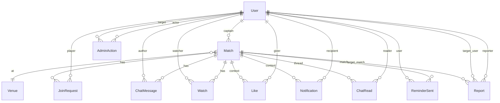

# PITCHUP — Карта приложения

> ⚠ **Эта карта — навигатор + сводки.** **ERD (Главные сущности) и таблица "Что доступно по статусу" — канонические, спека на них ссылается.** Остальные секции — производные от spec-файлов.
> При конфликте: **спека выигрывает** для секций где есть детали в spec-файлах; **ERD и таблица статусов** — источник правды здесь.
>
> **Audit-чеклист в шапке:** миграция `total_spots` — v1 стартует с правилом minimum 8, legacy-матчей нет (свежий проект).
>
> **Последний аудит против спеки:** `2026-05-24` (четыре волны в один день): первая — полировка (минимум `total_spots` поднят с 2 до 8; `captain_crew` уточнён как `NOT NULL DEFAULT '{}'`; добавлены rate limits и CSRF-policy; `likes_reminder` SSE заменён on-read computation; `POST /watch` требует isFull=true; добавлена таблица actions для `my_match_changed`). Вторая — **JoinRequest enum расширен (`cancelled`/`left`/`kicked`); добавлена таблица `revoked_sessions` для banned/delete invalidation; ERD получил колонку Type; зафиксирован audit-note про отсутствие username/handle; Notification.type enum зафиксирован; добавлен Retention policy блок; sub-label для Section Past; ladder-сортировка `/admin/reports`**. Третья — **Venue ERD досинхронизирован со спекой:** добавлены `lat`/`lng` (карта + Haversine), `active bool` (механика деактивации в `/admin/venues`); `surface` исправлен с `text enum` на `text[]` (multi-select grass/hard); `cover_image text` переименован в `cover_id varchar(40)` (унификация с `Match.cover_id`); в [global.md](./pitchup-spec-global.md) "Покрытие поля" зафиксированы backend-токены `grass` / `hard`. Четвёртая — **JWT lifetime зафиксирован = 333 дня** (Auth.js v5 `session.maxAge`), `revoked_sessions` TTL = 334 дня (вместо неопределённого "expiry JWT + 1 день"); опечатка `ushered Watch` → `stale Watch` с уточнением условия (`match.start_time < now()`); **`Match.cover_id` объявлен snapshot `venue.cover_id` на момент INSERT** (денормализация — смена cover у venue не переписывает прошедшие/будущие матчи). Пятая — полировка: `revoked_sessions` TTL в ERD унифицирован до «334 дня» (было «expiry JWT + 1 день»); alias `captain_approved` убран из SSE→notification mapping — остался каноничный `accepted`; в секцию `auth_revoked` добавлен механизм межпроцессной доставки (Postgres `LISTEN/NOTIFY sse_revoke:{user_id}`, heartbeat как fallback). Шестая — defense-in-depth для двух инвариантов: (a) **`POST /join` теперь явно проверяет `user !== match.captain_id`** (новый код `400 captain_cannot_join`) — закрывает прямой curl/баг клиента в обход CTA-каскада; (b) **`cancelled_at` / `cancel_reason` добавлены в "Что нельзя менять"** в `/matches/:id/edit` — PATCH whitelist'ом отбрасывает эти поля, реактивация Cancelled-матча в v1 не поддерживается. Карта (таблица "по статусу", ERD, BottomNav, Cron, стек) не затронута — backend error codes делегированы в match.md. Седьмая — полировка-баги: (a) терминология stub player — "crew member" убран как синоним (противоречил global.md "Тип матча → Терминология"), оставлен единственный канон "stub player"; (b) иконка 🚫 kicked добавлена в enum иконок Updates-панели (global.md); (c) orphan `DELETE /join` в секции Идемпотентность (match.md) заменён на реальные `POST /leave` и `POST /cancel-request`; (d) тап на `/users/:id` из inbox убран — report-notification.type не существует в v1; (e) sign-out описание в personal.md исправлено (copy-paste из Delete account); (f) cover default "рандом" → "детерминированно по venue.id" (personal.md); (g) swipe-up multi-match pin sheet уточнён (discovery.md). Восьмая — **аудит по оси "Состояния"**: (a) **`my_status` mapping расширен** — добавлены on-read правила для `JoinRequest.status ∈ {left, kicked, cancelled}` (все три → CTA-роль `none`, могут переподать); `accepted` разбит на два случая (`cancelled_at IS NULL` → `accepted`, `cancelled_at IS NOT NULL` → `cancelled`); `watching` уточнён до "Watch-запись есть И status ∉ {pending,accepted}"; `kicked` объявлен SSE-only для анимации, on-read = `none` (global.md); (b) **диаграмма игрока**: убрана ошибочная стрелка `Accepted → Rejected: match cancelled` — cancel матча не меняет status accepted JoinRequest, `my_status='cancelled'` derives on-read из `match.cancelled_at` (match.md); (c) **Section Past**: добавлен sub-label `accepted + Cancelled → "Match was cancelled"` (personal.md). История правок живёт в `git log`, в шапке не дублируем.
>
> **Audit checklist** (проходить при каждой правке спеки и после длительных правок карты):
> - [x] Стек (Next.js 15 + Postgres + Prisma + Auth.js v5 + MapLibre) — сверено с [global.md](./pitchup-spec-global.md)
> - [x] BottomNav: 5 табов (My matches | Games | Map | Chats | Me), pill-стиль. Таб #5 называется `Me`; "Profile" — только для контента внутри `/me` и страницы `/users/:id`.
> - [x] TopBar: лого + 🔔, **аватара нет** (свой профиль — через BottomNav `Me`)
> - [x] Login: Google OAuth, **никаких magic link / email-пароль**. JWT claims (`googleSub` / `email` / `name` / `picture`) и расширение до второго провайдера — описаны в [global.md](./pitchup-spec-global.md) "Что лежит в JWT". **JWT lifetime = 333 дня** (Auth.js v5 `session.maxAge`), refresh-flow в MVP нет — см. "Аутентификация" в [global.md](./pitchup-spec-global.md).
> - [x] PWA / Web Push: **v1.1**, не MVP. В MVP — Notification API (browser notifications) + email + in-app inbox. Morning reminder не дублируется в browser (фронт фильтрует по `type` — см. [global.md](./pitchup-spec-global.md) "Real-time sync", `notification_added`).
> - [x] Cron-список: morning reminder ×2 (10:00 и 20:00 Europe/Prague) + auto-reject pending (каждые 5 минут при `now() >= start_time`) + inbox TTL cleanup (раз в сутки, 30 дней) — сверено с [match.md](./pitchup-spec-match.md) (секция "Cron-задачи") и таблицей "Cron-задачи" ниже.
> - [x] Жизненный цикл матча и игрока — single source в [match.md](./pitchup-spec-match.md) ("Состояния матча", "Состояния игрока на матче"). В карте — только ссылка, mermaid'ов больше нет. `my_status` в SSE — UI-derived enum, не = `JoinRequest.status`; маппинг — в [global.md](./pitchup-spec-global.md) "Real-time sync".
> - [x] Сущности (User / Match / JoinRequest / Watch / ChatMessage / ChatRead / Venue / Like / Notification / Report / AdminAction / ReminderSent / **revoked_sessions**) — модель User сведена: канон `is_admin: bool`. **User — НЕТ поля `handle/username`.** Идентификация в UI = name + avatar (см. global.md). Decision в v1.1 если понадобится. `Watch`, `Like`, `ChatRead`, `ReminderSent` без `id` — composite PK (см. ERD ниже). `Notification` — отдельная таблица под in-app inbox (UI-термин), TTL 30 дней; `ChatRead` — `last_read_at` per пара (user, match), источник правды для unread dots в `/chats`. `Report` — жалобы с UNIQUE(reporter, target) для дедупа. `AdminAction` — audit-лог promote/demote/ban/unban. `ReminderSent` — идемпотентность morning reminder cron'а. `revoked_sessions` — JWT-blacklist для banned/delete-account инвалидации. **`Venue`** содержит `lat`/`lng` (карта + Haversine, см. [discovery.md](./pitchup-spec-discovery.md)), `surface text[]` (multi-select `grass`/`hard`), `cover_id varchar(40)` (та же палитра что у Match, дефолт детерминированный по `venue.id` — см. [global.md](./pitchup-spec-global.md) "Cover venue"), `active bool` (NOT NULL DEFAULT true, защита от деактивации с upcoming-матчами — см. [personal.md](./pitchup-spec-personal.md) "/admin/venues").
> - [x] Cancelled и In progress: что разрешено/запрещено (Edit, Cancel, Leave, Cancel request) — см. таблицу "Что доступно по статусу" ниже

---

> Веб-приложение для пикап-футбола в Праге. Капитан создаёт матч → игроки находят и подают заявку → капитан апрувит → играют.
> **Stack:** Next.js 15 (App Router) + TypeScript + Tailwind + shadcn/ui + Postgres + Prisma + Auth.js v5 (Google) + MapLibre/OSM. Mobile-first, 480px центральный контейнер. **PWA — v1.1, не MVP.**

---

## 👥 Роли

| Роль | Что может |
|---|---|
| **Гость** (не залогинен) | Смотреть `/games`, `/map`, `/matches/:id`, профили. Не может Join, чат, лайкать. |
| **Player** (залогинен) | Всё что гость + Join/Leave/Watch/чат/лайки. |
| **Captain** (player, создал матч) | Всё что player + Create/Edit/Cancel match, Approve/Reject, Kick, удалять чужие сообщения в своём чате. |
| **Admin** | Бан, модерация, hide text, `/admin/*`. |

---

## 🗺 Карта экранов

```
┌─ Публичные ────────────────────────────────────────┐
│  /                  лендинг                        │
│  /login             Google OAuth (Auth.js v5)      │
│  /welcome           онбординг (после первого входа)│
│  /legal/terms                                      │
│  /legal/privacy                                    │
└────────────────────────────────────────────────────┘

┌─ Discovery (для всех) ─────────────────────────────┐
│  /games             список матчей + фильтры        │
│  /map               карта матчей с пинами          │
│  /matches/:id       страница матча (2 таба)        │
│    └─ Tab: Lineup | Chat                           │
│  /users/:id         публичный профиль игрока       │
└────────────────────────────────────────────────────┘

┌─ Личное (требует логин) ───────────────────────────┐
│  /my-matches        главная: Upcoming/Past/Captain │
│  /chats             все чаты матчей юзера          │
│  /me                настройки, notifications,      │
│                     account actions                │
└────────────────────────────────────────────────────┘

┌─ Капитан / создание ───────────────────────────────┐
│  /matches/new       wizard 3 шага                  │
│  /matches/:id/edit  редактирование (до старта)     │
└────────────────────────────────────────────────────┘

┌─ Admin (только админ) ─────────────────────────────┐
│  /admin/users       список юзеров, бан             │
│  /admin/matches     все матчи, модерация           │
│  /admin/venues      справочник стадионов           │
│  /admin/reports     жалобы                         │
└────────────────────────────────────────────────────┘
```

---

## 🧭 Навигация (BottomNav, 5 табов, pill-стиль активного)

| # | Таб | URL | Label | Кому |
|---|---|---|---|---|
| 1 | My matches | `/my-matches` | "My matches" | auth-only (для гостя — disabled) |
| 2 | Games | `/games` | "Games" | guest + auth |
| 3 | Map | `/map` | "Map" | guest + auth |
| 4 | Chats | `/chats` | "Chats" | auth-only (для гостя — disabled) |
| 5 | Me | `/me` | "Me" | auth-only (для гостя — disabled) |

Таб 5 — превью профиля (аватар, имя) + настройки (Notifications, Sign out, Delete account).

**BottomNav скрыт на `/welcome` целиком** — юзер не прошёл онбординг, тапы вызывали бы редиректы обратно через middleware-guard. Выходы с `/welcome` — только `[Get started →]` или `Sign out` в TopBar.

**TopBar (auth):** лого слева + 🔔 справа. **Аватара нет** — свой профиль через BottomNav `Me`.
**TopBar (guest):** лого слева + `[Sign in]` справа.
**TopBar (/welcome):** лого слева + ghost-ссылка `Sign out` справа (вместо 🔔).

`[+ New match]` — обычная кнопка в top bar на `/games` и `/map` (не FAB).

---

## ⚽ Жизненный цикл матча и игрока

Mermaid-диаграммы и текстовые правила — **источник правды в** [match.md](./pitchup-spec-match.md):

- **Состояния матча** (Open / AlmostFull / Full / InProgress / Ended / Cancelled) → [match.md → "Состояния матча"](./pitchup-spec-match.md).
- **Состояния игрока на матче** (none / pending / accepted / watching, + Rejected с auto_reason) → [match.md → "Состояния игрока на матче"](./pitchup-spec-match.md).

Состояние матча **вычисляется on-read** из `start_time` + `duration` + `cancelled_at` — нет cron для перехода между статусами. Cron существует только для `auto-reject pending` (см. секцию "Cron-задачи" ниже).

---

## 🔒 Что доступно по статусу матча

Сводная таблица. Источник правды — CTA-каскад в [match.md](./pitchup-spec-match.md) (секции "CTA bar" и "Reject / Kick / Leave flows"). Полный реестр кодов конфликта (`409 match_locked` / `409 over_capacity` / `409 already_processed` / ...) и lock-стратегия — в [match.md → "Конкурентность и блокировки"](./pitchup-spec-match.md).

| Действие | Open / AlmostFull / Full | In progress | Ended | Cancelled |
|---|---|---|---|---|
| **Join match** (player) | ✅ (live + есть слот / есть `[Notify me]` если full) | ❌ disabled `"Match in progress"` | ❌ disabled `"Match ended"` | ❌ disabled `"Match cancelled"` |
| **Cancel request** (pending) | ✅ | ❌ скрыт (pending уже auto-rejected или окно 5 мин) | ❌ | ❌ (pending → rejected `auto_reason=match_cancelled`) |
| **Leave match** (accepted) | ✅ | ❌ намеренно — матч считается состоявшимся | ❌ | ❌ |
| **Like teammates** (captain / accepted) | ❌ | ❌ | ✅ | ❌ |
| **Edit match** (captain) | ✅ (до `start_time`) | ❌ | ❌ | ❌ |
| **Cancel match** (captain) | ✅ (до `start_time`) | ❌ | ❌ | ❌ (уже cancelled) |
| **Approve / Reject pending** (captain) | ✅ | ❌ `409 match_locked` | ❌ | ❌ |
| **Kick accepted** (captain) | ✅ | ❌ | ❌ | ❌ |
| **`[Manage match]` кнопка** (только капитан на live; для всех остальных ролей и статусов — отсутствует в DOM) | ✅ активна | ❌ не рендерится — CTA: `"Match in progress"` | ❌ не рендерится — CTA: `[Like teammates]` / `"Match ended"` | ❌ не рендерится — CTA: `"Match cancelled"` |
| **Shuffle teams** (captain) | ✅ (если `filled ≥ 4`) | ✅ намеренно — оффлайн-координация | ✅ | ❌ |
| **Чат — читать** | ✅ все (гость = snapshot, без SSE) | ✅ | ✅ | ✅ (по прямой ссылке) |
| **Чат — читать (по роли)** | Captain/Accepted: ✅; Pending: ❌ (Tab disabled, см. match.md); Watching: ✅ read-only (как гость); Guest: ✅ read-only snapshot, без SSE; Left/Kicked: ✅ read-only (история чата доступна в Past) | — | — | — |
| **Чат — писать** | ✅ accepted + captain | ✅ accepted + captain | ✅ accepted + captain (post-match координация) | ❌ read-only для всех, инпут скрыт, backend `409 chat_frozen` |
| **Чат — удалить сообщение** (captain) | ✅ | ✅ | ✅ | ✅ модерация работает даже на read-only-фризе |
| **Виден в `/games`, `/map`** | ✅ | ❌ только в `/my-matches` у своих (accepted, captain) + прямая ссылка | ❌ уходит из publics | ❌ уходит из publics |
| **Прямая ссылка `/matches/:id`** | ✅ | ✅ | ✅ | ✅ |

---

## 🧩 Главные сущности



| Сущность | Поля | Type |
|---|---|---|
| **User** | id / google_sub (unique, primary OAuth identifier — middleware lookup'ает по нему) / email / name / avatar_url / contact_info / email_notifications (default true) / is_admin / banned / created_at. Row создаётся **только** при завершении онбординга — пока юзер не нажал `[Get started →]` на `/welcome`, его в БД нет (см. "Guard онбординга" в spec-global.md). **`name` / `avatar_url` / `email` — снапшот в момент онбординга, не sync с Google на последующих sign-in** (см. "Google profile — snapshot, не sync" в [global.md](./pitchup-spec-global.md)). **НЕТ поля `handle/username`** — см. audit-checklist. | id `uuid` / google_sub `text` / email `text` / name `text` / avatar_url `text` / contact_info `text` / email_notifications `bool` / is_admin `bool` / banned `bool` / created_at `timestamptz` |
| **Match** | id / captain_id / venue_id / start_time / duration (минуты) / total_spots / price (Kč) / surface (enum) / studs_allowed / field_booked / description / **captain_crew NOT NULL DEFAULT '{}'** (никогда NULL — `captain_crew.length` всегда безопасен; пустой crew = open match) / cancelled_at / cancel_reason / description_hidden / cancel_reason_hidden (см. "Hide text (модерация)" в [personal.md](./pitchup-spec-personal.md)) / cover_id | id `uuid` / captain_id `uuid FK` / venue_id `uuid FK` / start_time `timestamptz` / duration `int` / total_spots `smallint` / price `int` / surface `text` enum / studs_allowed `bool` / field_booked `bool` / description `text` / captain_crew `text[]` / cancelled_at `timestamptz null` / cancel_reason `text null` / description_hidden `bool` / cancel_reason_hidden `bool` / cover_id `varchar(40)` |
| **JoinRequest** | id / match_id / user_id / status (`pending` / `accepted` / `rejected` / `cancelled` / `left` / `kicked`) / guest_count (0..4) / message / auto_reason (NULL / `match_started` / `match_cancelled`) / created_at / updated_at. **UNIQUE(match_id, user_id)** — одна строка на пару. **Leave/Kick/Cancel-request — UPDATE status, не DELETE.** Это позволяет показывать в Past матчи где юзер был и ушёл/был кикнут (см. personal.md → Section Past). Re-apply после Reject = UPDATE status→pending (не новый INSERT). | id `uuid` / match_id `uuid FK` / user_id `uuid FK` / status `text` enum / guest_count `smallint` / message `text null` / auto_reason `text null` / created_at `timestamptz` / updated_at `timestamptz` |
| **Watch** | match_id / user_id (просто флаг "подписан"). **Composite PK (match_id, user_id)** — без отдельного `id`. | PK (match_id `uuid`, user_id `uuid`) |
| **ChatMessage** | id / match_id / author_id / text / created_at / deleted_at | id `uuid` / match_id `uuid FK` / author_id `uuid FK` / text `text` / created_at `timestamptz` / deleted_at `timestamptz null` |
| **ChatRead** | match_id / user_id / last_read_at. **Composite PK (match_id, user_id)** — одна строка на пару. Unread = существует ли `ChatMessage` с `created_at > last_read_at AND deleted_at IS NULL` для этого `(match_id, user_id)`. UPSERT при открытии Tab Chat / при `chat_read_sync` SSE. Row создаётся лениво (первое открытие чата) — отсутствие row = "ничего не читал", unread = все сообщения чата. См. "Unread chat dots" в [personal.md](./pitchup-spec-personal.md). | PK (match_id, user_id) / last_read_at `timestamptz` |
| **Venue** | id / name / address / lat / lng / google_maps_url / surface (массив `text[]` из значений `grass` / `hard`, multi-select — у одного venue может быть оба, см. "Покрытие поля" в [global.md](./pitchup-spec-global.md)) / cover_id (см. "Cover venue" в [global.md](./pitchup-spec-global.md), не enum БД — валидация на app-уровне) / active (NOT NULL DEFAULT true, защита от деактивации с upcoming-матчами — см. "/admin/venues" в [personal.md](./pitchup-spec-personal.md)) | id `uuid` / name `text` / address `text` / lat `double precision` / lng `double precision` / google_maps_url `text` / surface `text[]` / cover_id `varchar(40)` / active `bool` |
| **Like** | match_id / giver_id / receiver_id. **Composite PK тройка** = UNIQUE — один лайк на пару + матч, без отдельного `id`. | PK (match_id, giver_id, receiver_id) |
| **Notification** | id / user_id / type (`approved` / `rejected` / `kicked` / `match_cancelled` / `match_updated` / `spot_opened` / `morning_reminder`) / match_id (nullable — у будущих типов без матча) / body (короткий текст) / created_at / read_at (nullable; NULL = непрочитано). **Mapping SSE action → notification.type — в [global.md](./pitchup-spec-global.md) → "Real-time sync".** **Index:** `(user_id, created_at DESC)` для панели Updates. **TTL:** строки старше 30 дней чистятся кроном (см. "Cron-задачи"). Red dot на 🔔 = `EXISTS (notification WHERE user_id=? AND read_at IS NULL)`. Mark-as-read = UPDATE всех `read_at IS NULL` → `now()` для user_id (при открытии панели Updates). | id `uuid` / user_id `uuid FK` / type `text` enum / match_id `uuid null FK` / body `text` / created_at `timestamptz` / read_at `timestamptz null` |
| **Report** | id / reporter_id / type (`match` / `player`) / target_match_id (nullable, NOT NULL когда type=`match`) / target_user_id (nullable, NOT NULL когда type=`player`) / comment (max 500) / status (`new` / `reviewed` / `dismissed`) / created_at / reviewed_at (nullable) / reviewed_by (nullable, admin user_id). **UNIQUE(reporter_id, type, target_match_id, target_user_id)** — повторная жалоба от того же юзера на тот же объект backend возвращает 200 без INSERT (тихий дедуп, см. "Модалка отправки" в [personal.md](./pitchup-spec-personal.md)). **Index:** `(status, created_at DESC)` для списка в `/admin/reports`. Сохраняется навсегда (нет TTL — нужен для апелляций / истории нарушений). | id `uuid` / reporter_id `uuid FK` / type `text` enum / target_match_id `uuid null FK` / target_user_id `uuid null FK` / comment `text` / status `text` enum / created_at `timestamptz` / reviewed_at `timestamptz null` / reviewed_by `uuid null FK` |
| **AdminAction** | id / actor_admin_id / target_user_id / action (`promote` / `demote` / `ban` / `unban`) / reason (text, required) / created_at. Audit-лог для управления админскими ролями и банами. В UI v1 не показывается (читается напрямую из БД для апелляций / расследований). См. "Admin role management & safety" в [personal.md](./pitchup-spec-personal.md). | id `uuid` / actor_admin_id `uuid FK` / target_user_id `uuid FK` / action `text` enum / reason `text` / created_at `timestamptz` |
| **ReminderSent** | match_id / user_id / kind (`morning_reminder`). **Composite PK тройка** = UNIQUE — идемпотентность morning reminder cron'а через `INSERT ON CONFLICT DO NOTHING`. Никакого `id`, `created_at` (опционально, для дебага). Чистится тем же inbox-TTL cron'ом для матчей, завершившихся > 7 дней назад. См. "DST + идемпотентность" в "Cron-задачах" ниже и в [match.md](./pitchup-spec-match.md). | PK (match_id, user_id, kind `text` enum) |
| **revoked_sessions** (НОВАЯ) | jti / user_id / revoked_at. Используется для banned/delete-account инвалидации JWT. INSERT происходит в той же транзакции что и ban/delete-account (см. "Banned-инвалидация" в [global.md](./pitchup-spec-global.md) и `Sign out / Delete account` в [personal.md](./pitchup-spec-personal.md)). **TTL:** 334 дня (JWT lifetime 333 + 1 день запаса), чистится в том же inbox cron'е (см. Retention policy и Cron-задачи). | jti `text PK` / user_id `uuid FK` / revoked_at `timestamptz` |

> ⚡ Слоты на матче — единая формула `computeSlots(match)`, источник правды — секция **"Slot math"** в [pitchup-spec-global.md](./pitchup-spec-global.md). Кратко: `filled = 1 (captain) + captain_crew.length + Σ(accepted JoinRequest: 1 + guest_count)`. Все компоненты / API / SQL **обязаны** ходить через одну функцию, не пересчитывать локально.
>
> **Важно для нового статус-enum:** `accepted` в формуле — это `JoinRequest.status = 'accepted'`. Статусы `left`, `kicked` **НЕ входят** в `filled` (после Leave/Kick слот свободен). Статусы `cancelled`, `rejected`, `pending` — тоже **НЕ входят**.

---

## 🎯 Три типа "не-юзера" в Lineup

Это часто путают, фиксирую.

**Канонические термины:** запись в `captain_crew[]` — **stub player**. Массив целиком — **crew**. Термин "crew member" не каноничен и не используется — см. [global.md](./pitchup-spec-global.md) "Тип матча → Терминология".


| Тип | Что это | Откуда | Где видно |
|---|---|---|---|
| **Stub player** (запись из `captain_crew`) | Имя-строка, заданная капитаном при создании. Серый чип с first name, не кликабелен. | Капитан вводит chip-input'ом в `/matches/new` или `/edit` | Tab Lineup, мини-ростер MatchCard |
| **Guest** (анонимный +N) | Анонимный спутник, привязан к заявке игрока. Имени нет, рендерится как бейдж `+N` на чипе хозяина. | Игрок указывает stepper'ом в Join-модалке (0..4) | Бейдж рядом с именем accepted/pending |
| **Watching** | Юзер, подписавшийся на "уведомить если слот откроется". | Тап `[Notify me]` на full матче | НЕ виден в Lineup (внутренний флаг); капитан видит счётчик "N watching" |

**Stub Pavel → real Pavel:** автоматической связи нет. Капитан жмёт `[✓]` — real Pavel становится accepted, серый stub остаётся в Lineup. Чтобы схлопнуть — `[Edit match]` → удалить чип из crew chip-input. Никаких модалок и сравнения имён (см. "Approve flow" в [pitchup-spec-match.md](./pitchup-spec-match.md)).

---

## 📨 Уведомления

| Канал | Когда | Кому |
|---|---|---|
| 📧 **Email** (узкий) | Approve, Kick, Morning-of-match reminder | себе |
| 🔔 **In-app inbox** (🔔 в TopBar) | Всё остальное: Reject, Cancel match, "slot opened" для watching, edit details | себе |
| 🌐 **Browser** (Notification API) | Опционально — повторяет in-app | себе, если разрешил |

Web Push (фоновые / iOS Safari) → v1.1 с PWA.
SSE — два канала: per-match `/api/matches/:id/stream` (чат, Lineup, статус) + global `/api/updates/stream` (inbox red dot, счётчики).

---

## 🔁 Ключевые потоки

### Join match
```
Player на /matches/:id
  → [Join match] (CTA в потоке страницы, не sticky)
  → Модалка: stepper "Bringing friends 0..4" + message
  → [Send request] → POST /api/matches/:id/join
  → Pending. Captain видит в Lineup + captain sheet
```

### Approve (captain)
```
Captain в Tab Lineup или captain sheet
  → [✓] на pending (disabled если 1+guest_count > free — hard cap)
  → Approve мгновенный, без модалки → Pending → Accepted
  → Email игроку: "✓ You're in"
```
**Hard cap.** `total_spots` — жёсткий потолок: backend reject'ит approve, который дал бы `filled > capacity`, UI дублирует disabled-кнопкой с tooltip `"Not enough spots — increase Total or reject"`. Чтобы принять больше — `[Edit match] → Total spots [+]`. Edit total ↓ ограничен снизу current `filled` (см. "Total spots — hard cap для approve" в [pitchup-spec-global.md](./pitchup-spec-global.md)).

### Leave / Kick
```
Player: [Leave match] → reason → освобождает слот(ы) (1+N если с гостями)
Captain: [Kick] → confirm → освобождает слот(ы), email кикнутому
→ В обоих случаях: in-app "🟢 A spot just opened" всем watching + captain, и все Watch-записи на матче снимаются в той же транзакции — но только при переходе `isFull: true → false` (watch-записи существуют лишь когда матч был full, противоречий нет; см. `notify watching` в spec-match.md)
```

### Cancel match (captain, только до start_time)
```
[Manage match] → [Cancel match] → modal с обязательной reason
→ Баннер на странице "Match cancelled · [reason]"
→ Матч уезжает из public discovery и из Upcoming
→ In-app уведомление accepted и pending (не email); watching — тихо удаляются без уведомления
```

---

## ⏰ Cron-задачи

> Источник правды — [global.md](./pitchup-spec-global.md) → "Cron-задачи". Здесь — сводка.

| Job | Когда | Что делает |
|---|---|---|
| **Morning reminder (утро)** | 10:00 Europe/Prague | Email accepted + капитану на матчи сегодня `start_time >= now()` (т.е. ≥ 10:00; матчи до 10:00 к этому моменту уже в прошлом — они получили вечернее накануне) |
| **Morning reminder (вечер)** | 20:00 Europe/Prague | Email accepted + капитану на матчи завтра 00:00–11:59 (покрывает и матчи до 10:00, которые не попадут в утренний cron) |
| **Auto-reject pending** | каждые 5 минут | Реджектит pending на матчах где `now() >= start_time` (auto_reason = `match_started`) |
| **Inbox TTL cleanup** | раз в сутки, 03:00 Prague | `DELETE FROM notification WHERE created_at < now() - interval '30 days'`. Также чистит `reminder_sent` для матчей, завершившихся > 7 дней назад; **stale `Watch` для прошедших матчей** (`Watch WHERE match.start_time < now()` — `spot_opened` на прошедший матч не шлётся, запись бесполезна); **`revoked_sessions` старше 334 дней** (JWT lifetime 333 + 1 день запаса — см. "Аутентификация" в [global.md](./pitchup-spec-global.md) и Retention policy ниже). |

Это **единственные** cron'ы. Статус матча, "spot opened" и пр. — on-read / event-driven.

---

## 🧹 Retention policy

- **JoinRequest, ChatMessage, Like** — без TTL (нужны для истории / Section Past, лайков, апелляций).
- **Cancelled-матчи без участников** и связанные данные — рассмотреть TTL в v1.1 (в v1 живут вечно для аудита).
- **Notification, ReminderSent** — TTL в кроне (см. Cron-задачи выше).
- **revoked_sessions** — TTL = 334 дня (JWT lifetime 333 + 1 день запаса, см. "Аутентификация" в [global.md](./pitchup-spec-global.md)). Чистится в том же inbox cron.
- **Watch** — stale записи для прошедших матчей (`match.start_time < now()`) чистятся в том же inbox cron — Watch на in-progress / past матч бесполезен (`spot_opened` не шлётся).

**DST + идемпотентность.** Cron'ы morning reminder зарегистрированы в TZ `Europe/Prague` (не UTC), чтобы локальное "10:00" / "20:00" не съезжало дважды в год. Spring-forward и fall-back на 10:00 не влияют. Защита от дубля при ретраях / рестартах — таблица `reminder_sent(match_id, user_id, kind)` с `UNIQUE(match_id, user_id, kind)`, отправка через `INSERT ON CONFLICT DO NOTHING`. Подробности — в "Cron-задачи" в [match.md](./pitchup-spec-match.md).

---

## ✂️ Что осознанно НЕ в v1

- Web Push / PWA install / iOS Safari notifications → v1.1
- Команды и авто-баланс в Lineup
- Передача капитанства
- Перенос матча (только cancel + new)
- Отмена матча после `start_time`
- DM между игроками (только чат матча)
- Repeat/recurring matches
- Stats игрока, репутация, no-show
- Repeat crew между матчами, invite-link для stub'ов
- Авто-открытие лайк-модалки на `/my-matches` (есть карточка-напоминалка)
- Платежи, оплата поля в приложении

Подробнее → [pitchup-spec-personal.md](./pitchup-spec-personal.md) "Известные пробелы" и "Что НЕ делаем в v1".

---

## 📚 Где искать детали

| Тема | Файл |
|---|---|
| Глобальные решения, компоненты UI | [pitchup-spec-global.md](./pitchup-spec-global.md) |
| Discovery (`/games`, `/map`) | [pitchup-spec-discovery.md](./pitchup-spec-discovery.md) |
| Матч (страница, edit, create, captain flows) | [pitchup-spec-match.md](./pitchup-spec-match.md) |
| Личные экраны, профиль, админка | [pitchup-spec-personal.md](./pitchup-spec-personal.md) |

Полный навигатор → [pitchup-spec-INDEX.md](./pitchup-spec-INDEX.md).
