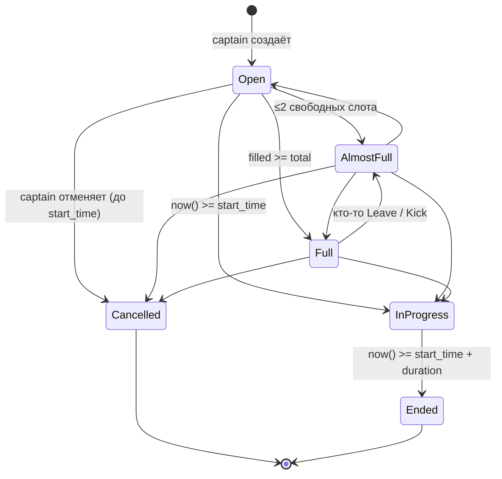
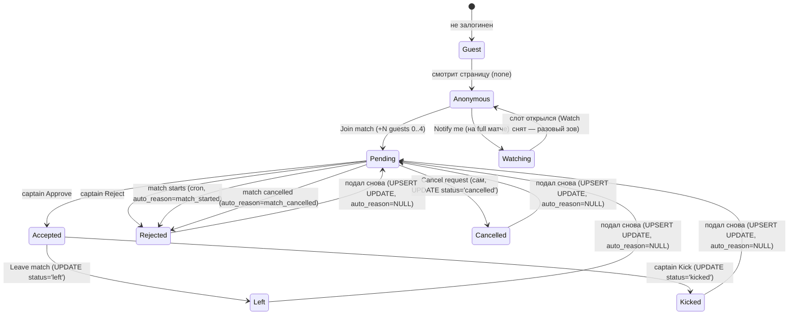

# PITCHUP — Спека: матч (страница, редактирование, создание)

> Часть спеки. Карта всех файлов — [INDEX](./pitchup-spec-INDEX.md).
> ⚠ **После правки этого файла** — пройди audit-checklist в шапке [pitchup-app-map.md](./pitchup-app-map.md) и синхронно обнови карту, если затронуты пункты чек-листа (стек, нав, TopBar, login, PWA, cron, lifecycle, сущности).
> Здесь: `/matches/:id` (детали, ростер, чат, CTA, captain sheet, состояния), `/matches/:id/edit`, `/matches/new`.

---

## `/matches/:id` — Страница матча

**Layout — обычная скроллируемая страница, без sticky элементов:**

```
[← Back]                                    [⋯]

┌───────────────────────────────────────────┐
│           Hero cover venue (16:9)         │
└───────────────────────────────────────────┘

Letná Park                                  H1
150 Kč / person

📅 Sat 21 Jun · 18:00   (in 3h 20m)
⏱ 90 min
📍 Milady Horákové 23             [Open map ↗]

Bring your boots, no long studs...
(description капитана; пусто → блок скрыт)

🌱 Grass · No studs · Bring: Rubber only
[аватар]  Ivan Novak  Captain

🟢 9/14 players · 5 spots open  →  (тап → Lineup)

[ CTA — зависит от роли/статуса ]

──────────────────────────────────────────
[ Lineup ]                    [ Chat ]
──────────────────────────────────────────
(контент выбранного таба, скроллится дальше)
```

**Элементы страницы (сверху вниз):**
1. `[← Back]` слева · `[⋯]` справа (share / report — см. ниже)
2. Hero cover venue (16:9) — предзаготовленная иллюстрация-аватарка (см. "Cover venue" в [global.md](./pitchup-spec-global.md))
3. Название venue (H1)
4. Цена: `{price} Kč / person` или `Free`
5. `📅` дата + время + countdown `(in 3h 20m)` если до старта < 24ч · `⏱` длительность · `📍` адрес + `[Open map ↗]`
6. **Description** — текст капитана, инструкции для игроков. Если `description_hidden = true` (модерация) — плейсхолдер `"[Description removed by moderator]"` серым. Если описания нет — блок скрыт.
7. `🌱 Grass` / `🏟️ Hard surface` + `Studs OK` / `No studs` (только для Grass) · `Bring: [обувь]` (вычисляется по surface + studs_allowed, см. "Покрытие поля" в [global.md](./pitchup-spec-global.md))
7a. **Field not booked** — если `field_booked = false`: строка `Field not yet booked` серым, мелким шрифтом, без акцента. Если `field_booked = true` — строка скрыта.
8. Organizer: аватар + имя + бейдж `Captain`. Тап → `/users/:id`
9. **Счётчик слотов** — `"9/14 players · 5 spots open"` (тапабельно → переключает таб на Lineup и скроллит к нему) / `"Match full"`. Цвет: зелёный если есть слоты, оранжевый ≤2 (`"1 spot left"`), красный если full.
10. **CTA** — зависит от роли и статуса матча (см. "CTA" ниже). Обычный блок в потоке страницы, не sticky.
11. **Tab bar** `[ Lineup ] [ Chat ]` — переключатель, два таба. Контент выбранного таба разворачивается ниже в том же скролле. **Дефолтный таб — Lineup.** Deep-link `?tab=chat` открывает страницу сразу на Tab Chat (см. ниже).
12. **Tab Lineup** / **Tab Chat** — детально в разделах ниже.

**Deep-link `?tab=chat`:** нужно для перехода с `/chats → MatchCard` (юзер пришёл из таба чатов, ожидает чат — не должен делать лишний тап). Frontend при загрузке: если `searchParams.get('tab') === 'chat'` → активный таб = Chat, параметр удаляется из URL через `router.replace` (как с `?sheet=captain` — чтобы не залипал в истории и не открывался при F5/back). Tab bar остаётся видимым и кликабельным — юзер всегда может переключиться на Lineup одним тапом. Любое другое значение `tab` или отсутствие параметра → Lineup. Сочетание с `?sheet=captain` допустимо (sheet откроется поверх, активный таб под ним = Chat), хотя боевого юзкейса для комбинации в v1 нет.

**Tab Lineup** (детально в разделе "Tab Lineup" ниже)
**Tab Chat** (детально в разделе "Tab Chat" ниже)

### CTA bar

**Источник правды — каскад ниже.** Сначала проверяем гостя, потом ветвимся по статусу **матча** и роли **юзера**. Параллельных reference-таблиц нет — раньше дублировали, рассинхронились, выпилили (см. примечание после каскада).

#### Инварианты (на них держится каскад)

1. **Статус матча exclusive.** Матч всегда ровно в одном из: `Open` / `AlmostFull` / `Full` / `InProgress` / `Ended` / `Cancelled`. Статус вычисляется on-read из `start_time` + `duration` + `cancelled_at` через единый helper (см. "Состояния матча" ниже). Для каскада `Open` / `AlmostFull` / `Full` сливаются в ветку **"live"** — отличаются только наполненностью слотов внутри неё.
2. **Роль юзера на матче exclusive.** На паре `(user, match)` юзер ровно в одном из: `captain` / `accepted` / `pending` / `watching` / `none`. Гарантируется транзакциями:
   - Captain — assigned при создании матча, не меняется. Captain **не может** быть accepted/pending/watching/none на свой матч (его слот = 1 + `captain_crew.length`).
   - approve: `pending → accepted` атомарно.
   - join: создание `pending` в той же транзакции удаляет Watch-запись если была (см. "Watching логика" ниже).
   - leave / kick / cancel-request: `accepted/pending → none`, Watch не возвращается автоматически.
3. **Гость** = нет сессии. Это **отдельная ветвь** до проверки роли — у гостя нет `(user, match)` пары вообще.

#### Каскад

```
match.status?
├─ Cancelled    → disabled "Match cancelled"                       (любая роль, включая гостя)
├─ Ended        → user ∈ {captain, accepted}?
│                   yes → [Like teammates]
│                   no  → disabled "Match ended"                   (включая гостя)
├─ InProgress   → disabled "Match in progress"                     (любая роль, включая гостя и captain)
└─ live (Open / AlmostFull / Full)
    └─ guest?
        ├─ yes → disabled [Sign in to join]
        └─ no  → user.role?
            ├─ captain   → [Manage match]
            ├─ accepted  → [You're in ✓]  +  [Leave match]
            ├─ pending   → disabled [Waiting for organizer...]  +  [Cancel request]
            │              (если match.isFull → доп. строка снизу
            │               "Match is now full · captain may still approve")
            ├─ watching  → "You'll be notified if a spot opens"  +  [Stop watching]
            │              (роль watching существует только когда `match.isFull === true` —
            │               backend `POST /watch` отбивает не-full матчи с `409 not_full`,
            │               и `notify watching` синхронно снимает все Watch при переходе
            │               isFull: true → false. См. "Watching логика" ниже.)
            └─ none      → match.isFull?
                            yes → [Notify me if a spot opens]
                            no  → [Join match]
```

**Status-first.** Статус матча проверяется **раньше** роли (включая `guest`). На завершённых матчах (Cancelled / Ended / InProgress) гость видит тот же disabled-CTA что залогиненный, не `[Sign in to join]` — джойниться там некуда, логин ничего не изменит. `[Sign in to join]` появляется только на live-статусах, где CTA действительно открыл бы action.

`match.isFull` = `computeSlots(match).free === 0`. Единственная функция считает заполненность — см. "Slot math" в [global.md](./pitchup-spec-global.md).

> **Источник правды по CTA — каскад выше.** Никаких параллельных reference-таблиц в этом файле и в [app-map.md](./pitchup-app-map.md). Раньше дублировали — два места рассинхронились. Если нужна "одна строка по статусу" — таблица "Что доступно по статусу" в карте, но и она про действия, а не про текст CTA.

#### Заметки по веткам

- **Pending на InProgress.** Запись `pending` в InProgress физически **не должна существовать** — cron каждые 5 минут реджектит pending при `now() >= start_time` (см. "Reject / Kick / Leave flows" ниже). Но в окне до 5 минут после старта она может ещё висеть. В этом окне CTA показывается по match-state ветке (`disabled "Match in progress"`), а не по user-role — `[Cancel request]` скрыт. Каскад match-first гарантирует одинаковый disabled-стейт независимо от того, успел cron сработать или нет.
- **Pending на Cancelled.** Если матч отменили пока юзер ждал апрув — backend проставляет его pending в `rejected` с `auto_reason = match_cancelled` (см. "Cancel match" в captain sheet ниже). На странице матча CTA = `disabled "Match cancelled"` по match-state ветке, роль уже не важна.
- **Ended + captain.** Captain получает тот же `[Like teammates]`, что и accepted — он считается участником своего матча. Никакого "captain не может лайкать" — может, кроме себя самого (модалка отфильтрует).
- **InProgress + captain.** Manage / Edit / Cancel недоступны после старта (см. "Reject / Kick / Leave flows" ниже). Каскад это закрывает одной веткой — никакой "captain-после-старта" специальной строки не нужно.
- **Watching ⇒ isFull (инвариант).** На live-матче роль `watching` физически существует только при `match.isFull === true`. Backend `POST /watch` отбивает не-full матчи с `409 not_full` (см. "Per-endpoint checklist" ниже), а `notify watching` синхронно удаляет все Watch-записи в той же транзакции, что меняет `isFull: true → false` (Leave / Kick / Edit total↑ / Edit remove stub). Любая страница матча с ролью `watching` гарантированно показывает full-стейт. Отдельной ветки `watching + !isFull` в каскаде нет.

**Join flow (модальное окно при нажатии Join):**
- Stepper `Bringing friends [− 0 +]` (диапазон 0..4, default 0). Каждый гость = ещё один слот. Подпись под stepper: "Guests are anonymous — they count as extra spots and can't apply separately."
- Textarea "Message to organizer (optional)"
- `[Send request]` / `[Cancel]`
- Сообщение и `guest_count` видны капитану в captain sheet и в Tab Lineup (бейдж `+N` рядом с именем pending-игрока).

**Notify me flow:**
- Тап `[Notify me if a spot opens]` — никакой модалки, просто подписка одним тапом. Toast `"We'll ping you next time a spot opens."` Слово **next** намеренное: подписка разовая (см. "Watching логика" ниже).
- **Backend-проверка `isFull === true`.** `POST /watch` отбивает не-full матчи с `409 not_full` (см. "Per-endpoint checklist" ниже). UI кнопку `[Notify me]` на не-full матче и так не показывает (см. CTA-каскад), но 409 закрывает редкие гонки: юзер открыл full-матч в фоне, кто-то Leave-нул и `notify watching` уже разослал пуши, юзер вернулся через минуту и тапнул `[Notify me]` не видя обновления → backend отвечает `409 not_full` → frontend ловит и показывает toast `"A spot just opened — refresh to join"` + автоматически перерисовывает CTA (страница пересинхронизируется, юзер видит `[Join match]`). Аналогично — для прямого curl.
- Когда слот освобождается (уход / кик) → **in-app inbox** всем watching: "🟢 A spot just opened in [match]" + **в той же транзакции все Watch-записи на матче удаляются** (см. "Watching логика" ниже — это разовый зов, не постоянная подписка). Капитан тоже получает in-app "A spot opened up". **Email не шлём** (см. "Уведомления" в [global.md](./pitchup-spec-global.md) — email только для approve/kick/morning reminder). Это сознательная мина для v1: watching-юзер увидит обновление только при заходе в приложение / открытии inbox.
- Бывший watching-юзер идёт на страницу матча. Его Watch-запись уже снята, CTA рассчитывается по ветке `none`: если ещё есть слот — `[Join match]` (обычная Join-модалка со stepper'ом +N гостей 0..4), если опоздал (другие watching успели первыми и снова забили матч) — `[Notify me]` для переподписки одним тапом. Матч с мягким капом, капитан сам решает апрувить ли заявку с гостями. Дальше обычный pending flow.
- После start_time watching-подписки игнорируются (статус не показывается, уведомления не шлём).

**Гости в Lineup и в management:** см. "Гости (+N при подаче заявки)" в [global.md](./pitchup-spec-global.md). Кратко:
- Accepted-игрок с гостями = один PlayerChip `Ivan Novak +3` (один чип с бейджем), занимает 1+N слотов в счётчике.
- Leave / Kick освобождают всю группу (1+N), отдельно гостей не отрезать.
- Изменить число гостей после accept нельзя — Leave + новая заявка.

**Leave flow (модальное окно при нажатии Leave match):**
- Заголовок "Why are you leaving?"
- Radio: "Can't make it" / "Injury" / "Personal reasons" / "Other" (обязательно — `[Confirm & leave]` disabled пока ничего не выбрано)
- При "Other" — обязательное текстовое поле (`[Confirm & leave]` disabled пока пусто)
- `[Confirm & leave]` destructive / `[Cancel]`
- Причина видна капитану. Если матч через <24 часа — предупреждение "The organizer will be notified"
- При уходе: слот(ы) освобождаются, капитан получает in-app уведомление + все watching-игроки получают in-app "🟢 A spot just opened in [match]" + все Watch-записи на матче удаляются в той же транзакции (разовый зов, см. "Watching логика" ниже). Точнее: уведомление watching-игроков и удаление watch-записей срабатывают только при переходе `isFull: true → false` (см. `notify watching` в Concurrency). Противоречия нет — watching-записи появляются только когда матч был full, поэтому они всегда существуют в паре с `isFull === true`. Email не шлём — см. "Уведомления" в [global.md](./pitchup-spec-global.md)

**Cancel request flow (отзыв pending-заявки):**
- Доступен игрокам со статусом `pending` на этом матче (включая заявки с гостями `+N` — отзывается вся заявка целиком, отдельной отмены гостей нет).
- Тап `[Cancel request]` → confirm bottom-sheet:
  - Заголовок: "Cancel your request?"
  - Подпись: "You can apply again later if you change your mind."
  - Кнопки: `[Yes, cancel]` destructive / `[Keep waiting]` ghost
  - Никакого `reason`-поля (в отличие от Leave) — игрок ещё не был принят, ничего объяснять не нужно.
- На confirm → `POST /api/matches/:id/cancel-request`. Backend делает `UPDATE join_request SET status='cancelled'` (не DELETE — UNIQUE(match_id, user_id) сохраняется, чтобы корректно работал re-apply через UPSERT, и для истории). См. "Per-endpoint checklist" ниже.
- Toast `"Request cancelled"`. CTA-bar перерисовывается обратно в `[Join match]`.
- **Уведомление капитану не шлём** — pending просто исчезает из его списка (Tab Lineup и captain sheet обновляются через SSE `lineup_updated` / на следующий рендер). Иначе капитан получит спам если игроки часто передумывают.
- **Race с captain approve** (одновременный POST approve и DELETE join):
  - Backend выполняет операции последовательно с проверкой текущего статуса.
  - Если approve выиграл — DELETE возвращает `409 already_accepted`. Frontend: toast `"You were just accepted!"`, CTA-bar рефрешится в состояние `[You're in ✓]` + `[Leave match]`. Игрок сам решает остаться или выйти через обычный Leave flow.
  - Если cancel выиграл — captain approve возвращает `404 request_not_found`. В captain sheet/Lineup карточка pending просто исчезает.

**Watching логика:**
- Никакой упорядоченной очереди. Подписка = просто флаг `watching=true` на паре `(user, match)`.
- Матч полный, слотов нет — игрок жмёт `[Notify me]` и ждёт письма.
- Слот открылся → in-app inbox **всем watching сразу** ("🟢 A spot just opened"). Email не шлём (см. "Уведомления" в [global.md](./pitchup-spec-global.md)). **В той же транзакции все Watch-записи на матче удаляются — пуш разовый, не постоянная подписка.** Юзер заходит на страницу матча уже как `none`: если ещё есть слот — видит `[Join match]`, если опоздал (другие watching успели первыми и снова забили матч) — видит `[Notify me]` и может переподписаться одним тапом. Кто первый зашёл и попал в pending — того и капитан апрувит. Координация в чате если нужна.
- **Гости:** watching-игрок, идущий на страницу матча после уведомления, при тапе `[Join match]` видит обычную Join-модалку со stepper'ом "Bringing friends 0..4". Если выбрал столько +N, что суммарно превысит free — заявка всё равно создастся, но капитан не сможет её апрувнуть (`[✓]` disabled, см. "Total spots — hard cap для approve" в [global.md](./pitchup-spec-global.md)). Капитан выбирает: реджект, или поднять total через `[Edit match]`.
- **Что происходит с Watch-записью при Join:** в том же транзакте, что создаёт pending JoinRequest, Watch-запись на этой паре `(user, match)` удаляется. Логика: watching = "я не в игре, дайте знать". Как только юзер стал pending, флаг ему уже бессмысленен (он узнает результат через approve/reject), а если он cancel-нёт заявку и захочет снова watching — пусть нажмёт `[Notify me]` повторно. Параллельных состояний "pending + watching" не существует.
- **`/my-matches` стейл-карточка:** После удаления Watch-записи глобальный SSE `my_match_changed` для watching-юзеров **не эмитится** — in-app уведомление `"🟢 A spot just opened"` служит достаточным сигналом. `👀 Watching` карточка в Section Upcoming может показывать устаревшее состояние до следующего рендера `/my-matches` (SSR пересчитает `my_status = none` автоматически). Если юзер хочет пересубскрибиться — переходит на страницу матча (по уведомлению или напрямую) и нажимает `[Notify me]` снова.
- **Race "N watching → один слот":** все watching получают одно in-app сразу + все Watch-записи на матче удаляются одной транзакцией. Дальше first-write wins — `[Join match]` это обычный POST под тем же serializable-локом, что и Approve (см. "Race с captain approve" выше). Кто опоздал и попал на full-матч — видит обычный `[Notify me]` CTA (Watch-запись уже снята при отправке пуша, повторный тап создаёт новую — это осознанный re-subscribe, не дубликат).
- Watching не отображается в Tab Lineup — это внутренний флаг, не публичный статус. Капитан не управляет watching-листом.
- Капитан видит только: "N people are watching this match" — счётчик в captain sheet, просто для информации.
- **Watch создаётся только на full-матче.** Backend `POST /watch` проверяет `computeSlots(match).isFull === true` (см. "Per-endpoint checklist" выше) и отбивает не-full матчи с `409 not_full`. Инвариант: любая Watch-запись в БД создавалась в момент, когда слотов не было. UI кнопку `[Notify me]` на не-full матче и так не показывает — backend-проверка закрывает гонки (закешированная страница, прямой curl): юзер открыл full-матч в фоне, кто-то Leave-нул и `notify watching` уже разослал пуши, юзер вернулся через минуту и тапнул `[Notify me]` не видя обновления → backend отвечает `409 not_full` → frontend toast `"A spot just opened — refresh to join"` + перерисовывает CTA. Если юзер успел тапнуть пока матч ещё full (быстрее `notify watching`), его Watch создастся легитимно и попадёт в следующий `notify watching` batch.

**Tab Lineup:**
- Видна всем (гостям, pending, approved, капитану)
- **Captain-only кнопка `[🎲 Shuffle teams]`** в правом верхнем углу таба (sticky под TopBar). Видна только капитану своего матча, на **всех статусах кроме Cancelled** (Open / Almost full / Full / In progress / Ended). Disabled когда `computeSlots(match).filled < 4` (минимум для 2 команд по 2 человека). Тап → bottom-sheet "Shuffle teams" (см. "Shuffle teams" ниже). Не-капитан / гость / pending этой кнопки не видят вообще.
- Структура (сверху вниз):
  1. **Accepted (N/M)** — в порядке: капитан → реальные accepted-игроки (в порядке принятия) → stub'ы из `captain_crew` (в порядке создания):
     - **Real player chip** — полноцветный аватар + короткое имя (`Mark H.` — first name + инициал фамилии при коллизии в пределах матча, иначе просто first name). Никаких `@handle` — username в системе нет, см. "Уникальный логин / username" в [global.md](./pitchup-spec-global.md). Если игрок взял гостей — бейдж `+N` рядом с именем (например `Ivan N. +3`). Слот-счётчик включает гостей.
     - **Stub chip** (запись из `captain_crew`) — серый силуэт-аватар + имя (только first name), 50% opacity заливка чипа. **Не кликабелен** — long-press / hover показывает tooltip `"Not on app yet"`. Бейджа `+N` у stub'ов не бывает (гости — это механика заявок, у stub'ов нет заявки). См. "Тип матча" в [global.md](./pitchup-spec-global.md).
  2. **Pending (K)** — PlayerChip'ы серые (50% opacity), в порядке подачи. Если pending с гостями — тот же бейдж `+N`. Капитан **в этой же ленте** видит inline-кнопки `[✓]` `[✗]` справа от каждого pending для quick approve/reject. `[✓]` **disabled** для заявок, где `1 + guest_count > computeSlots(match).free` (tooltip `"Not enough spots — increase Total or reject"`, см. "Total spots — hard cap для approve" в [global.md](./pitchup-spec-global.md)). `[✗]` всегда активна. Не-капитан видит только серые чипы без кнопок.
- **Визуальное различие stub vs pending:** оба серые, но stub = силуэт-аватар + только first name; pending = реальный аватар user'а + короткое имя + кнопки `[✓] [✗]` у капитана. Не путать.
- **Игроки со status ∈ {left, kicked} в Lineup НЕ показываются.** JoinRequest-row сохраняется в БД для истории и валидации re-apply (UNIQUE(match_id, user_id)), но из ростера убирается полностью — слот они уже не занимают (computeSlots их не считает). Их **сообщения в чате остаются с пометкой автора** (имя + аватар как обычно; опционально маленький badge `"left"` / `"removed"` под именем — не критично для MVP, можно отложить).
- Reject из Lineup → подтверждение в bottom-sheet ("Decline Ivan's request?" / "Decline Ivan's request (+3 guests)?" если с гостями). Approve — сразу, без подтверждения.
- Никаких команд и авто-баланса в v1

**Approve flow (когда капитан жмёт `[✓]` на pending):**
- Approve **мгновенный**, без модалки и без сравнения имён. `UPDATE status = accepted` в одной транзакции. Slot-счётчик +1 (+ `guest_count` если есть).
- **Hard cap.** Backend проверяет `computeSlots(match-after-approve).filled <= capacity`; если превысит — `409 over_capacity` (см. "Total spots — hard cap для approve" в [global.md](./pitchup-spec-global.md)). UI капитана дублирует ту же проверку: `[✓]` disabled когда нет места. Хочешь принять больше — `[Edit match] → Total spots [+]`, потом approve.
- Никакой автоматической связи между pending-юзером и stub'ами `captain_crew` нет. Если друг "Pavel" зарегистрировался и подал Join, а в crew уже есть строка `"Pavel"` — капитан просто апрувит (если есть место), на матче временно отображаются оба (серый stub + цветной real Pavel). Если места нет из-за stub'а — капитан сначала удаляет stub в Edit, потом апрувит.
- Если хочешь убрать stub после прихода реального игрока — `[Manage match] → [Edit match]` → удалить чип из chip-input (см. `/matches/:id/edit`). Это **единственный** способ синхронизации crew с реальными участниками. Видимое действие, без скрытой "магии".

**Tab Chat:**
- Лента сообщений (аватар + имя + текст + время). Тап на аватар или имя автора → `/users/:id`. **Автор резолвится на render-time**, не на write-time — если юзер был забанен / удалил аккаунт после отправки, сообщение рендерится как `[Removed user]` с дефолтным аватаром, тап отключён (см. "Бан / удаление аккаунта" в [global.md](./pitchup-spec-global.md)).
- **Stub'ы из `captain_crew` в чате не присутствуют** — у них нет аккаунта, не могут писать, не читают, не имеют пермиссий. В Lineup они видны, но в чате — нет. Капитан, если хочет передать "Pavel завтра опоздает на 10 минут" — пишет от своего имени.
- Инпут снизу + кнопка Send
- **SSE subscription** на `/api/matches/:id/stream` — только для залогиненных. Один subscription обновляет чат, Lineup и статус матча. События: `message` / `lineup_updated` / `match_updated` / `match_cancelled` / `match_deleted`. Браузер автоматически переподключается при разрыве. **Fallback:** если SSE недоступен — polling каждые 10 сек. **Это per-match канал**; глобальные события (red dot, /me счётчики) идут через отдельный канал `/api/updates/stream` — см. "Real-time sync" в [global.md](./pitchup-spec-global.md).
- **`match_deleted`** — служебное событие, эмитится при admin delete матча (`/admin/matches → [Delete]`, hard-delete row'ы). Frontend ловит → закрывает SSE-соединение (сервер уже сам прервёт стрим, но клиент-side cleanup) → редирект `router.push('/games')` с toast `"This match was removed"`. Отличается от `match_cancelled`: cancelled оставляет страницу матча доступной по прямой ссылке (баннер + read-only чат + история), deleted полностью убирает матч из БД (страница → 404, ссылки из чатов и инбокса перестают работать).
- **Чат-доступ по ролям:**
  - **Captain + accepted** — полный доступ: подключаются к SSE, читают, пишут.
  - **Watching** — read-only (как гость): статичный snapshot на момент загрузки, без SSE. Tab Chat виден в Tab bar, инпут скрыт, под лентой подсказка "Join the match to chat".
  - **Pending** — **Tab Chat disabled в Tab bar** с тултипом `"Wait for captain approval to chat"`. Тап на disabled-таб ничего не делает. Pending **не подключается к per-match SSE** (`/api/matches/:id/stream`) — никаких chat events до approve. Логика: пока капитан не подтвердил, юзер не должен видеть приватную координацию ростера; реджектнутый pending мог бы скриншотить чат для харасмента.
  - **Гость (none, без сессии)** — Tab Chat виден, открывается, показывает статичный snapshot. SSE не подключается (требует сессию).
- **Писать** — только captain + accepted. Backend `POST /api/matches/:id/messages` отбивает pending/watching/none с `403 not_a_participant`.
- Новый approved участник видит всю историю с начала
- Сообщения ушедших (Leave) или кикнутых игроков **остаются в чате как есть** — имя и аватар сохраняются, тап ведёт на `/users/:id`. Замена на "[Removed user]" происходит только при ban или delete аккаунта (см. "Бан / удаление аккаунта" в [global.md](./pitchup-spec-global.md))

**Статус матча × право писать:**
- **Open / Almost full / Full / In progress / Ended** — чат открыт. Accepted/captain пишут, остальные читают (или не видят, если гость без сессии — см. выше). На Ended чат **не запирается** — post-match координация (фото, «когда в следующий раз», кто куда поехал) и так живёт в этом канале, обрезать её незачем. Единственное правило write-доступа — роль на матче, не статус.
- **Cancelled** — чат **read-only для всех, включая капитана**. Инпут скрыт, вместо него строка "Chat closed · match cancelled" под лентой. Логика: матча не будет, координировать в этом чате нечего, инпут только провоцирует выяснение отношений. Бывшие accepted и captain видят историю, но писать не могут. Backend на `POST /api/matches/:id/messages` при `status === 'cancelled'` возвращает `409 chat_frozen` (backstop от прямых запросов; UI инпут уже скрыл).
- **Модерация капитана работает на всех статусах**, включая Cancelled. Captain `[Delete]` на любом сообщении в своём чате остаётся доступен, чтобы можно было снести оскорбительную строку и в past-матче. Delete — это не "писать в чат", это модерация; read-only фриз её не покрывает. На Cancelled у капитана captain sheet выключен (см. "Видимость captain sheet по статусам" ниже) — но inline `[Delete]` на сообщении в Tab Chat работает независимо от sheet'а.

**Captain sheet** (открывается через `[Manage match]` в CTA bar или авто-открывается при URL-параметре `?sheet=captain`):

**Авто-открытие по `?sheet=captain`:** нужно для перехода с `/my-matches → [Manage →]`. Frontend при загрузке: если `searchParams.get('sheet') === 'captain'` И **юзер — captain этого матча** И **статус матча live** (Open / AlmostFull / Full) → bottom sheet открывается, параметр удаляется из URL через `router.replace` (без параметра, чтобы не залипал в истории браузера и не открывался снова при F5).

**Если хотя бы одно условие не выполнено** (юзер не captain — например, был демоутнут, или открыл чужую ссылку с параметром; или матч уже InProgress/Ended/Cancelled — captain sheet недоступен, см. "Видимость `[Manage match]` по статусам" ниже) — параметр **молча игнорируется**: sheet не открывается, URL всё равно очищается через `router.replace` (чтобы F5 / back не дёргали "что-то невидимое"). Никаких toast'ов и редиректов — юзер видит обычную страницу матча в роли, в которой он есть. Backend дополнительно отбивает любые captain-mutating endpoints для не-captain ролей (см. "Per-endpoint checklist" в "Конкурентность и блокировки").

**Auto-close на start_time:** клиент проверяет `now() >= start_time` раз в 30 секунд пока sheet открыт. Если матч переходит в InProgress при открытом sheet — sheet авто-закрывается с toast `"Match just started"`. Это страхует кейс, когда капитан открыл sheet за 1-2 минуты до старта и завис на approve/edit — backend всё равно отобьёт мутации `409 match_locked`, но UX лучше закрыть sheet явно, чем дать капитану жать кнопки, получающие 409.

Альтернативный вид для bulk-управления; для одиночных действий капитан может использовать inline-кнопки в Tab Lineup.
- Список pending requests: аватар + имя + бейдж `+N guests` (если N > 0) + сообщение игрока (если написал) → `[Approve]` `[Reject]`. Approve берёт всю группу (1+N слотов) сразу. **`[Approve]` disabled** если `1 + guest_count > computeSlots(match).free` (tooltip `"Not enough spots — increase Total or reject"`, см. "Total spots — hard cap для approve" в [global.md](./pitchup-spec-global.md)). `[Reject]` всегда активна. Тап на аватар/имя → `/users/:id` (там Contact info и остальное).
- Список принятых игроков → кнопка `[Kick]` на каждом → confirm modal → **кикнутый игрок получает email + in-app уведомление** "You were removed from [match]", слот(ы) освобождаются → все watching-игроки получают in-app "🟢 A spot just opened" + все Watch-записи на матче удаляются в той же транзакции (разовый зов, см. "Watching логика" ниже). Email только для кикнутого, watching — in-app (см. "Уведомления" в [global.md](./pitchup-spec-global.md))
- `[Edit match]` → /matches/:id/edit. Скрыт после `start_time` (см. `/matches/:id/edit` ниже).
- `[Cancel match]` destructive — **виден только до `start_time`** (после старта матч считается состоявшимся, отмены нет — см. "Reject / Kick / Leave flows" ниже). → modal с textarea "Reason for cancellation" (обязательное поле, max 200 chars — см. "Валидация и санитизация" в [global.md](./pitchup-spec-global.md)). Под textarea — счётчик `{n}/200` (серый, при 180+ оранжевый, при 200 красный). Кнопка `[Confirm cancel]` disabled когда `textarea.value.trim() === ''` (пусто или whitespace-only) ИЛИ `textarea.value.length > 200` (overflow). → причина показывается на странице матча баннером "Match cancelled · [причина]". **Уведомление (in-app only, не email) получают accepted-игроки и pending** (watching — нет, Watch-записи тихо удаляются). См. "Уведомления" в [global.md](./pitchup-spec-global.md).
  - **Что физически происходит с pending и watching при Cancel:** все pending JoinRequest на этом матче проставляются в `status = rejected` с системной пометкой `auto_reason = match_cancelled` (не удаляются — для истории и чтобы в `/my-matches` карточка корректно отобразилась как Past). Все Watch-записи удаляются (тихо, без уведомления). На самой странице матча и pending-, и бывший-watching-юзер видят cancelled-баннер и disabled CTA. В `/my-matches` pending-карточка с бейджем `Waiting…` сразу пропадает из Upcoming и появляется в Past как "Request declined · match cancelled".

**SSE-события при Cancel (все роли):**
- **Accepted:** `notification_added` (in-app "Match was cancelled") + `my_match_changed: { match_id, my_status: 'cancelled', action: 'match_cancelled' }` — карточка мгновенно перемещается из Upcoming в Past в открытой вкладке.
- **Pending (auto-rejected):** `notification_added` (in-app "Your request was declined — match was cancelled") + `my_match_changed: { match_id, my_status: 'declined', action: 'match_cancelled' }` — `Waiting…` карточка уходит из Upcoming в Past как "Request declined · match cancelled".
- **Watching:** Watch удалён тихо, без `notification_added` и без `my_match_changed`. `👀 Watching` карточка в Section Upcoming становится стейловой до следующего рендера `/my-matches`. Допускаем: watching — это легковесная подписка без гарантии real-time синхронизации (аналогично поведению при spot opened, см. "Watching логика" выше).

**Reject / Kick / Leave flows:**
- **Reject pending = Kick accepted** — одна сущность с точки зрения юзера. Игрок получает уведомление ("Your request was declined" или "You were removed from [match]"). **Лимита на повторную подачу нет** — может подавать сколько хочет, капитан реджектит сколько нужно. Спам / харасс решается админ-баном (`/admin/users → [Ban]`, закрывает доступ ко всем матчам, см. "Бан / удаление аккаунта" в [global.md](./pitchup-spec-global.md)).
  - Капитану на каждую новую подачу не приходит push/email (см. "Уведомления" — email только approve/kick/morning). Pending появляется в captain sheet / Lineup на следующем рендере. Loop "reject → re-apply → reject" телефон капитана не дёргает.
  - Если в будущем понадобится captain-level контроль ("блок этого юзера с моих матчей") — добавим отдельной фичей. В v1 нет (см. "Что НЕ делаем в v1" в [personal.md](./pitchup-spec-personal.md)).
- **Kick approved** идёт через confirm modal в captain sheet/Lineup. Освобождает слот(ы), капитан + все watching-игроки получают уведомление.
- **Captain не может покинуть матч.** Если капитану нужно выйти — он отменяет матч (`Cancel match`), и только до старта (см. ниже). Передачи капитанства в v1 нет.
  - **Captain удаляет свой аккаунт** — все его upcoming матчи (статусы Open / AlmostFull / Full с `start_time > now()`, **исключая** InProgress / Ended / Cancelled) **авто-отменяются тем же flow, что и manual cancel**: cancelled_at проставляется, pending mass-rejected с `auto_reason=match_cancelled`, accepted получают in-app + SSE, watching удаляются тихо, баннер на странице матча `"Match cancelled · organizer deleted their account"`. См. "Бан / удаление аккаунта" в [global.md](./pitchup-spec-global.md) для полного flow удаления аккаунта (там же — что происходит с прошлыми матчами и чатом).
- **Отмена матча возможна только до `start_time`.** После старта матч считается состоявшимся — `[Cancel match]` в captain sheet **скрывается** (вместе с `[Edit match]`). Backend на `POST /api/matches/:id/cancel` возвращает `409 match_already_started`. Это касается и капитана, и админа в `/admin/matches`. Кейсы вроде ливня после kickoff, травмы, форс-мажора в v1 решаем вне приложения (чат, личка) — спека не плодит "post-start cancel" с непонятной семантикой (что делать с лайками, чатом, морнинг-ремайндером уже ушедшим утром). Если по фидбеку понадобится — см. "Известные пробелы" в [personal.md](./pitchup-spec-personal.md).
- **Pending живёт до `start_time`, потом авто-реджект.** Принцип: матч начался — поезд ушёл, ждать апрува уже бессмысленно.
  - **Cron каждые 5 минут** проходит по матчам где `now() >= start_time` и есть оставшиеся pending — авто-реджектит пачкой с `auto_reason = match_started`. Игроки получают in-app уведомление "Your request was declined — match has started". Email не шлём (см. "Уведомления" в [global.md](./pitchup-spec-global.md)).
  - **SSE-эмиссия после commit'а.** На каждого реджектнутого юзера cron шлёт через глобальный канал `/api/updates/stream`: `notification_added` (стандартное уведомление в inbox, см. "Уведомления") + `my_match_changed: { match_id, my_status: 'declined', action: 'match_started' }`. Без этого карточка с бейджем `Waiting…` в `/my-matches → Section Upcoming` зависала бы у юзера до ручного reload (cron посчитал, БД обновил, но открытая вкладка об этом не знает). С эмиссией — карточка мгновенно уезжает из Upcoming в Past как `"Request declined · match started"`.
  - Окно "матч уже начался, pending ещё не помечен" — до 5 минут. В это время CTA на странице матча показывается по match-state ветке (`disabled "Match in progress"`, см. CTA каскад выше), `[Cancel request]` скрыт. Юзер не залипает в "Waiting" — UI уже схлопнулся в общий InProgress-стейт.
  - **В `/my-matches → Section Upcoming`** карточка с бейджем `Waiting…` пропадает максимум за 5 минут после `start_time` и переезжает в Past как "Request declined · match started".
  - **Backend защита.** На `POST /api/matches/:id/approve` и `POST /api/matches/:id/reject` сервер проверяет `match.status === live` — если матч уже InProgress/Ended/Cancelled, возвращает `409 match_locked`. То же для `POST /api/matches/:id/join` (нельзя подать новую заявку на не-live матч). UI капитана в это время выключен (см. "Видимость `[Manage match]` по статусам" ниже), но backstop на API нужен от прямых curl-ов и гонок.

**Видимость `[Manage match]` по статусам.** Кнопка рендерится **только** капитану и **только** на live-статусах — каскад CTA проверяет статус матча до роли, поэтому для InProgress/Ended/Cancelled кнопки нет:

| Статус | `[Manage match]` |
|---|---|
| Open / Almost full / Full | ✅ рендерится, активна (полный sheet: pending, Kick, Edit, Cancel) |
| In progress | ❌ не рендерится — CTA показывает `disabled "Match in progress"` (все роли, включая капитана) |
| Ended | ❌ не рендерится — CTA показывает `[Like teammates]` для captain/accepted, `disabled "Match ended"` для остальных |
| Cancelled | ❌ не рендерится — CTA показывает `disabled "Match cancelled"` (все роли) |

**Для не-капитана:** кнопка `[Manage match]` **не рендерится вообще** — отсутствует в DOM, не просто disabled. Это следует из CTA-каскада: ветка `captain` единственная, где появляется `[Manage match]`, и только при live-статусе. Остальные роли (accepted, pending, watching, none, guest) получают свои CTA-элементы и кнопку не видят совсем. Аналогично `[🎲 Shuffle teams]` в Tab Lineup — рендерится только капитану, для других отсутствует.

После старта матча captain sheet больше не открывается. Все capt-операции живут только до `start_time`. **Шафл команд** живёт отдельно от sheet — кнопка в Tab Lineup, см. "Shuffle teams" ниже; работает в том числе во время матча и после.

**Shuffle teams** (рандомайзер команд, captain-only, эфемерно):

Локальная утилита капитана для деления ростера на 2 или 3 команды случайным образом. Открывается из **Tab Lineup** через кнопку `[🎲 Shuffle teams]` в правом верхнем углу таба (видна только капитану своего матча на всех статусах кроме Cancelled, см. "Tab Lineup" выше). **Не живёт в captain sheet** — это сознательно: sheet выключается после `start_time`, а шафл должен оставаться доступным во время матча и после. **Не сохраняется в БД, не пушится игрокам, не реактивно** — это инструмент капитана для оффлайн-координации на поле.

**Modal flow:**
1. Тап `[🎲 Shuffle teams]` в Tab Lineup → bottom-sheet "Shuffle teams" открывается.
2. **Настройки:**
   - Radio: `(•) 2 teams` (default) / `( ) 3 teams`
   - Кнопка `[Shuffle]` primary. **Disabled** если `computeSlots(match).filled < 2 * teamCount` (минимум 2 человека на команду: для 2 команд нужно ≥4 юнита, для 3 команд ≥6). Tooltip `"Need at least N players"`.
3. Тап `[Shuffle]` → Fisher-Yates на массиве юнитов → round-robin по `teamCount` чанкам → результат отрисовывается прямо в этом же sheet, заменяя секцию настроек.
4. **Result view:**
   - `🔴 Red (N)` подзаголовок + список юнитов построчно (`{unitLabel}`)
   - `🔵 Blue (M)` подзаголовок + список
   - `🟢 Green (K)` — только если выбрано 3 teams
   - Кнопки: `[Shuffle again]` (re-roll с тем же teamCount), `[Copy as text]` (копирует ростер в clipboard в формате `Red:\n- Ivan\n- Pavel\n...\n\nBlue:\n- ...` для отправки в чат матча, WhatsApp, и т.п.), `[Change setup]` (вернуть на шаг настроек, если хочется перейти с 2 на 3 команды или наоборот), `[Done]` (закрыть sheet)

**Что такое "юнит шафла":**

Один юнит = одна позиция на поле. Источник правды по числу юнитов — `computeSlots(match).filled` (та же формула, см. "Slot math" в [global.md](./pitchup-spec-global.md)). Раскладка:

| Кто | Юнитов | Label в результате |
|---|---|---|
| Капитан | 1 | `{display_name} (Captain)` |
| Каждый accepted-игрок | 1 | `{display_name}` |
| Каждый гость (`guest_count` любой accepted-заявки) | 1 на каждого | `Guest 1`, `Guest 2`, ... — сквозная нумерация по матчу в порядке: accepted players по дате принятия → их гости подряд |
| Каждый stub из `captain_crew` | 1 | `{first_name}` (как в Lineup) |

**Гости не привязаны к хосту в шафле** — `Ivan +3` даёт 4 независимых юнита (`Ivan`, `Guest 1`, `Guest 2`, `Guest 3`), которые могут попасть в разные команды. Это сознательно: анонимный `Guest 1` на поле бесполезен для координации ("в красную пошёл Guest 1 — это который?"), что должно подталкивать гостей зарегистрироваться отдельно и попадать в шафл со своим именем. См. "Что НЕ делаем в v1" в [personal.md](./pitchup-spec-personal.md).

**Распределение:** Fisher-Yates shuffle всего массива юнитов → раздаём по командам round-robin (`unit[i] → team[i % teamCount]`). При нечётном делении одна команда получает +1 (рандомно какая — берётся random offset перед round-robin, чтобы "лишний" не всегда падал в красную).

**Кэш (localStorage, только устройство капитана):**
- Ключ: `plusonefc:teams:${match_id}` → `{ teamCount: 2|3, assignments: [{ unitLabel, team }], generatedAt: ISO }`.
- При следующем открытии `[Shuffle teams]` на том же устройстве — sheet открывается сразу на Result view с последним результатом + кнопками `[Shuffle again]` / `[Change setup]` / `[Done]`.
- На другом устройстве, в incognito, после очистки localStorage — кэша нет, sheet открывается на шаге настроек (чистый).
- **Не реактивно.** Если после shuffle игрок left / kicked / approved новый / удалён stub / изменён `total_spots` — кэш не обновляется автоматически и расхождение не подсвечивается. Капитан жмёт `[Shuffle again]`, если хочет учесть текущий состав. Сознательное упрощение MVP: вся фича существует только в голове капитана и в его браузере.
- **Cleanup на logout / sign-out:** при выходе из аккаунта (вручную в `/me → [Sign out]` или auto-sign-out при delete account) — итерируем `Object.keys(localStorage)`, для каждого ключа с префиксом `plusonefc:teams:` зовём `localStorage.removeItem(key)`. Это страхует shared-устройство (один браузер, несколько футбольных компаний): следующий вошедший юзер не должен видеть кэш ростеров предыдущего капитана.
- **Никакого TTL для активной сессии нет.** Пока юзер залогинен, ключи `plusonefc:teams:${match_id}` живут в localStorage **вечно** — переживают cancel / admin-delete матча. Объём небольшой (десятки байт на матч), коллизий с новыми матчами нет (UUID). Если когда-нибудь упрёмся в квоту — добавим cleanup на старте приложения (сверка `match_id` с актуальным `/my-matches → Captain` и удаление лишнего). В v1 не делаем — cleanup только на logout.

**Видимость:** см. таблицу "Видимость captain sheet по статусам" выше. Кратко — доступно на Open / Almost full / Full / In progress / Ended. На Cancelled — нет (sheet вообще не открывается).

**Что НЕ делаем в v1 шафла** (см. также "Что НЕ делаем в v1" в [personal.md](./pitchup-spec-personal.md)):
- Сохранение команд в БД — кэш только локальный.
- Push результатов игрокам через SSE — фича невидима не-капитану.
- Системное сообщение в чат — капитан сам копирует `[Copy as text]` если хочет.
- Балансировка по skill / weight / win rate — pure random.
- Drag-and-drop ручная корректировка после shuffle — только `[Shuffle again]`.
- Группировка гостей с хостом в одну команду — гости анонимны и независимы (см. выше).

**Права капитана в чате:**
- Удалить любое сообщение в чате своего матча (своё или чужое)
- Своё сообщение может удалить любой игрок

**Per-message [Delete] UI affordance:**
- **Desktop** — hover на сообщении показывает `[⋯]` справа от bubble → click открывает popover-menu с пунктом `Delete` (видим только если у юзера есть право: captain на любое сообщение / автор на своё).
- **Mobile** — long-press на сообщении (≥500ms haptic) открывает то же меню в формате bottom-sheet.
- **Confirm:** native `confirm("Delete this message?")` или кастомный bottom-sheet с `[Delete]` (destructive) / `[Cancel]`. Без confirm удалять нельзя — мисс-тапы на mobile долгого нажатия частые.
- После confirm → `DELETE /api/matches/:id/messages/:msgId`. Сообщение помечается `deleted_at` (soft-delete), в ленте мгновенно заменяется на серую строку `"[message deleted]"` без аватара автора. SSE `message_deleted: { msgId }` всем подписчикам — обновление в открытых вкладках.

**Перенос матча:** не делаем. Капитан отменяет и создаёт новый. Прошедшие матчи остаются видны в поиске и на странице.

**Лайки после матча:**
- Только для accepted игроков и капитана (не для watching, не для гостей, не для pending). Капитан считается участником своего матча — модалка отфильтрует только его самого из ростера
- **Когда появляется модалка:** авто-открывается при первом открытии страницы матча в статусе Ended, если игрок ещё никого не лайкал на этом матче. Закрыл — больше сама не появится; вернуться через CTA `[Like teammates]` всегда можно
- **Напоминание на `/my-matches`:** карточка "1 match awaits your likes" в секции Likes reminder, если есть прошедший матч где игрок ещё не оценил
- В модалке — ростер (без себя), у каждого кнопка `👍 Like`. **Лайк нельзя снять** — поставил и поставил. Каждому тиммейту максимум один лайк за матч
- Лайки видны только на странице конкретного матча в Tab Lineup: под именем игрока "👍 5"
- На профиль и любые глобальные метрики **не влияют** — это просто счётчик внутри одного матча
- No-show в приложении **не отслеживаем** в v1 (ни в UI юзера, ни в админке). Если понадобится репутационная метрика — заведём в CRM отдельно, не в основном продукте
- Это просто приятная социальная фишка, не механика

**Глобальный admin** (только): бан пользователей, удаление аккаунтов, модерация всех матчей.

**Формат отображения времени матча (используется везде — /my-matches, /games, /map, /matches/:id, /chats):**
- `> 24 часов` до старта → дата + время: "Tue 20 May, 19:00"
- `< 24 часов` до старта → "Starts in 5h 30min" (accent цвет, жирно)
- Идёт → "In progress"
- Закончился: `< 1 часа` назад → "Just ended"; `1ч–23ч59м` → "Ended Xh ago"; `1–6 дней` → "Ended N days ago"; `7+ дней` → полная дата "Mon DD" (тот же формат, что до старта)

**Состояния матча:**



Состояние **вычисляется on-read** из `start_time` + `duration` + `cancelled_at` — нет cron для перехода Open ↔ AlmostFull ↔ Full ↔ InProgress ↔ Ended. Cron существует только для `auto-reject pending` (см. ниже).

- **Open** — default
- **Almost full** (≤2 свободных слота) — оранжевый бейдж "2 spots left" / "1 spot left" (конкретное число, не слово "Almost full")
- **Full** — только `[Notify me]`
- **Cancelled** — баннер "Match cancelled · [причина]", всё disabled. Если `cancel_reason_hidden = true` (модерация) — баннер показывает "Match cancelled · [reason removed by moderator]". См. "Hide text" в [personal.md](./pitchup-spec-personal.md) (`/admin/matches`). **Видимость в личных списках:** cancelled-матч **сразу** уходит в `/my-matches → Section Past` (не висит в Upcoming) — секция Upcoming показывает только live-матчи, "Your next match" укрупнённая карточка всегда отражает реальный следующий матч. **Видимость в `/games` и `/map`:** скрыт из публичных списков — не мозолит глаза остальным юзерам. Прямая ссылка `/matches/:id` продолжает работать всегда (для уведомлений, чатов, шеринга).
- **In progress** — баннер "Match in progress". Статус **вычисляется on-read** по `now() >= start_time` — никакого cron для перехода не нужно. CTA bar: disabled "Match in progress" для всех залогиненных (гость → disabled [Sign in to join] по верхней ветке каскада) — **Leave недоступен** игрокам, **Cancel и Edit недоступны капитану** (матч уже считается состоявшимся, см. "Reject / Kick / Leave flows" выше). Это намеренно. **Видимость в `/games` и `/map`:** скрыт — публичный поиск показывает только не начавшиеся матчи (Open / Almost full / Full). In progress матч доступен по прямой ссылке `/matches/:id` и виден в `/my-matches` у своих участников (accepted, captain).
- **Ended** — баннер "Match ended · 👍 Like your teammates". Статус вычисляется on-read по `now() >= start_time + duration`

> Cron-задачи:
> - **Morning-of-match reminder** — два cron-запуска в день, email всем accepted + капитану матча:
>   - **10:00 Europe/Prague:** матчи с `start_time` **сегодня, `start_time >= now()`** (т.е. матчи начинающиеся в 10:00 и позже — матчи до 10:00 к этому моменту уже в прошлом) → напоминание в день игры, утром когда планируешь день.
>   - **20:00 Europe/Prague:** матчи с `start_time` **завтра 00:00–11:59** → напоминание накануне вечером, потому что 10:00 следующего дня либо уже после матча, либо слишком поздно.
>   **Матчи с `start_time` до 10:00** утреннего reminder'а не получают — к моменту срабатывания 10:00-cron'а их `start_time < now()`, условие `start_time >= now()` ложно. Но они получили вечернее напоминание накануне: 20:00-cron накануне покрывает завтрашние 00:00–11:59. Это ожидаемое поведение, не пробел.
>   Единственный reminder в v1. "T-1h" не делаем — за час до игры человек уже в дороге или забыл и не успеет.
>
>   **DST. Cron зарегистрирован в TZ `Europe/Prague`, не UTC** — иначе локальное время "10:00" сдвигалось бы на час дважды в год. Edge-cases при переходе:
>   - **Spring-forward (последнее вс марта, 02:00 → 03:00):** 10:00 существует обычным образом, cron срабатывает один раз. Никакого риска пропуска или дубля для morning-reminder'ов (которые в 10:00 и 20:00).
>   - **Fall-back (последнее вс октября, 03:00 → 02:00):** повторяется час 02:00–03:00, не 10:00. Cron в 10:00 срабатывает один раз. Тоже без особенностей.
>   - **Защита от дубля при ретраях / рестартах процесса** (не из-за DST, а вообще): таблица `reminder_sent(match_id, user_id, kind)` с `UNIQUE(match_id, user_id, kind)`, где `kind ∈ {'morning_reminder'}`. Cron перед отправкой делает `INSERT ON CONFLICT DO NOTHING` — если строка уже есть (другой инстанс cron'а / повторный запуск после краша), email не уходит. Письмо идёт только при успешном INSERT. Это инвариант, не привязанный к DST — он закрывает любой повтор cron'а независимо от причины.
>   - **TTL таблицы `reminder_sent`:** **минимум ≥ 24 часа после `start_time`** (иначе morning-cron'ы могут дублировать письма в день матча). В v1 чистим вместе с Inbox TTL cleanup (см. ниже) — 7 дней после `start_time`. Конкретно 7 дней взято потому, что pending/likes-уведомления и так живут в Inbox 30 дней, а reminder_sent — техническая запись, дольше держать незачем.
> - **Auto-reject pending при старте матча** — каждые 5 минут пачка по матчам где `now() >= start_time` и остались pending. In-app уведомление "Your request was declined — match has started". В той же пачке — DELETE watch для тех же матчей (см. checklist в "Конкурентность"). Подробнее — в "Reject / Kick / Leave flows → Pending живёт до `start_time`".
> - **Inbox TTL cleanup** — раз в сутки в **03:00 Europe/Prague**. Удаляет:
>   - `notification` старше **30 дней** (in-app inbox чистится, иначе разрастается на годы; пуш-уведомления у юзера всё равно проходят через ОС-нотификации, в приложении достаточно недавнего хвоста).
>   - `reminder_sent` для матчей, у которых `start_time` был **> 7 дней назад** (см. выше — TTL ≥ 24ч соблюдён с большим запасом).
>   - `revoked_sessions` старше **334 дней** (TTL = JWT lifetime 333 + 1 день запаса; токен к этому моменту естественно истёк). Подробнее — "Аутентификация" в [global.md](./pitchup-spec-global.md).
>   - `watch` на матчах с `start_time < now() - 1 день` — страховочная чистка на случай пропуска auto-reject cron'а. Основная чистка Watch идёт в auto-reject (см. выше).
>   Это полный список cron'ов в v1: 2× morning reminder + auto-reject pending + Inbox TTL. Должен совпадать с реестром cron'ов в [app-map.md](./pitchup-app-map.md).
>
> Pending и watching reminder не получают (они не подтвердили участие).
>
> Статус матча в БД не хранится — вычисляется on-read из `start_time` / `duration`.

**Состояния игрока на матче:**

Роль юзера на паре `(user, match)` exclusive: `captain` / `accepted` / `pending` / `watching` / `none`. См. также "CTA bar" выше — каскад match-first определяет UI по этой роли.



**JoinRequest.status enum:** `pending` / `accepted` / `rejected` / `cancelled` / `left` / `kicked`. **UNIQUE(match_id, user_id)** сохраняется — никаких DELETE на Leave / Kick / Cancel-request, всегда UPDATE текущей строки. Re-apply (повторный Join после rejected / cancelled / left / kicked) — UPSERT UPDATE: `status='pending'`, `auto_reason=NULL`, `message`, `guest_count`, `updated_at=now()`.

**Лимита на повторную подачу нет.** Игрок может Join → Reject → Join сколько угодно раз. Спам / харасс решается админ-баном (см. "Бан / удаление аккаунта" в [global.md](./pitchup-spec-global.md)). Captain-level "block from my matches" — v1.1+, в v1 нет.

**Auto-rejected pending различимы по `auto_reason`** (`match_started` / `match_cancelled` / NULL для captain-reject). В UI / in-app inbox формулировки разные — см. "Reject / Kick / Leave flows" выше.

**Таймзоны:**
- В БД все timestamps хранятся в **UTC**
- На UI отображаются в **Europe/Prague** (независимо от TZ браузера пользователя)
- Если игрок из другой TZ — рядом со временем подпись "Prague time"

**Кнопки:**
| Элемент | Действие |
|---|---|
| `← Back` | navigate back |
| `⋯` | dropdown: `Share` / `Report match`. Для гостя и капитана этого матча — только `Share` (Report скрыт). Тап `Report match` → модалка отправки жалобы. См. "Share flow" ниже и "Модалка отправки" в [personal.md](./pitchup-spec-personal.md) (`/admin/reports`). |
| `Open map ↗` | открывает Google Maps (URL берётся из `venue.google_maps_url` из админки). На iOS / Android открывается в нативном Google Maps app если установлен, иначе — в браузере. Apple Maps не поддерживаем. Если `venue.google_maps_url` не заполнено — кнопка **скрыта**. |
| `Join match` | модалка со stepper "Bringing friends 0..4" + message → POST /api/matches/:id/join с `guest_count` (0..4) → pending. См. "Гости (+N при подаче заявки)" в [global.md](./pitchup-spec-global.md). |
| `Notify me` | POST /api/matches/:id/watch |
| `Stop watching` | DELETE /api/matches/:id/watch |
| `Cancel request` | confirm modal → POST /api/matches/:id/cancel-request (UPDATE status='cancelled', не DELETE — см. "Cancel request flow") |
| `Leave` | confirm modal → POST /api/matches/:id/leave (UPDATE status='left', не DELETE) |
| `Manage match` | открывает captain bottom-sheet |
| `Like teammates` | открывает модалку с ростером — ставишь 👍 кому хочешь → сохраняется |

**Share flow:**

`[⋯] → Share` доступно всем (гость, accepted, pending, captain) — публичная ссылка, логин не требуется. Тап:
- Если браузер поддерживает `navigator.share` (mobile Safari, Chrome Android, большинство современных мобильных) → системная share sheet с пред-заполненными полями:
  - `title`: `"Football at {venue.name}"`
  - `text`: `"⚽ {Mon DD HH:MM} · {accepted}/{total} players · {venue.name}"` (пример: `"⚽ Tue 20 May 19:00 · 8/14 players · Letná Park"`)
  - `url`: канонический `https://plusonefc.app/matches/{id}`
- Иначе (desktop Chrome/Firefox, нет Web Share) → fallback: `navigator.clipboard.writeText(url)` + toast `"Link copied"`.
- Если и clipboard API недоступен (очень старые браузеры) → второй fallback: inline-popover с пред-выделенным `<input>` для ручного копирования.

На `Cancelled` и `Full` матчах share продолжает работать — ссылка валидна, получатель увидит соответствующее состояние при открытии (баннер cancelled / `[Notify me]` для full). На удалённом матче (404) — стандартный error-экран.

**OG meta tags & preview** (HTML `<head>` страницы матча — для rich preview при шеринге в WhatsApp / Telegram / iMessage / Slack / Facebook):

| Тег | Значение |
|---|---|
| `<title>` | `"{venue.name} · {Mon DD HH:MM} · PITCHUP"` |
| `<meta name="description">` | `"{accepted}/{total} players · {price or Free} · {surface}. Join via PITCHUP."` |
| `<meta property="og:title">` | `"Football at {venue.name}"` |
| `<meta property="og:description">` | `"{Mon DD HH:MM} · {accepted}/{total} players · {venue address}"` |
| `<meta property="og:url">` | `https://plusonefc.app/matches/{id}` |
| `<meta property="og:type">` | `"website"` (event не везде поддерживается — берём website для совместимости) |
| `<meta property="og:image">` | `/og/match-default.png` — статичная картинка 1200×630, лежит в `public/og/`. Брендированный фон + лого + "Pickup football in Prague" |
| `<meta property="og:image:width">` | `1200` |
| `<meta property="og:image:height">` | `630` |
| `<meta name="twitter:card">` | `"summary_large_image"` |

**Cancelled-матч:** только `og:description` меняется на `"This match was cancelled. Browse other matches on PITCHUP."` Остальные теги без изменений, картинка та же.

**404 / удалённый матч:** OG-теги дефолтные (как на лендинге), `og:description` = `"Match not found."`

---

## Конкурентность и блокировки

Единственный источник правды по race-сценариям и locking-стратегии. Прозой в flows выше иногда упоминаются "serializable-лок", "409 already_accepted", "first-write wins" — здесь это сведено в реестр. Если flow и эта секция расходятся — правда здесь, flow надо чинить.

### Стратегия — advisory lock per match_id

Любой mutating endpoint, который трогает состояние конкретного матча (slot count, status, roster, crew, watch-list, pending requests, likes), в **начале транзакции** берёт advisory-лок:

```sql
SELECT pg_advisory_xact_lock(hashtextextended('match:' || $match_id, 0));
```

Лок снимается автоматически на commit/rollback. Все операции на одном матче сериализуются, разные матчи параллельны.

Следствия (намеренно простая модель для MVP):
- **Ни одна транзакция не берёт больше одного advisory-лока.** Lock ordering не нужен, deadlock невозможен.
- **Никаких `SELECT ... FOR UPDATE` на конкретные строки.** Внутри крит-секции одна транзакция владеет матчем целиком — все SELECT'ы и так консистентны.
- **Никакого `SERIALIZABLE` isolation.** Работаем под дефолтным `READ COMMITTED`, retry на `40001 serialization_failure` не нужен.
- **Чат-сообщения (`POST /api/matches/:id/messages`) лок не берут** — они не трогают slot/status/roster, конкурентность не критична, достаточно timestamp-порядка.
- **Создание матча (`POST /api/matches`) лок не берёт** — `match_id` ещё не существует, лочить нечего.

### Per-endpoint checklist

Каждый mutating handler **после** взятия лока перечитывает state из БД (не верит payload'у и не верит данным, прочитанным до лока) и проверяет инварианты. Несоответствие → 4xx, transaction rollback.

| Endpoint | Что меняет | Проверки под локом (по порядку) | Коды конфликта |
|---|---|---|---|
| `POST /matches/:id/join` | UPSERT join_request под UNIQUE(match_id, user_id): нет строки → INSERT pending; status ∈ {rejected, cancelled, left, kicked} → UPDATE→pending (`auto_reason=NULL`, `message`, `guest_count`, `updated_at=now()`); status ∈ {pending, accepted} → конфликт; + DELETE watch для (user, match) в той же транзакции (idempotent) | 1) match.status === live (Open/AlmostFull/Full с свободным слотом или Full с возможным watch-путём — иначе `409 match_locked`) · 2) start_time > now() · 3) **user !== match.captain_id** (капитан не может Join свой матч — `400 captain_cannot_join`; UI кнопку Join капитану не показывает, защита от прямого curl и багов клиента) · 4) если status=accepted → `409 already_in_match`; если status=pending → `409 already_requested`; если status ∈ {rejected, cancelled, left, kicked} → UPDATE to pending с reset `auto_reason=NULL` (ОК) · 5) DELETE watch | `409 match_locked` / `400 captain_cannot_join` / `409 already_requested` / `409 already_in_match` |
| `POST /matches/:id/cancel-request` (юзер pending) | UPDATE join_request → cancelled (не DELETE) | 1) join_request существует · 2) status === pending (иначе approve выиграл или уже cancelled) | `404 request_not_found` / `409 already_accepted` / `409 already_processed` |
| `POST /matches/:id/leave` (юзер accepted) | UPDATE join_request → left (не DELETE), освобождает 1+guest_count слотов + notify watching | 1) join_request существует · 2) status === accepted · 3) match.status === live | `404 not_in_match` / `409 match_locked` |
| `POST /matches/:id/approve` | UPDATE join_request → accepted + DELETE watch для (user, match) в той же транзакции (idempotent — на случай если юзер успел Watch до approve) | Берётся advisory_xact_lock(match_id) (или `SELECT ... FOR UPDATE` по match-row) для защиты от race "two approves on last slot". Под локом: 1) match.status === live · 2) join_request существует и status === pending · 3) `computeSlots(match after approve).filled <= capacity` · 4) DELETE watch | `409 match_locked` / `404 request_not_found` / `409 already_processed` / `409 over_capacity` |
| `POST /matches/:id/reject` | UPDATE join_request → rejected (auto_reason=NULL) | 1) match.status === live · 2) join_request существует и status === pending | `409 match_locked` / `404 request_not_found` / `409 already_processed` |
| `POST /matches/:id/kick` | UPDATE join_request → kicked (не DELETE), освобождает 1+guest_count слотов + email + in-app notification кикнутому ("You were removed from [match]") + notify watching | 1) match.status === live · 2) join_request status === accepted | `409 match_locked` / `404 not_in_match` |
| `POST /matches/:id/cancel` | UPDATE match.cancelled_at + mass-reject pending + DELETE watch | 1) cancelled_at IS NULL · 2) start_time > now() | `409 already_cancelled` (idempotent — можно 200) / `409 match_already_started` |
| `PATCH /matches/:id` (edit) | UPDATE match.* + crew rows + maybe notify watching | 1) start_time > now() AND cancelled_at IS NULL · 2) если total ↓ или crew + — `computeSlots(after).filled <= total` | `409 match_locked` / `409 capacity_below_filled` |
| `POST /matches/:id/watch` | INSERT watch ON CONFLICT DO NOTHING | 1) match.status === live · 2) **user !== match.captain_id** (капитан Watch-ить свой матч не может — `400 captain_cannot_watch`) · 3) **нет JoinRequest с status ∈ {pending, accepted}** от этого user для этого матча (`400 already_in_match`; status ∈ {rejected, cancelled, left, kicked} — допустимо, watch разрешён) · 4) **`computeSlots(match).isFull === true`** — watch имеет смысл только когда слотов нет. UI кнопку `[Notify me]` на не-full матче и так не показывает (см. CTA-каскад), backend-проверка закрывает прямой curl и закешированные вкладки (юзер открыл full-матч в фоне, кто-то Leave-нул, юзер вернулся и тапнул `[Notify me]` не видя обновления). | `409 match_locked` / `400 captain_cannot_watch` / `400 already_in_match` / `409 not_full` |
| `DELETE /matches/:id/watch` | DELETE watch | (idempotent — без проверок, всегда 200) | — |
| `POST /matches/:id/likes` | INSERT like ON CONFLICT DO NOTHING (UNIQUE: user, match, target) | 1) match.status === ended · 2) user был captain или accepted на матче · 3) target ≠ user · 4) target user row существует И не banned (на случай если target забанен/удалён между загрузкой модалки и тапом) | `409 match_not_ended` / `403 not_a_participant` / `404 target_not_found` |
| Cron `auto-reject pending` | UPDATE join_request → rejected (auto_reason=match_started) + DELETE watch для матчей с `start_time <= now()` (та же пачка, чтобы не плодить устаревшие Watch-записи) | по каждому матчу: 1) есть pending, где start_time <= now() — пачкой · 2) DELETE FROM watch WHERE match_id IN (...) | — (cron, ошибки логируем) |

**Cron-цикл — отдельная транзакция на каждый матч**, чтобы лок одного матча не блочил остальные.

### `notify watching` (DRY-операция внутри транзакции)

Несколько endpoints (`Leave`, `Kick`, `Edit` с увеличением total или удалением stub) могут освободить слот. Общая под-операция, выполняется **в той же транзакции, под тем же advisory-локом**:

1. Сравнить `computeSlots(match)` до и после изменения. Если было `isFull === true`, стало `isFull === false` — продолжаем; иначе шаг 2-3 пропускаем.
2. `SELECT user_id FROM watch WHERE match_id = $id` — собрать список.
3. `DELETE FROM watch WHERE match_id = $id`. (Подписка разовая, см. "Watching логика".)
4. Внутри transaction — `INSERT notification(...)` для собранных user_id + для captain (in-app уведомления, см. ERD в [app-map.md](./pitchup-app-map.md)). **Captain self-trigger skip:** если триггер освобождения слота сделал сам captain (`Edit total↑`, `Kick`) — captain **НЕ** получает push "A spot opened up" о собственном действии. Только при `Leave` (юзер вышел сам) captain получает in-app пуш (он этого слота не освобождал, должен узнать). Watching-юзеры получают пуш всегда, независимо от триггера.
5. После commit — emit SSE `lineup_updated` + `match_updated`.

Email на освобождение слота **не шлём** (см. "Уведомления" в [global.md](./pitchup-spec-global.md)).

### Race-пары — что разруливается чем

| Сценарий | Резолюция |
|---|---|
| Approve + Approve (две вкладки капитана, разные pending) | Сериально. Второй перечитает capacity → `409 over_capacity` если первый занял последний слот. |
| Approve + Cancel-request | Кто первый взял лок, тот выиграл. Опоздавший approve → `404 request_not_found`. Опоздавший cancel-request → `409 already_accepted`. Совпадает с прозой в "Cancel request flow". |
| Approve + Leave (другого accepted) | Сериально. Approve, идущий вторым, видит освобождённый слот и проходит. **`notify watching` шлётся только после commit'а** освобождающей транзакции (Leave). Если в то же окно проходит следующий approve, который занимает слот обратно — watching уже получили пуш, тапают `[Notify me]` повторно и попадают на снова-full матч (видят `[Notify me]` CTA → re-subscribe). Это accepted limitation, не баг: гарантировать "пуш только если слот всё ещё свободен" значит держать watch-таблицу на гонке всех последующих approve, что в advisory-lock'е невозможно (notify должен быть атомарен с Leave). |
| Approve + Edit(total ↓ или crew +) | Сериально. Edit первым: approve перечитает capacity → `409 over_capacity` если не вмещается. Approve первым: Edit пройдёт только если новый capacity >= filled (включая нового accepted), иначе `409 capacity_below_filled`. |
| Approve + Cron auto-reject (граница 5-мин окна) | Cron берёт лок первым → переводит pending в rejected(match_started). Captain approve затем видит status !== pending → `409 already_processed`. |
| Approve + Cancel match | Cancel первым → approve видит status !== live → `409 match_locked`. Approve первым → cancel проходит, новый accepted остаётся в ростере (его инвайт не отменяется, статус матча Cancelled и так выключает CTA). |
| Join + Join (двойной submit одного user) | Сериально. Второй видит существующий pending → `409 already_requested`. |
| Join + Cancel-match | Cancel первым → join → `409 match_locked`. Join первым → cancel проходит, новый pending попадает в mass-reject(match_cancelled). |
| Leave + Kick (юзер уходит сам в момент кика) | Сериально. Второй (любой из двух) видит row отсутствующим → `404 not_in_match`. Фронт обоих экшенов трактует 404 как success-no-op (желаемое состояние "юзер не в матче" достигнуто). |
| Leave/Kick + watching-notify | Атомарно внутри одной транзакции. Подписчики получают пуш ровно один раз, watch-таблица очищается ровно один раз. |
| N watching → один слот | Лок сериализует Leave (открывает слот) и все последующие Join. Все N watching получают одно in-app сразу + watch очищается. Кто первым тапнул `[Join match]` — тот pending; остальные на странице матча видят `[Notify me]` (Watch уже снят, новый тап = осознанный re-subscribe). |
| Watch + Leave (юзер ставит watch ровно в момент когда слот открывается) | Сериально через advisory-лок. Если Leave первым — `notify watching` отработал, isFull стал false, watch-таблица пустая. Юзер тапает `[Notify me]` → backend проверяет `isFull === true` → `409 not_full` → frontend toast `"A spot just opened — refresh to join"` + CTA рефрешится в `[Join match]`. Если Watch первым — Watch создан на full-матче (валидно), Leave следом эмитит `notify watching` и снимает все Watch-записи включая только что созданную; юзер получает один in-app пуш. |
| Edit (remove stub) + Approve | Сериально. Edit первым: stub удалён, approve может занять освободившийся слот. Approve первым: при удалении stub новый filled пересчитывается и edit проходит. |
| Edit (remove stub) + watching-notify | Внутри транзакции Edit. Если удаление stub'а превращает isFull в !isFull — notify watching отрабатывает как при Leave. |
| Like + Like (двойной тап) | UNIQUE(user, match, target) + ON CONFLICT DO NOTHING → idempotent, повтор = 200. |
| Like + target deleted/banned | Юзер открыл Like-модалку, в этот момент target забанен или удалил аккаунт. Тап `👍` → backend проверяет target user row → если нет (deleted) или banned → `404 target_not_found`. Фронт ловит, перерисовывает ростер (модалка обновляет содержимое: вместо чипа `target` → `[Removed user]` без `👍` кнопки), toast `"This player is no longer available."` Уже стоявшие лайки на этого target остаются в БД, но в UI рендерится `[Removed user]` без счётчика (см. "Бан / удаление аккаунта" в [global.md](./pitchup-spec-global.md)). |

### Идемпотентность

Все mutating endpoints безопасны к повтору (двойной submit, retry на network timeout):
- `POST /matches/:id/leave` (повторный, юзер уже left/kicked) — `404 not_in_match`, фронт трактует как "уже вышел" = success-no-op (без error-toast).
- `POST /matches/:id/cancel-request` (повторный, заявка уже не pending) — `409 already_processed`, фронт трактует аналогично = success-no-op.
- `DELETE /watch` — `200` всегда (idempotent DELETE).
- `POST /watch` — `ON CONFLICT DO NOTHING`, повтор = `200`.
- `POST /likes` — UNIQUE + ON CONFLICT, повтор = `200`.
- `POST /join` — повторный → `409 already_requested`, фронт показывает toast "You already applied" и рефрешит CTA.
- `Approve / Reject / Kick / Cancel-match` — повторный с тем же id видит уже-обработанное состояние → `409 already_processed` / `409 already_cancelled` (для cancel допустимо отвечать `200` чтобы был чистый idempotent, см. таблицу выше). Фронт показывает актуальное состояние без error-toast.

### SSE-эмиссия

Все SSE-события (`message`, `lineup_updated`, `match_updated`, `match_cancelled`) эмитятся **после commit'а**, не из транзакции. Иначе подписчик может получить событие про state, который потом откатился. Технически — через `LISTEN/NOTIFY` после commit'а, либо через app-level event bus, вызываемый из post-commit hook.

`notification`-записи (in-app уведомления — то, что рендерится в UI-панели "inbox"/Updates) пишутся **внутри** транзакции — они должны исчезнуть вместе с rollback'ом.

---

## `/matches/:id/edit` — Редактирование матча (капитан)

**TopBar:** `[← Back]` → `/matches/:id` слева, заголовок "Edit match" по центру.

Доступ — только капитану своего матча и админу. Остальные получают 403.

**Окно редактирования закрывается на старте матча.** Edit разрешён пока матч **не стартовал и не отменён** — т.е. статусы **Open / Almost full / Full** (`now() < start_time`, не Cancelled). Full специально включён: именно через Edit капитан поднимает Total spots, чтобы апрувнуть лишнюю заявку при hard cap (см. "Approve hard cap" выше и "Total spots — hard cap для approve" в [global.md](./pitchup-spec-global.md)) — без этого hard cap превращается в дед-энд. Для **In progress / Ended / Cancelled** — backend на любой PATCH возвращает 409 `match_locked`; на GET `/matches/:id/edit` сервер редиректит обратно на `/matches/:id`. Это касается и капитана, и админа (через `/admin/matches → [Edit]`) — прошлое и идущий матч не редактируем, чтобы не плодить рассинхрон между чатом, ростером и фактом.

Соответственно `[Edit match]` в captain sheet видна только пока матч не стартовал.

**Что можно менять:**
- Description (textarea)
- Total spots (stepper). **Минимум stepper'а = текущий `computeSlots(match).filled`** (1 капитан + crew + accepted с гостями) — ниже поставить нельзя, кнопка `[−]` disabled, под полем подсказка `"To lower below {filled}, kick a player or remove guests first."` Если у accepted-игроков есть гости (`guest_count > 0`), напоминаем что Kick освобождает **всю группу** (1 + guest_count) — для тонкой подгонки total капитан может сначала кикнуть игрока с большим `+N`. Это держит инвариант `filled <= capacity` (см. "Total spots — hard cap для approve" в [global.md](./pitchup-spec-global.md)). Поднимать total можно свободно. **Минимальное значение stepper'а — 8** (см. "Шаг 2" в `/matches/new` ниже); опустить ниже 8 нельзя даже если `filled < 8`.
- **Players coming with you** — chip-input как в `/matches/new` step 2. Текущие записи из `captain_crew` показаны как chips, можно удалять `[×]` и добавлять. Те же правила ввода имени: trim whitespace; blank после trim игнорируется; duplicates allowed; max 30 chars per name (UI + backend). Hard-лимит: добавление stub'а disabled когда `computeSlots({ ...match, captain_crew: [...crew, new_stub] }).filled > total`, tooltip `"Already filling all spots. Increase Total to add more."` (та же логика что в `/matches/new` step 2). Учитывает гостей accepted-игроков — используем единую функцию (см. "Slot math" в [global.md](./pitchup-spec-global.md)).
  - **Удалённый stub** — исчезает из Lineup, slot-счётчик пересчитывается. Stub'у никого не нотифицируем (его как user'а не существует). **Но если slot тем самым освободился** (до удаления `computeSlots().isFull = true`, после — `false`) — watching-игроки получают in-app `"🟢 A spot just opened in [match]"`, как при обычном Leave/Kick (см. "Watching логика" выше).
  - **Добавленный stub** — slot занимается. Если из-за этого матч стал full — никаких уведомлений, watching-игроки просто перестают видеть свободные слоты при следующем заходе.
- Surface — только если у venue несколько surface'ов (select: Grass / Hard surface)
- **Studs allowed** (toggle Yes/No) — виден только если surface = Grass. Для Hard surface всегда false и скрыт.
- Price per person (number / Free)
- Field status (checkbox `☑ Field is booked`)

**Что нельзя менять (= перенос матча, который запрещён, см. "Что НЕ делаем в v1" в [personal.md](./pitchup-spec-personal.md)):**
- Date / time
- Duration
- Venue
- **`cancelled_at` / `cancel_reason`** — терминальные. Раз матч Cancelled — навсегда (см. state-diagram "Состояния матча": `Cancelled --> [*]`). PATCH `/matches/:id` **игнорирует** эти поля в payload (whitelist допустимых полей на бэкенде, не blacklist) — даже если клиент пришлёт `cancelled_at: null`, бэкенд молча отбрасывает. Реактивация Cancelled-матча в v1 не поддерживается; ошибочно отменённый матч пересоздаётся через `/matches/new`. На стороне БД `cancelled_at` пишется только через `POST /matches/:id/cancel` (см. чек-лист выше).

Если нужно поменять — капитан отменяет матч и создаёт новый.

**После сохранения:**
- **Material changes** (`start_time`, `duration`, `venue`, `surface`, `studs_allowed`, `price`, `field_booked`) — этих в v1 редактируются только `surface` / `studs_allowed` / `price` / `field_booked` (date/time/duration/venue не меняются, см. "Что нельзя менять" выше): уведомление всем accepted (in-app `notification_added` + SSE `my_match_changed action='match_updated'`), body содержит список изменённых полей.
- **Non-material** (`total_spots`, `captain_crew`, `description`) — silent: notification entry **не создаётся**. UI accepted-юзеров обновится через SSE `my_match_changed action='match_updated'` без записи в inbox.
- Watching при `total_spots ↑` (или удалении stub'а, освобождающем слот) — получают `spot_opened` (как при Leave/Kick, см. "Watching логика").
- Watching и pending о material-изменениях не дёргаем — они не подтвердили участие, информацию увидят на странице матча при следующем заходе.
- Redirect → `/matches/:id`

**Backend validation errors на сохранении edit'а:** форма проходит UI-валидацию (stepper disabled ниже `filled`, lock после `start_time`), но между загрузкой и submit состояние могло поменяться (юзер завис, параллельная вкладка, кто-то заджойнился и капитан успел approve). UI обрабатывает по коду ошибки (аналогично wizard step 3 в `/matches/new`):

| Код | Кейс | Toast / UI |
|---|---|---|
| `409 capacity_below_filled` | total ↓ ниже текущего `filled` (например, между загрузкой формы и submit капитан в другой вкладке апрувнул pending) | Toast `"Can't lower below current players ({filled})."` Stepper в форме обновляется новым `filled` minimum, юзер корректирует total и пробует снова. |
| `409 match_locked` | `start_time` прошёл во время edit'а (юзер завис на форме) | Toast `"Match just started — edits closed."` Auto-close модалки/страницы edit с редиректом на `/matches/:id`. |
| `409 concurrent_modification` | другая вкладка / устройство edit'нула параллельно — `updated_at` в payload устарел vs БД | Toast `"Match was updated in another tab."` Reload страницы (`window.location.reload()`) с актуальным состоянием формы. |

**Edge cases:**
- Изменение surface или studs_allowed → уведомление "Surface updated. Bring: [shoes]" **только accepted** (текст обуви вычисляется по новой комбинации). Pending не уведомляем — они ещё не подтверждены и не приобретают экипировку под матч; информацию увидят на странице матча при следующем заходе. Watching тем более не уведомляем. Сознательное упрощение в духе общего правила "Edit → только accepted".
- **Surface Grass → Hard:** `studs_allowed` force-reset в `false` в той же транзакции (если был true). Студы запрещены на Hard всегда — невалидная комбинация не должна оставаться в БД из-за того, что капитан забыл сбросить toggle перед сменой surface.
- Увеличение total spots → watching-игроки получают in-app "🟢 A spot just opened in [match]" + все Watch-записи на матче удаляются в той же транзакции (как при обычном освобождении слота, см. "Watching логика" выше — разовый зов). Email не шлём (см. "Уведомления" в [global.md](./pitchup-spec-global.md)).
- Уменьшение total spots → разрешено только до текущего `filled` (см. правило stepper'а выше). Pending остаются на месте, но `[Approve]` у тех заявок, что больше не вмещаются (`1 + guest_count > free`), становится disabled. Капитан выбирает: реджектить лишние pending, или снова поднять total. Никого автоматически не кикает и pending не удаляет.

---

## `/matches/new` — Создание матча (wizard, 3 шага)

**Общий layout:**
```
New match        [✕ Close]
●━━○──○         Step 1/3
─────────────────────────
[контент шага]
─────────────────────────
[Back]           [Next →]
```
Footer `[Back]` = предыдущий шаг (на step 1 — disabled). `[✕ Close]` в header = выйти из wizard целиком. На step 3 — footer кнопка `[Publish match]` вместо `[Next →]`.

**Закрытие через `[✕ Close]`:** если хоть одно поле заполнено (форма dirty) — браузерный `confirm("Discard match? Your changes will be lost.")`. Если пустая форма (step 1, ничего не введено) — закрывается без подтверждения. Никаких кастомных модалок поверх модалок.

**Шаг 1 — When & Where:**
- Date picker (calendar grid). **Минимум — сегодня (Europe/Prague), прошлые даты в гриде задизейблены** (серые, не тапаются). **Максимум — `today + 20 дней` (включительно, итого 21 день начиная с сегодня)** — симметрично с day picker'ом на `/games` и `/map` (лента "21 день начиная с сегодня" = day 0..20, см. [discovery.md](./pitchup-spec-discovery.md)). Дальше создавать нельзя: матч за этой границей не появлялся бы в публичных списках (picker туда не докручивает, `?date` fallback'ает на сегодня) — матч-«призрак», видимый только по прямой ссылке. Лучше явно отрезать. В UI это: даты > today+20 в гриде задизейблены, тултип `"You can schedule up to 3 weeks ahead."` Default — сегодня. Backend на `POST /api/matches` с `start_time` позже конца дня `today + 20` (Prague-time) возвращает `400 too_far_ahead`.
- Time input. Если выбранная дата = сегодня — **минимум `now() + 30 min` (Prague)**, более ранние значения отбиваются: при выборе показывается inline-ошибка `"Match must start at least 30 minutes from now."`, `[Next →]` disabled пока время невалидно. Если дата в будущем — любое время 00:00–23:59 валидно. Backend дублирует проверку: `POST /api/matches` с `start_time < now() + 30min` (UTC сравнение) возвращает `400 invalid_start_time`.
  - **Верхняя граница:** `start_time <= end_of_day(today + 20)` в Europe/Prague (т.е. `start_time` не позже 23:59:59 двадцатого дня от сегодня). `end_time = start_time + duration` может перетекать на следующий день — например, `start_time=23:00 day=today+20` + `duration=120min` → `end_time=01:00` дня `today+21`. Это **разрешено**: ограничение only на `start_time`, не на `end_time`. Backend `400 too_far_ahead` срабатывает только при нарушении границы `start_time`.
- Duration: chips `[60 min]` `[90 min]` `[120 min]` + custom input
- Venue search `[🔍 Search venue...]` — поиск по базе стадионов (pre-loaded top-30 Праги)
- Список результатов с выбором
- Если нужного стадиона нет в списке — создать матч нельзя. Справочник venue ведёт только админ. Игроки договариваются о новых местах вне приложения (в чате существующих матчей и т.д.).

**Шаг 2 — Format & Details:**
- **"Total spots"** — stepper `[− 14 +]`. **Минимум 8, максимум 30** (минимум — 4-a-side = `total=8`, ниже теряем смысл pickup-формата и одновременно вылетаем из всех чипов `Game size` на `/games` — матч был бы видим только при "Any", фактический ghost-listing. Потолок взят с запасом над 11v11 = 22; больше — не pickup-футбол, не v1). Когда упёрся в границу — кнопка `[+]` / `[−]` disabled. Default = 14 (7-a-side, типичный размер). Backend на `POST /api/matches` и PATCH `/matches/:id` с `total_spots < 8` или `total_spots > 30` возвращает `400 invalid_total_spots`.
- **"Players coming with you"** — chip-input. Хелпер-текст: `"Add friends who are playing for sure. We'll mark their spots as filled."`
  - Input с placeholder `"Type a name and press Enter"`. Каждый Enter (или запятая, или blur) → текущий текст → chip с `[× remove]`. Только first name, свободный текст. **Trim whitespace; blank после trim — игнорируется (chip не создаётся); duplicates allowed; max 30 chars per name** (валидация UI: input блокирует ввод после 30 символов; backend: `POST /api/matches` и `PATCH /matches/:id` отбивают `crew[i].length > 30` или `crew[i].trim() === ''` с `400 invalid_crew_name`).
  - Капитан в этот список **не входит** — он уже занимает 1 слот как user.
  - Лимит: `total_spots - 1`. Когда упёрся — input disabled с tooltip `"Already filling all spots. Increase Total to add more."`
  - Пусто = open match (default).
  - Превью под input: `"Match will publish as 9/10 — looking for 1"` (динамически обновляется: `1 + chips.length / total`). Если chips = 0 → `"Match will publish as 1/14 — looking for 13"`.
- Surface: подставляется из venue. Если у venue 1 surface — read-only ("Grass" / "Hard surface"). Если оба — single-select.
- **Studs allowed** (toggle Yes/No) — виден только если surface = Grass. Для Hard surface скрыт (всегда implicit No).
- **Field status:** checkbox `☑ Field is booked` (unchecked by default). Можно поставить позже через Edit.
- Price per person (optional): number input + "Kč" / toggle "Free"

> **Allow "+1" чекбокса больше нет.** Любой матч принимает заявки с гостями — игрок указывает +N (0..4) в Join-модалке, капитан решает на approve. См. "Гости (+N при подаче заявки)" в [global.md](./pitchup-spec-global.md).

**Шаг 3 — Description & Preview:**
- Textarea **Description** — "Tell players the details: meeting point, what to bring, skill level, etc." (optional, max 2000 chars)
- Preview карточки матча (static)
- `[Publish match]` full-width accent

**После публикации:**
- Toast "Match published!" → redirect /matches/:id (новый)

**Backend validation errors на `[Publish match]`:** форма проходит загруженную валидацию, но между загрузкой и submit время утекло (юзер завис на step 3) → backend возвращает `400` / `409`. UI обрабатывает по коду ошибки:
- `400 invalid_start_time` (выбранное время теперь < `now() + 30 min`) → toast `"Match must start at least 30 minutes from now."` + редирект на step 1 с фокусом на time input. Все остальные поля (date, venue, total, crew, surface, description) сохраняются в wizard state — переделывать не нужно.
- `400 too_far_ahead` (выбранная дата теперь позже конца дня `today + 20` Prague-time, например юзер открыл форму ровно на границе и подвис) → toast `"Match date can't be more than 3 weeks ahead."` + редирект на step 1 с фокусом на date picker. State сохраняется.
- `400 invalid_total_spots` → toast `"Total spots must be between 8 and 30."` + редирект на step 2.
- `409 venue_inactive` (admin деактивировал venue пока юзер был на step 3) → toast `"This venue is no longer available. Pick another."` + редирект на step 1, **venue selection сбрасывается** (`venue_id = null`), остальные поля state сохраняются. Backend-проверка: `POST /api/matches` начинается с `SELECT venue WHERE id=$venue_id AND active=true` — если строки нет, `409 venue_inactive`. Симметрично — `PATCH /api/matches/:id` admin/captain не меняет venue (это не редактируемое поле), так что race не повторяется на edit.
- Любая другая ошибка (`500`, network) → toast `"Couldn't publish. Try again."` Юзер остаётся на step 3, состояние сохранено, кнопка `[Publish match]` снова активна.
